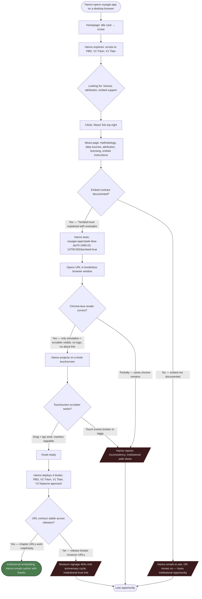
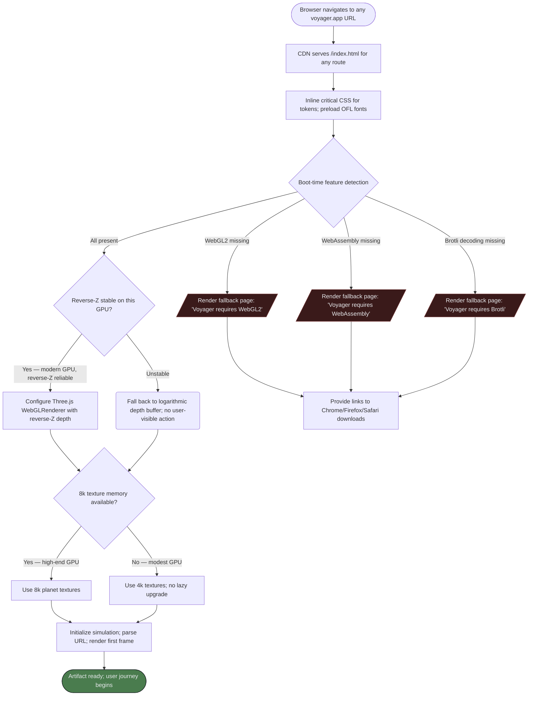
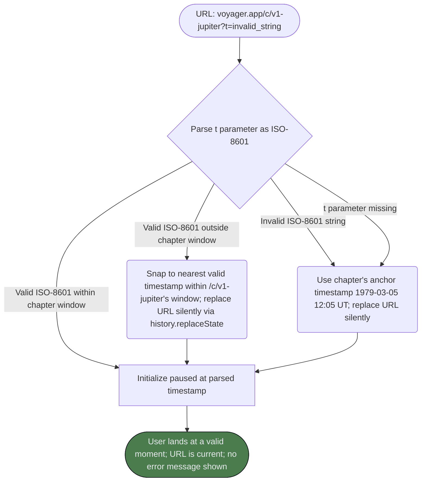

# UX Design Specification — Voyager

**Author:** Developer
**Date:** 2026-05-16

---

## Executive Summary

### Project Vision

Voyager is a browser-based, narrative-driven cinematic replay of the Voyager 1 and Voyager 2 missions (1977–2030), built around a single coherent time axis the user can scrub, pause, and zoom from 1× real-time to 1,000,000×. The product treats the mission as the protagonist — not as one entry in a multi-mission planetarium catalog. The lede feature is **"see what Voyager saw"**: CK-reconstructed attitude data drives instrument boresights so the spacecraft physically turns, the scan platform articulates, and the narrow-angle camera's frustum sweeps the targets it actually aimed at in 1979, 1980, 1986, 1989, and 1990.

The visual register is *Apollo in Real Time* applied to an unmanned mission for the first time — silent, dignified, time-anchored, generous typography. The artifact is a portfolio piece; success is recognizable quality, not engagement metrics. The Definition of Done — "linkable next to *Apollo in Real Time*, NYT long-scroll science features, and FWA Three.js winners without an apology" — is the launch gate, not the 2027-09-05 anniversary date. Voyager 1's 50th anniversary is opportunity timing; the artifact ships when it's ready, not before.

**The design hero is the Pale Blue Dot reconstruction (1990-02-14)** — the spacecraft physically turns toward the inner solar system, the narrow-angle camera frustum sweeps Venus → Earth → Jupiter → Saturn → Uranus → Neptune, and original NASA photo plates composite into the scene at the corresponding instants. Every other design decision serves this scene's emotional integrity.

### Target Users

**Primary (design persona): Maya, 34, space-curious adult.** A composite north-star user — Brooklyn software designer; watched *For All Mankind* through twice; owns *Pale Blue Dot* and Ann Druyan's *Cosmos*; follows planetary scientists on Bluesky; reads long-form science features in *The Atlantic* and *Quanta*. Knows Voyager left the solar system; could not tell you what happened between Cape Canaveral and the heliopause. **Wants to be moved, not informed.** Two journey modes: first-time happy path (J1 — opening from a Hacker News link) and depth-seeking return visit (J2 — finding the Triton flyby moment to share).

**Secondary: Marcus, 47, AP Physics teacher.** Public high school in Columbus, OH. Uses a school-managed Chromebook over HDMI to a classroom smartboard. Needs no-install, no-account, bookmarkable per-chapter URLs as lesson plan assets. Plays the V2 Jupiter flyby twice at different speeds to make gravity assist legible. **The 1280×720 floor + URL-as-assignment pattern serves Marcus directly.**

**Tertiary: Dr. Hanno Reinhardt, 56, museum curator.** Vienna planetary science wing; planning 2027 anniversary programming. Needs four kiosks running deep-linked URLs in `?embed=true` chrome-less mode (Pale Blue Dot, V2 Triton, V1 Titan slingshot, V2 Neptune approach). Touchscreen scrubber must work. Attribution and licensing must be discoverable. **The embed surface is the seam that lets institutional adoption happen without bespoke work.**

**Operational: solo developer/maintainer (2028+).** Approves kernel-update PRs from a phone on a train. The artifact survives without continuous engineering attention because the bake → drift report → CI flow is well-trodden.

### Key Design Challenges

1. **The differentiator is invisible if not designed loudly enough.** If Maya doesn't *notice* the spacecraft physically turning during her first encounter, "see what Voyager saw" failed and the product reads as a NASA Eyes clone. UI affordances must announce the attitude reconstruction through behavior — articulated platform visible, boresight cone prominent, camera framing that puts the act of *aiming* at the center of the frame — without breaking the AiRT register through over-labeling.

2. **One scrubber, six orders of magnitude.** The timeline must feel good at 1× (real-time, near-stationary), at 1e6× (full mission scrubs in ~50s), and at the automatic cadence transitions in between (daily cruise → 1-hour approach → 1-minute flyby → 10-second closest-approach). The cadence gear-shifts happen *inside* the chapter automatically; the user should feel cinematic pacing, not loading buffers.

3. **Scientific honesty as visual register, not as caveats.** CK-vs-synthesized labeling, past-solid/future-dashed trajectory styling, methodology surface — non-negotiable per the PRD. The challenge is integrating these into the typographic register so they read as instrument-panel honesty, not as legal footnotes.

4. **Chapter copy that supports without lecturing.** The simulation is the protagonist. Copy is restrained, hand-written per chapter (not templated), in a typographic register Maya pauses on and reads. Marcus needs it to be projector-legible; Hanno needs it to read at kiosk-arm distance. One typographic system serves all three.

5. **Three distinct audiences, one chrome.** Maya's evening laptop scroll, Marcus's classroom projector, Hanno's museum kiosks. The `?embed=true` mode is the seam — every other UX decision must serve all three audiences without compromise. No "classroom mode" toggle. No museum mode. One artifact.

6. **Touch + pointer parity for the timeline scrubber.** The primary control surface must work for mouse hover (Maya), trackpad gesture (Maya's MacBook), touch (Hanno's kiosks, optional tablet), and keyboard (Marcus's accessibility floor, screen-reader-adjacent users). The scrubber's "physical feel" survives all four input modes.

### Design Opportunities

1. **Reframe time controls as cinematic affordances.** The scrubber as a film strip. Chapter markers as vertebrae along the timeline. Speed multiplier as a tactile, audibly-acceleration-implied slider — not a dropdown buried under a gear icon. "This is a cinema you scrub through," not "this is a tool with a time setting." Every existing competitor treats time as a setting; making it the spine is a positioning lever.

2. **Make the URL a first-class share affordance.** Every moment of awe is a copyable second. Pre-rendered OG cards convert the artifact into a vector of communication, not just a destination. Maya's J1 resolution ("she copies the URL — it has the timestamp baked in — and sends it to her sister") is design-able: the address bar reflects the current second at all times; share is implicit, not modal.

3. **The HUD as a quiet scientific instrument panel.** Monospace simulation dates, AU distances with significant-figures precision, instrument-shutoff status as a small typographic legend that updates as ISS / UVS / PLS / LECP go offline across the decades. Not gamified UI. Part of the AiRT register, not separate from it.

4. **The Pale Blue Dot scene as a designed event.** The spacecraft turn is choreographed, not procedurally interpolated. The frustum sweep is timed to Maya pausing for thirty seconds. The NASA photo plates composite in at the historically-correct instants with a typographic register that matches the chapter copy. This is the scene every other decision serves.

5. **Restraint as a design move.** No lens flares. No invented sound effects. No orbital-mechanics-violating maneuvers for drama. The Golden Record audio off by default. The chapter copy short. The HUD dismissable. The product is allowed to be beautiful, not allowed to be fictional — and the *restraint* is the signal that this is the work of someone who respects the mission.

---

## Core User Experience

### Defining Experience

**The core action is scrubbing the timeline.** Everything else serves this. The user drags a scrubber from 1977 to 2030 — with their thumb on a kiosk, their finger on a trackpad, their cursor on a desktop — and feels time as a physical, continuous axis they control. When the scrub feels right, the product feels right. When it feels right at 1× *and* at 1e6× *and* at the automatic cadence transitions inside an encounter window, the product is done.

**Cold-start moment:** A first-time visitor at `/` sees a held title card ("Voyager. 1977 to 2030.") for two beats, dissolving into a wide shot of Cape Canaveral on 1977-09-05. The timeline scrubber materializes at the bottom of the viewport, chapter markers visible as vertebrae. No modal. No cookie banner. No signup. No tooltips. The user hits play when they're ready — or scrubs immediately if they're impatient. The simulation starts paused.

**The core loop, end-to-end:** Land → see the title → scrub or play → the camera follows the action through cruise → a chapter approaches and the view-frame transitions automatically into a body-centered frame → the scan platform articulates, the cone aims, things happen → the chapter copy materializes on the side without pulling focus → the moment lands → the user pauses, copies the URL, sends it, or scrubs forward. Repeat for 11 chapters.

**The product is the simulation; everything else is supporting structure.** Chapter copy supports. HUD supports. Chapter index supports. About page supports. The 3D canvas is the protagonist of every viewport, every breakpoint, every input mode.

### Platform Strategy

**Browser-only single-page application, static-CDN delivery.** Per the PRD this is locked: TypeScript + Three.js + Vite, no server, no API, no database, no accounts. The application's "state" is the URL plus client memory. Every chapter URL serves the same `index.html`; client-side routing handles the rest.

**Input modes (all four must work):**

| Input | Source audience | Treatment |
| --- | --- | --- |
| **Mouse + keyboard** | Maya (MacBook), Marcus (classroom Chromebook) | Tier 1 — full polish. Hover affordances, click-and-drag scrubber, keyboard shortcuts for primary controls. |
| **Trackpad** | Maya | Tier 1 — inherits from mouse; pinch-to-zoom on canvas; momentum-scrub respected. |
| **Touch** | Hanno (kiosks), Maya (tablet, optional) | Tier 2 — pointer events; scrubber drag works; pinch-to-zoom on canvas. No phone-specific gestures. |
| **Keyboard alone** | Accessibility floor; screen-reader-adjacent users | Tier 1 — every primary control reachable. `Space` = play/pause, `←/→` = scrub, `1`–`9` = chapter jump, `?` = help, `Home/End` = mission bounds. |

**Viewport floor:** 1280×720 desktop, fully polished. Tablet (1024×768+) functional but not optimized. Phone (<768px) best-effort; not v1-polished. No phone-app native wrapper. No PWA install prompt. No service worker.

**Browser matrix:** Latest two stable versions of Chrome, Firefox, Safari (desktop). Edge inherits from Chrome. WebGL2, WebAssembly, Brotli required. If missing → fallback page, not degraded simulation.

**Offline behavior:** None. The artifact loads its asset bundle (≤35 MB first-paint, ≤150 MB full) and is fully self-contained after that, but no Service Worker, no offline PWA. If the user loses connectivity mid-session, the simulation keeps running from cached chunks until it hits a chunk it doesn't have, then degrades gracefully.

**No live data, ever.** The artifact does not call APIs at runtime. No "where is Voyager now" telemetry. No DSN integration. No analytics pings. This is a deliberate architectural and UX commitment — the artifact is a static historical retrospective, dignified by its self-containedness.

### Effortless Interactions

These should feel automatic. The user never thinks about them; if they do, we failed.

1. **The view-frame transition into and out of an encounter.** As the simulation approaches a gas-giant encounter, the camera blends from heliocentric to body-centered over a smooth ±2-day window. The user does not click anything. They don't pick "enter Jupiter view." It happens cinematically and reverses on exit. (PRD: Pattern 4, smoothstep blend.)

2. **The cadence shift inside an encounter.** The trajectory cadence transitions from daily (cruise) → 1-hour (approach, ±30 days) → 1-minute (flyby, ±2 days) → 10-second (closest approach, ±1 hour) without the user noticing. No loading spinners. No "preparing high-detail view" pop-ups. Chunk prefetch fires at 90% of the current chunk; speed caps automatically if a chunk isn't ready. The user feels cinematic pacing, not buffering.

3. **The URL keeping itself current.** The browser's address bar always reflects the current simulation timestamp (and chapter if inside one). The user never clicks "share" — they just copy the URL. The deep-link → paused-at-moment behavior is symmetric. Maya copies, sends to her sister, sister clicks, lands at the exact second Maya was looking at. Zero friction.

4. **The chapter copy materializing.** Chapter copy appears on the side of the viewport as the simulation enters a chapter window, fades when the window exits. No "X to close" affordance. No "chapter info" button. The copy is there when it's relevant; it isn't when it's not.

5. **Reduced motion just working.** A user with `prefers-reduced-motion: reduce` set never sees a single camera blend. Transitions are instant cuts. Speed multiplier changes are instant. The simulation still plays at 60 FPS — only *additional* motion is reduced. The user does not toggle a setting. Their OS-level preference is honored at boot.

6. **The Golden Record toggle never asking twice.** Audio off by default (per PRD). When the user toggles it on, the preference persists for the session (localStorage). They don't re-toggle every chapter. Across sessions, the default is *re-applied*, not *remembered* — Maya doesn't want her Tuesday-night audio choice carrying over to Friday.

7. **The embed mode being one URL parameter.** Hanno appends `?embed=true` to any URL; chrome vanishes. He doesn't open a "kiosk mode" panel, doesn't request an API key, doesn't sign up for an embed tier. One parameter. Symmetric across every chapter URL.

### Critical Success Moments

These are the moments where success or failure is decided. Each has a defined behavior and a failure mode.

**1. First-paint to first frame (target: ≤3s on broadband).**

- *Success:* Page loads. Title card holds. Scrubber appears. Maya thinks "ok, this looks like it'll be good." She hasn't seen a cookie banner, a signup modal, or a "loading…" spinner.
- *Failure:* Page is blank for >3s; or a cookie banner intercepts the title card; or the title card looks generic, not AiRT-class. Maya bounces.

**2. First scrub — the user moves the scrubber for the first time.**

- *Success:* The scrubber feels physical. Time moves visibly. The spacecraft position updates smoothly. The HUD date counts. Maya thinks "oh — this is *responsive*."
- *Failure:* The scrubber feels laggy or quantized. Time appears to skip. The spacecraft teleports. Maya thinks "this is a slideshow."

**3. First encounter — the scan platform turns. THIS IS THE MAKE-OR-BREAK MOMENT FOR THE DIFFERENTIATOR.**

- *Success:* Maya scrubs to V1 Jupiter (1979-03-05). The camera transitions to a Jupiter-centered frame. The model's scan platform visibly rotates. The narrow-angle cone aims at Io. Maya notices — without prompting — that the camera is moving on its own, aiming. She thinks "wait, the cameras can move?" Per the J1 climax, she pauses.
- *Failure:* The scan platform's articulation is too subtle to notice. The cone is decorative, not behavior. Maya sees only a path with a model on it. The product reads as a NASA Eyes clone. **5–10 friendly-user qualitative tests explicitly probe this moment per the PRD; if users don't notice, ship is gated.**

**4. The Pale Blue Dot reconstruction lands.**

- *Success:* Maya scrubs to 1990-02-14. The spacecraft physically turns toward the inner solar system. The narrow-angle cone sweeps Venus → Earth → Jupiter → Saturn → Uranus → Neptune. NASA photo plates composite into the scene at the corresponding instants. Maya sits with it for thirty seconds.
- *Failure:* The turn is procedural, not choreographed. The composite is technically present but visually flat. Maya thinks "huh, that's nice" and scrubs on. The hero scene under-delivers and the project's emotional center fails.

**5. The deep-link share.**

- *Success:* Maya copies the URL. The address bar has the timestamp baked in. She pastes into iMessage. The OG card renders showing the exact frame she was looking at. Her sister clicks. The page opens paused at that second. Zero friction.
- *Failure:* OG card is generic or missing. Sister's link opens at the homepage, not the moment. The communication vector breaks; the artifact stops propagating.

**6. The kiosk embed renders.**

- *Success:* Hanno tests `voyager.app/c/pale-blue-dot?t=1990-02-14T00:00Z&embed=true` in a borderless browser. Chrome is gone. Touchscreen scrubber works. He projects it on a kiosk. Six weeks later, four kiosks in the Vienna exhibit run deep-linked URLs. Institutional adoption happens through quality alone, exactly as the PRD predicts.
- *Failure:* Embed mode is half-applied (logo gone but share button stays); touch scrubber is finicky; URL contract breaks across a release and the kiosks silently 404 a month later.

### Experience Principles

These guide every UX decision downstream. When in doubt, return to these.

1. **Time is the spine, not a setting.** The scrubber is the primary control surface. Speed is tactile, not configurable. Chapter markers are vertebrae, not menu items. Every existing competitor buries time; we lead with it.

2. **Restraint is the design move.** No lens flares. No invented sound effects. No orbital-mechanics-violating maneuvers. No autoplay video. No modals. No cookie banners. No signup. The artifact is allowed to be beautiful, not allowed to be fictional. Restraint *is* the signal that we respect the mission.

3. **The simulation is the protagonist.** Every UI element supports the canvas; nothing competes with it. Chapter copy is on the side, not over. HUD anchors to edges. Chrome is dismissable. The 3D scene fills the viewport at all times.

4. **Effortless ≠ guided.** We don't onboard. We don't tutorialize. We don't explain how to use the scrubber. The affordances are visible enough that exploration is the tutorial. The first-three-seconds carry the entire learning curve.

5. **Scientific honesty as register, not as caveats.** CK-vs-synthesized labels read as instrument-panel honesty. Past-solid / future-dashed lines read as map convention. The about page is the deepest layer for the curious — never the gating layer.

6. **One artifact, three audiences.** Maya, Marcus, Hanno see the same product. No "classroom mode," no "museum mode." `?embed=true` is the only mode toggle. Every other decision serves all three audiences without compromise.

7. **The URL is the API.** Deep-linkability is a first-class commitment. The address bar is always live. Sharing a moment is implicit. URL contract stability is part of the public API surface.

8. **The artifact survives the developer leaving.** Maintenance burden approaches zero. Static CDN deploys; hash-pinned kernels; CI gates; ADRs document every rejected idea. The artifact still works in 2040 because nothing depends on a server you have to pay for.

---

## Desired Emotional Response

### Primary Emotional Goals

**The dominant emotional register is awe — wonder at what was done.** A first-time visitor leaves with a felt sense of the mission's scale: that two refrigerator-sized spacecraft, launched in the year *Star Wars* premiered, are now interstellar. That the gravity assist around Jupiter wasn't a metaphor — it was a 60,000-km/h whip. That the Pale Blue Dot photo was the result of someone *deciding* in 1990 to turn the spacecraft around and take it. The product earns the emotion by making the *acts themselves* legible, not by narrating them.

**Elegy is present as the bass note, not the melody.** The instrument-shutoff schedule reflected in the HUD as ISS / UVS / PLS / LECP go offline across the decades; the necessarily textual heliopause cards; the empty post-2030 cruise vector; the Golden Record audio gently audible at chapter markers (off by default, available when wanted) — these carry the weight of a long ending without converting the artifact into elegy. Maya leaves moved by achievement, not by grief. The bass-note register tracks the cultural temperature in 2026–2027 (operationally pacing the spacecraft toward the 50th anniversary; thruster swaps "to make the 50th") without becoming maudlin.

**The single test:** when Maya pauses for thirty seconds at the Pale Blue Dot reconstruction, what fills that thirty seconds is awe. When her sister texts back "yes. exactly." the next morning, what passed between them is recognition — that this is what the mission *was*. Neither moment is sentimental; both are dignified.

**Emotions to avoid actively:**

- **Sentimentality.** No swelling music. No "look how amazing this is" copy. No on-screen text that tells the user how to feel. The artifact does not tell; it shows.
- **Spectacle without meaning.** No lens flares, no invented camera shake, no orbital-mechanics-violating swoops "for drama." Beauty earned from physics; never beauty fabricated for impact.
- **Edutainment.** No quiz overlays, no "did you know?" tooltips, no gamified achievement badges, no progress bars implying completion. This is not Khan Academy. This is a cinema.
- **Anxious busy-ness.** No pulsing UI, no notification dots, no calls-to-action begging engagement. Restraint is the design move.
- **Apologetic caveats.** Scientific honesty (CK-vs-synthesized, past-solid/future-dashed) reads as instrument-panel honesty, not as legal disclaimers. The labels are quiet and confident.

### Emotional Journey Mapping

The five user journeys from the PRD each have a distinct emotional arc. The product must serve all five without compromise on any.

**Maya — first-time happy path (J1):**

| Stage | Emotion | UX surface |
| --- | --- | --- |
| **Discovery** (HN thumbnail) | Curious; cautiously hopeful | OG card showing the V1 turn-around frame; title "See what Voyager saw" sells the lede |
| **Landing** (page loads) | Reassured; "ok, this looks like it'll be good" | Sub-3s first paint; title card holds for two beats; no chrome interruptions |
| **Opening sequence** (title → Cape Canaveral) | Settled; in-register | Restrained typography sets AiRT mood inside three seconds |
| **First scrub** | Surprised by responsiveness | Physical scrubber feel; spacecraft moves smoothly; HUD date counts |
| **First encounter** (Jupiter, scan platform turns) | Astonishment | The differentiator-validation moment. "Wait, the cameras can move?" |
| **Pale Blue Dot** (hero scene) | Awe; reverence | Choreographed turn; frustum sweep; NASA plates composite in; thirty-second pause |
| **Share** (J1 resolution) | Recognition; communion | Copy URL → paste → OG card → sister clicks → exact moment |
| **Close laptop** | Settled; changed | "A different felt sense of what those forty years actually were" |

**Maya — depth-seeking return (J2):**

| Stage | Emotion | UX surface |
| --- | --- | --- |
| **Returning intent** | Purposeful; advocate | She's coming back to share, not to discover |
| **Finding the moment** (chapter index → V2 Neptune) | Confidence; agency | Discoverable chapter index; per-timestamp URL parameter |
| **The Triton arc** | Aesthetic recognition; the elegant-physics moment | Trajectory arc-below-ecliptic rendered correctly; chapter copy supplies the meaning |
| **Share to group chat** | Communicative pride | OG card preview shows the exact frame *before* the click |
| **Friends arrive** | Connection | The artifact is now a vector of communication; community forms around shared seconds |

**Marcus — secondary, classroom (J3):**

| Stage | Emotion | UX surface |
| --- | --- | --- |
| **Sunday-night prep** | Skeptical optimism | The artifact must work on a managed Chromebook, no signup, no install |
| **Testing on projector** | Practical confidence | 1280×720 floor renders cleanly at projector resolution; HUD legible |
| **Bookmark moment** | Efficiency satisfaction | Per-chapter URL = lesson plan asset |
| **Monday class — student says "wait, so the planet is *pulling it* and *throwing it*?"** | Vindication | The gravity-assist trajectory was visually correct; the physics is legible without lecturing |
| **Bookmarking next unit** | Trust | Marcus trusts the artifact for future lessons. He didn't validate as part of any market; he just used it because it worked. |

**Hanno — tertiary, museum curator (J4):**

| Stage | Emotion | UX surface |
| --- | --- | --- |
| **Discovery** (colleague referral from COSI) | Cautious interest | Existing exhibit-context cultural temperature gives Hanno permission |
| **Attribution check** | Professional reassurance | Discoverable licensing surface; clear NASA + Björn Jónsson attributions |
| **Embed mode test** | Working-it-out satisfaction | `?embed=true` chrome vanishes; touchscreen scrubber works; kiosk-projection-clean |
| **Six-week kiosk rollout** | Institutional pride | Four kiosks, deep-linked URLs, no bespoke work required |
| **Email author** | Reciprocal respect | "Thanks and offer to credit"; author accepts credit, declines payment |

**Operational developer (J5):**

| Stage | Emotion | UX surface |
| --- | --- | --- |
| **Bot PR opens** | Calm-paced anticipation | Hash-pinned manifest; CI runs; drift report generates automatically |
| **Drift report review** | Mechanical trust | `max_drift_km: 1.3` — well under threshold; no investigation needed |
| **Approve from phone on a train** | Operational confidence | No fragile state to inspect; no manual rebake; no deploy ceremony |
| **Phone away, open day-job Slack** | Satisfaction; relief | Maintenance burden approaches zero. The substrate they built holds up. |

### Micro-Emotions

These subtler emotional states matter most for the differentiator. Failure on any one of them collapses the dominant register.

- **Astonishment, not gee-whiz.** The first encounter must land as *recognition* ("oh — the cameras can move") rather than *spectacle* ("wow, special effects"). The register is sober awe, not amusement-park awe. The articulation must look mechanical and constrained — a real spacecraft turning, not a CGI showpiece.
- **Trust, built in three seconds.** First paint, title card, typographic register — these establish whether the user trusts the artifact's voice for the next forty minutes. Lose trust here and no downstream chapter recovers it.
- **Patience over urgency.** The artifact rewards lingering. Maya pausing for thirty seconds is the success criterion, not a failure of engagement. UI never urges. No "tap to continue." No autoplay-next-chapter button. Restraint is *generosity* toward the viewer.
- **Recognition over discovery.** Maya's "yes. exactly." sister-text is the emotional center. The artifact creates *shared* recognition between people who already half-understood Voyager — not a tutorial for the uninitiated. This is what distinguishes it from edutech.
- **Confidence-in-honesty.** When a user notices the small "attitude: CK reconstructed" indicator change to "attitude: synthesized (HGA Earth-pointing)" mid-cruise, they should feel *more* trust, not less. Honesty about the substrate is the deepest layer of the register.
- **Quiet competence over flourish.** Every UI affordance is the *minimum* gesture that gets the job done. The HUD doesn't pulse. The scrubber doesn't bounce on hover. The chapter copy doesn't slide in with momentum. Quiet competence is the *Apollo in Real Time* lineage.
- **Belonging without community.** The product is single-player. No comments, no profiles, no feed, no "users also viewed." Belonging happens *through* the URL Maya sends her sister — community forms around the artifact in messaging apps, not inside it. This is deliberate.

### Design Implications

Each desired emotional response maps to specific UX commitments:

| Emotion | UX design approach |
| --- | --- |
| **Awe** | Restraint; the simulation as protagonist; no UI elements competing for attention during hero moments (PBD, first encounter) |
| **Elegy (as bass note)** | Instrument-shutoff status persistently in HUD; heliopause cards as text + restraint; Golden Record audio as opt-in not autoplay |
| **Astonishment** | Articulated scan platform visible at human scale; boresight cone prominent during encounters; first-encounter camera framing that *centers on the act of aiming* |
| **Trust** | Sub-3s first paint; AiRT-class typography from frame one; no chrome blockers; CK-vs-synthesized labels surfaced quietly but discoverably |
| **Patience-over-urgency** | No autoplay-next; no "tap to continue"; HUD dismissable for unobstructed viewing; chapter copy fades when scene transitions |
| **Recognition** | Hand-written chapter copy that speaks to the half-informed adult; no glossary; no definitions; meaning conveyed by behavior |
| **Confidence-in-honesty** | About / Methodology page discoverable from homepage; provenance surfaced in attribution panel; UI labels are quiet, confident, never apologetic |
| **Quiet competence** | Minimum-gesture UI motion; CSS easings restrained; no hover bounces, no shimmer effects, no pulse animations on calls-to-action |
| **Belonging (without community)** | URL-as-share; OG cards; no social features; no comments; the artifact propagates *through* messaging apps, not by hosting community |

**What we will NOT do, because it would break the register:**

- Voiceover narration (deferred to v1.1+; the Golden Record is *audio*, not *narration*)
- Animated "swooping" hero shots between chapters
- Achievement badges, completion percentages, or any gamification surface
- Pop-up modals for any reason (cookie consent included — we will architect to not need it)
- Toast notifications, banner alerts, "subscribe for updates" prompts
- A loading-progress percentage during chunk prefetch (it's invisible; speed caps handle it)
- Hover effects that add information density (tooltips that explain controls)
- Onboarding tour overlays, "tour the app" CTAs, or empty-state illustrations

### Emotional Design Principles

These are the test questions for every design decision downstream. When in doubt, return to these.

1. **"Would Apollo in Real Time do this?"** If AiRT would not include this UI element, animation, copy tone, or interaction — neither do we. AiRT is the register reference.
2. **"Does this earn the awe, or perform it?"** A camera moving because real CK data says so earns awe. A camera swooping for "cinematic impact" performs it. Always earn.
3. **"Would Maya feel told-how-to-feel?"** If a copy line, animation, or sound effect tells Maya what emotion to have, cut it. The artifact shows; it does not tell.
4. **"Does this respect the viewer's patience?"** If a UI element rushes the viewer, pre-empts a pause, or fills silence — cut it. Restraint is generosity.
5. **"Would Hanno's curator-grade peer respect this?"** A planetary scientist or museum curator finding the artifact should feel it was made by someone who *belongs* in the cultural conversation, not someone trying to enter it. This is the institutional-amplification test.
6. **"Does the bass note hold?"** Elegy is present in every chapter — instrument shutoffs, the long cruise, the heliopause's necessary textuality. It is felt, not narrated. If a chapter forgets the bass note, the register flattens to entertainment.

---

## UX Pattern Analysis & Inspiration

### Inspiring Products Analysis

Three positive references define the visual and interaction register — pinned in the PRD as the Definition-of-Done benchmark. We study them not to clone, but to understand the discipline behind what makes each work.

#### 1. Apollo in Real Time (apolloinrealtime.org) — the primary reference

**What it is.** Ben Feist's web-based mission replays for Apollo 11, 13, and 17. The user lands on a clock that shows mission elapsed time, scrubs along an audio + video + telemetry timeline, and experiences the mission as it happened, second by second, without commentary.

**What it does right (the patterns we adopt directly):**

- **Time is the spine.** Mission Elapsed Time is the only navigation axis. There are no menus, no chapter pickers as primary surface, no "tap to start exploring" CTAs. The clock is the product.
- **Restrained chrome.** Monospace mission clock. Mission control transcripts in a quiet sans-serif. Crew audio waveforms muted, not flashy. Photo plates appear when they were taken, fade when they weren't relevant. The interface is **almost typography-only**.
- **Generous typographic hierarchy.** Mission timestamps in a tabular monospace; transcript text in body-readable serif; section labels in restrained caps. Three type voices, total. No decorative type.
- **Silence as an instrument.** Stretches where no one is talking are *honored*, not filled. The waveform goes flat for ten minutes during translunar coast; the product trusts the user to feel the silence as part of the mission.
- **Per-second deep-linking.** Any mission moment has a URL. Sharing a moment is implicit through the address bar; community forms in messaging apps and blog posts that quote specific seconds.
- **No accounts, no analytics, no banners.** Loads in a browser, works, propagates. A masterclass in zero-onboarding.
- **Trust-through-honesty.** When a transcript channel was lost, AiRT marks it [missing]; when audio quality degrades, it shows. The artifact never pretends to have data it doesn't.

**What we will adopt verbatim from AiRT:**

- Tabular monospace dates in the HUD
- Per-moment URL deep-linking with implicit address-bar share
- No accounts, no banners, no onboarding
- Silence/restraint as a design move (no need to fill empty cruise)
- Three-voice typographic hierarchy (mono, serif, restrained sans/caps)
- Quiet honest labeling of synthesis vs source

**What we will adapt for Voyager:**

- AiRT's audio-driven timeline becomes our **3D-driven timeline** — the canvas is the protagonist here, not the audio
- AiRT's transcript panel becomes our **chapter copy panel** — same restrained-side-of-viewport register
- AiRT's MET clock becomes our **simulation date + AU distance HUD** — same monospace dignity
- AiRT's mission-control rooms (the side-by-side video feeds) have no Voyager analogue; we replace with the **scan platform articulation view** during encounters

#### 2. NYT long-scroll science features — "Snow Fall," the Cassini retrospective, "Killing the Colorado"

**What they are.** Editorial long-form pieces from the New York Times Graphics desk. Snow Fall (2012) established the genre; the Cassini retrospective (2017) is the most relevant — a scrollytelling retrospective of a 20-year mission with 3D, photographs, infographics, and prose interleaved.

**What they do right:**

- **Prose as the primary medium, visuals as the punctuation.** When the Cassini piece needs to convey what a ring-plane crossing felt like, the prose does the work; the 3D visualization arrives at the climax, not at the start.
- **Scroll as a controlled rhythm.** The user's vertical scroll *paces* the experience. There's no autoplay, no "next" button — the user controls advancement.
- **Generous editorial typography.** Body in NYT Cheltenham (serif). Captions in NYT Imperial (smaller serif). Headlines in NYT Karnak Condensed. *Italics carry meaning.* Pull quotes are sparing and deliberate.
- **Visual register matches subject.** Cassini's piece is dark, dignified, technically accurate. Snow Fall is white, atmospheric. The visual register *serves* the subject; it doesn't override it.
- **Embedded interactivity feels like a courtesy, not a demand.** Where the Cassini piece wants you to scrub a flyby trajectory, you can — but only if you want to. Default is read-watch.

**What we will adopt from NYT long-scroll:**

- **Editorial typographic hierarchy** for chapter copy. We need a serif voice for prose (chapter copy) distinct from the monospace HUD. The serif gives the chapter copy *literary weight* — Maya doesn't feel like she's reading UI text.
- **Generous whitespace around prose.** Chapter copy is given air to breathe; never crammed.
- **Italics carry meaning, not decoration.** Reserved for emphasis the way essay writing reserves italics.
- **Subject-serving visual register.** Voyager's register is its own — silent, dignified, time-anchored — and the typography serves that, not vice versa.

**What we explicitly will NOT adopt from NYT:**

- **Scroll as the navigation surface.** NYT pieces are *passive* scrolls; Voyager is an *interactive* simulation. Our navigation is the scrubber, not the scroll. Scrolling would conflict with the canvas-as-protagonist commitment.
- **Heavy interleaving of full-screen photography.** NYT pieces are essentially illustrated essays; Voyager is essentially a film. We use NASA photo plates only at *historically correct instants* (Pale Blue Dot composite), never as decorative full-bleed transitions.
- **Long-form prose.** NYT pieces are 3,000–8,000 words. Our chapter copy is 50–150 words per chapter, max. The simulation does the heavy lifting; copy is punctuation.

#### 3. FWA Site of the Day Three.js / WebGL winners

**What they are.** Award-winning interactive web experiences from agency studios (Active Theory, North Kingdom, Resn, Bruno Simon's portfolio, etc.). Push the visual and technical ceiling of what's possible in a browser.

**What they do right:**

- **Technical fluency as aesthetic.** Reverse-Z, custom shaders, post-processing — used not to show off, but because the work demands it. The technique disappears into the result.
- **Bespoke type and interaction.** No off-the-shelf design system. Every cursor, every transition, every loader, every microcopy is intentional. Nothing feels stock.
- **The viewport is the experience.** Full-bleed canvas; no sidebar-and-content layouts. UI floats over the canvas, anchored to edges.
- **Loading is part of the artwork.** The opening sequence — even a 3-second wait — is choreographed, not a generic spinner.
- **First-paint is a designed event.** The first ten seconds carry as much craft as any chapter that follows.

**What we will adopt from FWA winners:**

- **Full-viewport canvas philosophy.** UI elements anchor to viewport edges; the simulation fills the frame.
- **Designed first-paint and loading sequence.** The title-card-to-Cape-Canaveral dissolve is *choreographed*, not generic. Loading chunks during encounters is handled by speed caps, not by progress bars.
- **Bespoke microcopy and microinteractions.** Every label, every transition, every cursor state is intentional. Nothing reads as boilerplate.
- **Technical fluency disappearing into result.** Reverse-Z, floating-origin, attitude reconstruction — all in service of the felt experience, never advertised to the viewer.

**What we explicitly will NOT adopt from FWA aesthetic:**

- **Designer-forward visual flourish.** Many FWA winners read as agency-portfolio pieces — bold type experiments, ironic copy, post-processing for its own sake. Voyager is mission-retrospective. The register is *dignified*, not *clever*.
- **Aggressive use of cursor effects, scroll-jacking, momentum interactions.** These call attention to themselves. Voyager's UI disappears into the canvas.
- **Music and sound design as primary mood-setting.** Voyager has the Golden Record (off by default, diegetic, optional). No ambient soundscapes. No audio cues on interactions.
- **Loud onboarding ("click here to begin").** FWA winners often gate the experience behind a designed-CTA "enter" screen. Voyager has no such gate.

### Transferable UX Patterns

Synthesized from the three references plus PRD-locked commitments. These are the patterns we deliberately adopt for downstream design work.

#### Navigation Patterns

| Pattern | Source | How it applies to Voyager |
| --- | --- | --- |
| **Time-as-spine scrubber as primary navigation** | AiRT | The timeline scrubber is the primary control surface (PRD-locked). Chapter markers along it are the only secondary navigation. |
| **Chapter index as accelerator, not primary** | AiRT, NYT | A small chapter-index affordance (top-right icon per J2) for direct jumps; never the *first* surface a user sees. |
| **Per-moment deep-linking** | AiRT | Every timestamp is a URL. Address bar always reflects current second. PRD-locked via FR37/FR38/FR42. |
| **No menu, no nav, no sidebar** | AiRT, FWA | Zero traditional web-navigation surfaces. The canvas + scrubber + HUD + chapter copy is the entire UI. |

#### Interaction Patterns

| Pattern | Source | How it applies to Voyager |
| --- | --- | --- |
| **Direct manipulation of time (drag scrubber)** | AiRT | The scrubber feels physical at every speed; drag/click/keyboard parity. Touch-pointer-keyboard tier-1. |
| **OS-respecting motion preferences** | NYT, modern web | `prefers-reduced-motion: reduce` honored (PRD-locked via FR46). |
| **Silent automatic state transitions** | AiRT | View-frame transitions, cadence shifts, chapter-copy fades — all automatic, all silent. User notices only the result. |
| **Persistent address-bar URL** | AiRT | URL updates as the simulation moves; share by copying address bar. No "share" button needed. |
| **Optional opt-in audio layer** | AiRT (mission audio), partial | Golden Record off by default; gentle when on; activates at chapter markers only. |

#### Visual & Typographic Patterns

| Pattern | Source | How it applies to Voyager |
| --- | --- | --- |
| **Three-voice typographic hierarchy** | AiRT, NYT | Monospace (HUD: dates, distances, instrument status); serif (chapter copy prose); restrained sans-caps (chapter titles, About headings). |
| **Tabular monospace numerals** | AiRT | All numeric HUD values use tabular-figure mono so the digits don't jitter as values change. |
| **Generous whitespace around prose** | NYT | Chapter copy panel has air to breathe; never edge-to-edge. |
| **Italics for emphasis only** | NYT | Italics carry meaning (a moon's name, an emphasized word). Never decorative. |
| **Edge-anchored HUD elements** | FWA, AiRT | Date/distance top-right; chapter title top-left; scrubber bottom; chapter copy right side (or bottom-sheet on narrow viewports). Use CSS `clamp()` for size, not media-query stepping. |
| **Full-viewport 3D canvas** | FWA | Canvas fills the viewport at every breakpoint; UI floats over it. Per PRD. |

#### First-Paint & Loading Patterns

| Pattern | Source | How it applies to Voyager |
| --- | --- | --- |
| **Designed first three seconds** | FWA | Title card "Voyager. 1977 to 2030." holds for two beats, dissolves into the launch frame. Not a generic loader. |
| **Loading hidden by speed cap, not progress bar** | (novel; informed by FWA design discipline) | Chunk prefetch is invisible. If a chunk isn't ready, speed caps; no progress UI. |
| **Restrained title card / opening sequence** | AiRT, NYT | Title sets the typographic register inside three seconds. No animated logos, no "Powered by" credits. |

#### Honesty & Methodology Patterns

| Pattern | Source | How it applies to Voyager |
| --- | --- | --- |
| **Quiet inline labels for data provenance** | AiRT (transcript [missing] markers) | "attitude: CK reconstructed" vs "attitude: synthesized (HGA Earth-pointing)" in HUD. Quiet, confident, never apologetic. |
| **Discoverable About / Methodology page** | AiRT, NYT | One link from homepage; explains data sources, validation tolerances, attribution. Never gates the experience. |
| **Past-solid / future-dashed trajectory styling** | (novel; cartographic convention) | Past trajectory solid; future dashed. Reflects that future positions are predicted, past samples are observed/refined. |

### Anti-Patterns to Avoid

Drawn from the competitive landscape analysis in the PRD plus broad failure modes in space/edu products. These are the patterns we will not adopt under any circumstance.

#### From competitors and the broader category

- **The 150-mission sidebar (NASA Eyes on the Solar System).** A sidebar of missions, planets, and toggles that turns the experience into a sandbox. Voyager has *no* sidebar — the artifact serves one mission with depth, not 150 missions with breadth.
- **The planetarium dome control panel (OpenSpace).** Power-user UI with menus, sub-menus, toggles for layer visibility, asset categories, time-step controls. Optimized for trained planetarium operators, not for Maya on her couch. Voyager exposes *one* control: time.
- **The labeled-dot trajectory (Solar System Scope, Solar System 3D).** Voyager rendered as a marker moving along a path, no model, no attitude, no instruments. The opposite of "see what Voyager saw." Our differentiator depends on visibly articulated spacecraft.
- **The static elegy (JPL's Voyager site).** Beautiful but inert. Static infographics, a "where are they now" counter, no time axis. The cultural temperature is *not* served by another static memorial.
- **The autoplay video disguised as interactive (some museum web companions).** A pre-rendered "tour" that the user can pause but can't actually control. Voyager is *interactive* — the user's scrubbing is what produces the experience.

#### From the broader edutech / interactive category

- **The cookie consent modal that intercepts first paint.** Architected away by collecting zero PII (PRD-locked NFR-S8). No banner needed because no consent is needed.
- **The "click to enable audio" gate.** FWA-aesthetic sites often gate the experience behind "click to begin" — usually to enable audio context. Voyager has no required audio; Golden Record is off by default; no gate.
- **The "share this!" toast appearing after a moment of awe.** Maya pauses for thirty seconds at PBD. A toast saying "Loving this? Share it!" would *destroy* the moment. URLs are implicit; no nudge.
- **The newsletter signup modal that pops up after 30 seconds.** Architecturally impossible: no backend, no email collection. But also: we wouldn't do this even if we could.
- **The "tour" overlay on first visit.** Walks the user through scrubber, chapters, and speed control with tooltips. Adds friction, breaks the canvas-as-protagonist commitment. The opening title-card sequence carries the entire learning curve.
- **Tooltips that explain controls on hover.** If a control needs an explanatory tooltip, the affordance failed. The scrubber, play button, and chapter markers must be self-evident.
- **Achievement badges, completion percentages, "you've watched 73% of the mission" progress.** Gamification turns awe into completionism. Out of scope by emotional design principle.
- **A loading-progress percentage during chunk prefetch.** Visible loading UI advertises a system limitation. Speed caps invisibly. The user notices smooth slowdown, not a spinner.

#### From the NYT long-scroll genre (despite being a reference)

- **Scroll-jacking.** Hijacking the user's scroll to advance the narrative. NYT pieces sometimes do this; we won't. Our advancement is the scrubber, never the scroll.
- **Mandatory linear progression.** NYT pieces often expect the reader to scroll top-to-bottom. Voyager is non-linear by design — Maya can jump to PBD before she's seen Jupiter.

#### From the FWA aesthetic (despite being a reference)

- **Loud designed-CTA enter screens** ("Begin your journey", "Enter the experience"). We have no such gate. The page loads → title card → cruise. Direct.
- **Bespoke cursor effects.** Custom cursors that follow the mouse with momentum, change shape over interactive elements, or display tooltips. These call attention to themselves and break the simulation-as-protagonist commitment.
- **Ironic / clever microcopy.** FWA winners often inject personality through copy ("Hello, traveler" / "You've reached the void"). Voyager's voice is dignified, not personable. Hand-written, not chatty.
- **Post-processing for its own sake.** Bloom, chromatic aberration, lens flare, depth-of-field — these *can* serve the canvas, but most often they perform "look how cinematic this is" rather than serving the subject. Used minimally and only when the image quality is degraded *without* them.

### Design Inspiration Strategy

The strategy in one paragraph: **adopt AiRT's typographic and time-axis discipline; adapt NYT's editorial register for chapter copy; borrow FWA's full-viewport craft and designed first-paint; explicitly reject competitor patterns (NASA Eyes' sandbox sidebar, OpenSpace's power-user controls, the labeled-dot trajectory, the static elegy) and edutech / FWA anti-patterns (modals, tours, scroll-jacking, gamification, ironic microcopy).** The synthesis is Voyager's register: *AiRT applied to an unmanned mission, with NYT editorial weight in the prose and FWA technical craft in the canvas.*

#### What to Adopt (verbatim)

- AiRT's time-as-spine navigation and per-moment URL deep-linking
- AiRT's tabular monospace HUD with quiet provenance labels
- AiRT's three-voice typographic hierarchy (mono / serif / restrained caps)
- AiRT's zero-onboarding, no-account, no-banner posture
- AiRT's silence-as-instrument (no need to fill empty cruise time)
- NYT's editorial body-serif typographic discipline for chapter copy
- NYT's italics-for-meaning convention
- FWA's full-viewport canvas and edge-anchored UI
- FWA's designed first-three-seconds opening sequence
- FWA's invisible technical-fluency principle (the tech disappears into the result)

#### What to Adapt

- AiRT's audio-driven timeline → adapted into our 3D-driven timeline (canvas is protagonist, not audio)
- AiRT's mission-control video feeds → adapted into our scan-platform articulation view during encounters
- NYT's prose-driven scrollytelling → adapted into 50–150-word chapter copy per chapter, supplementing the simulation (never replacing it)
- FWA's bespoke microcopy → adapted to dignified register (no irony, no personality, no clever)
- FWA's loading-as-art → adapted to invisible loading (chunk prefetch hidden behind speed cap, not behind a loader)

#### What to Avoid (explicit rejection list)

- NASA Eyes' 150-mission sandbox sidebar
- OpenSpace's planetarium-operator control panel
- Solar System Scope's labeled-dot trajectory
- JPL's static-infographic memorial
- Cookie consent modals (architecturally avoided)
- "Click to begin" gates
- Tour overlays / tooltips on hover for affordances
- Achievement badges, completion percentages, gamification surfaces
- Toast notifications, share prompts, subscribe nudges
- Scroll-jacking and mandatory linear progression
- Custom cursor effects with momentum
- Ironic microcopy
- Post-processing for its own sake (bloom, lens flare, chromatic aberration without justification)
- Pre-rendered "tour" videos disguised as interactive

This strategy keeps Voyager unique while standing on shoulders. The reference set is small and intentional: AiRT for the discipline, NYT for the prose, FWA for the craft. No additional references will be added without revisiting this strategy explicitly.

---

## Design System Foundation

### Design System Choice

**A fully bespoke design system built on a thin Web Components layer, with a hand-rolled WAI-ARIA primitive layer for accessibility correctness.**

Concretely, the stack is:

- **Component framework:** Vanilla TypeScript + Web Components (Lit 3+ recommended for ergonomics; plain `HTMLElement` subclasses are an option if Lit's reactive-properties decorator imposes too much). Custom Elements + Shadow DOM where encapsulation pays off; Light DOM where chapter-copy content needs to inherit global typographic styles.
- **Styling:** Vanilla CSS with CSS custom properties (CSS variables) as the design-token primitive. Scoped via Shadow DOM stylesheets per component. No Tailwind, no CSS-in-JS, no preprocessors beyond PostCSS for autoprefixing and `@property` polyfilling if needed.
- **Accessibility primitives:** Hand-rolled following WAI-ARIA Authoring Practices Guide (APG) patterns, supplemented by **two framework-agnostic micro-libraries**:
  - [`focus-trap`](https://github.com/focus-trap/focus-trap) (~3 KB) for any modal/drawer focus containment (chapter index, help overlay, About panel)
  - [`tabbable`](https://github.com/focus-trap/tabbable) (~2 KB) as `focus-trap`'s dependency, also used standalone for keyboard navigation order computation

  Total a11y-primitives footprint: ≤5 KB. Everything else (`role`, `aria-*`, focus management, keyboard handlers) is wired by hand following APG.
- **No component library at all.** No Material, no Ant, no Chakra, no MUI, no Radix UI, no Headless UI, no Ariakit, no shadcn/ui, no Tailwind UI. The component count is small enough (~8–10 components) that any library imposes more constraint than it removes.

### Rationale for Selection

#### Why bespoke (and not an established system)

Established design systems carry visual conventions that *cannot* be un-styled fast enough to reach the AiRT register. Material Design's elevation shadows, ripple effects, and FAB metaphor are the opposite of restraint. Ant's enterprise neutrality is the opposite of dignified-elegy register. Bootstrap's pill-buttons and breadcrumbs would be visible in the first frame. Even **shadcn/ui's** otherwise-neutral primitives carry a 2023–2025 SaaS-product visual lineage that fights the *Apollo in Real Time* timelessness we want.

A portfolio piece whose Definition of Done is *"linkable next to AiRT, NYT long-scrolls, and FWA Three.js winners without an apology"* cannot start from a SaaS-component foundation and refactor up. It has to start from typography and the canvas and build down.

#### Why Web Components (and not React/Svelte/Vue)

Four reasons, in priority order:

1. **Zero framework runtime cost.** The bundle budget is tight (first-paint ≤35 MB compressed, with the dominant cost being trajectory binaries + GLB models + KTX2 textures; JS bundle budget is ≤400 KB compressed per PRD NFR). Three.js + our app logic already eats most of that. A React or Vue runtime is 30–50 KB; for a UI surface this small, that's a tax we don't need. Web Components add ~0 KB.
2. **Lifecycle alignment with Three.js.** Three.js manages a long-lived WebGL canvas; the DOM UI is event-driven over the top. Web Components' lifecycle callbacks (`connectedCallback`, `disconnectedCallback`, `attributeChangedCallback`) map naturally to Three.js scene lifecycle without an adapter layer (no `react-three-fiber` reconciler, no shared state library, no virtual-DOM reconciliation racing the render loop).
3. **Encapsulation by default.** Shadow DOM scopes CSS automatically. No CSS-in-JS, no Tailwind class-name collisions, no module-CSS plumbing. Each component is a sealed unit — exactly the bespoke-craft posture from Step 5.
4. **Portfolio-craft signal.** "Built with vanilla TypeScript + Web Components" reads as deliberate craft on the project's public surface. "Built with React" reads as default. The technology choice itself is part of the portfolio signal — same logic as choosing reverse-Z over logarithmic depth.

**Why specifically Lit 3+ over plain custom elements:** Lit gives us reactive property decorators (`@property`, `@state`), an `html` template tag with efficient updates, and a 6-KB runtime. That's a small price for not hand-writing render-on-property-change boilerplate across 8 components. If Lit later proves to add cost without pulling weight, the rewrite to plain `HTMLElement` is mechanical — Web Components are a standard, not a framework.

**Why not Svelte:** Svelte compiles cleanly and would also work well here. It loses on the lifecycle-alignment criterion (its component model is a soft React-like SPA architecture); it doesn't natively output Web Components (the `customElement: true` mode exists but is a second-class path). Web Components win on first-principles alignment with the long-lived canvas architecture.

**Why not React (despite ecosystem):** Adds bundle cost; introduces a reconciler that fights the canvas render loop; the React-Three-Fiber adapter is a 12-KB additional dependency that imposes its own scene-graph semantics on top of Three.js. The PRD's "Rejected Technical Ideas" inventory rejected `react-three-fiber` for similar reasons (architectural impedance vs. raw Three.js). DOM-side React inherits that rejection.

#### Why hand-rolled a11y primitives + `focus-trap`/`tabbable` (and not Radix UI / React Aria / Ariakit)

The major headless accessibility libraries (Radix UI, React Aria, Headless UI, Ariakit) are all React-coupled. The good framework-agnostic options are:

- **Shoelace** (web-components-based; great library, but it imposes visual decisions we'd have to override)
- **Spectrum Web Components** (Adobe's library; same caveat)
- **Plain WAI-ARIA APG patterns** (free, framework-agnostic, exactly what the spec says)

For a UI surface this small, **implementing APG patterns directly is genuinely cheaper than picking a library and customizing it.** The components we need:

| Component | APG pattern | Implementation cost |
| --- | --- | --- |
| **Slider (timeline scrubber)** | [Slider (Multi-Thumb)](https://www.w3.org/WAI/ARIA/apg/patterns/slider-multithumb/) and [Slider (Single)](https://www.w3.org/WAI/ARIA/apg/patterns/slider/) | ~1 day. Keyboard (`←/→`, `Shift+←/→`, `Home/End`), `role="slider"`, `aria-valuenow`/`aria-valuemin`/`aria-valuemax`, pointer events, custom rendering. |
| **Button (play/pause/HUD toggle/audio toggle)** | Native `<button>` with `aria-pressed` for toggle state | ~1 hour. Just use native buttons. |
| **Menu / Listbox (chapter index)** | [Listbox](https://www.w3.org/WAI/ARIA/apg/patterns/listbox/) | ~half day. Keyboard arrow nav, `role="listbox"`, `aria-selected`, focus management. |
| **Dialog (help overlay, About if modal)** | [Dialog (Modal)](https://www.w3.org/WAI/ARIA/apg/patterns/dialog-modal/) | ~half day. `focus-trap` micro-library handles the hard part (focus containment, restore on close). |
| **Toggle group (speed multiplier presets)** | [Toolbar](https://www.w3.org/WAI/ARIA/apg/patterns/toolbar/) or radio group | ~half day. |

Total: **~3 days of work** for the entire a11y-primitive layer. A Radix-equivalent library would save maybe a day of *implementation* time and cost it back twice over in *customization* time fighting the visual conventions. Plus it would impose a framework dependency we explicitly rejected.

**`focus-trap` and `tabbable` are exceptions** because they implement non-trivial focus-management algorithms (computing the correct tabbable element set across iframes, shadow roots, content-editable, etc.) that we shouldn't re-implement. They're 5 KB combined and framework-agnostic.

### Implementation Approach

#### Component inventory (the complete list — there are not many)

The full DOM-layer component set for v1:

| Component | Tag name | Purpose | Shadow DOM? |
| --- | --- | --- | --- |
| `<v-timeline-scrubber>` | timeline scrubber | Primary control surface | Yes (encapsulated styles + complex rendering) |
| `<v-hud>` | HUD overlay container | Holds the four HUD elements as slots | Yes |
| `<v-hud-date>` | simulation date readout | Tabular monospace date in UT | Yes |
| `<v-hud-distance>` | distance-from-sun readout | Tabular monospace AU value | Yes |
| `<v-hud-chapter-title>` | current chapter title | Restrained caps | Yes |
| `<v-hud-speed>` | current speed multiplier | Tabular monospace, e.g. "10,000×" | Yes |
| `<v-hud-instruments>` | instrument-shutoff status | Per-spacecraft, per-instrument legend | Yes |
| `<v-chapter-copy>` | chapter copy panel | Side-of-viewport prose; serif | Yes |
| `<v-chapter-index>` | chapter index/menu | Listbox pattern, opens from top-right icon | Yes |
| `<v-attitude-indicator>` | CK-vs-synthesized label | Quiet provenance indicator | Yes |
| `<v-play-button>` | play/pause | Wraps native `<button>` with `aria-pressed` | Light DOM (native button) |
| `<v-audio-toggle>` | Golden Record audio toggle | Wraps native `<button>` | Light DOM |
| `<v-help-overlay>` | keyboard shortcut help | Dialog modal pattern | Yes |
| `<v-about-page>` | About/Methodology page | Light DOM (global typographic styles inherit) | Light DOM |
| `<v-attribution-panel>` | attribution surface | Light DOM | Light DOM |
| `<v-fallback-page>` | browser-unsupported fallback | Inline in `index.html`, no JS-dependent rendering | N/A |

**Total: 15 components.** Of these, 4 are essentially typography-only readouts (`v-hud-date`, `v-hud-distance`, `v-hud-chapter-title`, `v-hud-speed`). One is the scrubber (the only structurally complex one). The rest are thin wrappers over semantic HTML.

#### Design tokens (CSS custom properties)

A single root-scope token sheet defines every visual primitive. Components consume these via `var()`. Tokens organized by category:

```css
:root {
  /* Type voices — three voices total */
  --v-font-mono: 'JetBrains Mono', 'IBM Plex Mono', ui-monospace, monospace;
  --v-font-serif: 'Tiempos Text', 'Charter', 'Iowan Old Style', Georgia, serif;
  --v-font-sans: 'Söhne', 'Inter', system-ui, sans-serif;

  /* Type scale — restrained, AiRT-class */
  --v-size-mono-hud: clamp(0.75rem, 1.2vw, 0.875rem);
  --v-size-chapter-title: clamp(0.875rem, 1.4vw, 1rem);
  --v-size-chapter-copy: clamp(1rem, 1.6vw, 1.125rem);
  --v-size-chapter-copy-lg: clamp(1.125rem, 2vw, 1.375rem);
  --v-size-about-body: clamp(1rem, 1.6vw, 1.125rem);
  --v-size-about-heading: clamp(1.25rem, 2.4vw, 1.75rem);

  /* Color — deep-space palette, low-saturation, high-contrast */
  --v-color-bg: #0a0e14;             /* deep blue-black, never pure black */
  --v-color-fg: #e8eaed;             /* warm off-white body text */
  --v-color-fg-muted: #9aa0a6;       /* HUD secondary values */
  --v-color-fg-quiet: #5f6368;       /* provenance labels, fine print */
  --v-color-accent: #fbbc04;         /* warm signal-yellow for active markers, narrow-angle cone */
  --v-color-trajectory-past: #e8eaed;
  --v-color-trajectory-future: #5f6368;
  --v-color-ck: #34a853;             /* CK reconstructed: subtle green provenance indicator */
  --v-color-synth: #fbbc04;          /* Synthesized: subtle yellow */
  --v-color-focus: #4285f4;          /* keyboard focus ring */

  /* Spacing scale — modular, restrained */
  --v-space-1: 0.25rem;
  --v-space-2: 0.5rem;
  --v-space-3: 0.75rem;
  --v-space-4: 1rem;
  --v-space-6: 1.5rem;
  --v-space-8: 2rem;
  --v-space-12: 3rem;
  --v-space-16: 4rem;

  /* Motion — restrained durations and easings */
  --v-ease-out: cubic-bezier(0.2, 0.8, 0.2, 1);
  --v-ease-in-out: cubic-bezier(0.4, 0, 0.2, 1);
  --v-duration-fast: 120ms;          /* button presses, focus rings */
  --v-duration-base: 200ms;          /* HUD value transitions */
  --v-duration-slow: 400ms;          /* chapter copy fade in/out */

  /* Layout */
  --v-edge-margin: clamp(1rem, 3vw, 2rem);   /* viewport edge to HUD elements */
  --v-scrubber-height: clamp(48px, 6vh, 64px);
  --v-chapter-copy-max-width: 32ch;          /* readability ceiling */

  /* Z-index — flat, semantic */
  --v-z-canvas: 0;
  --v-z-hud: 10;
  --v-z-scrubber: 20;
  --v-z-chapter-copy: 30;
  --v-z-overlay: 100;                /* dialog, help, chapter index */
  --v-z-fallback: 1000;
}

@media (prefers-reduced-motion: reduce) {
  :root {
    --v-duration-fast: 0ms;
    --v-duration-base: 0ms;
    --v-duration-slow: 0ms;
  }
}
```

These tokens are the **only** design-system surface. There are no component-library defaults to override, no theme-provider wrapper, no Tailwind config — just a token sheet, applied via CSS variables across all components.

#### Code organization

```text
src/
├── components/                  # Web Components — one file per component
│   ├── v-timeline-scrubber.ts
│   ├── v-hud.ts
│   ├── v-chapter-copy.ts
│   └── ...
├── primitives/                  # Hand-rolled a11y primitive helpers
│   ├── slider-keyboard.ts       # APG slider keyboard handler
│   ├── listbox-keyboard.ts      # APG listbox keyboard handler
│   ├── dialog.ts                # Modal dialog with focus-trap
│   └── tabbable-helpers.ts
├── styles/
│   ├── tokens.css               # Design tokens (the single source of truth)
│   ├── typography.css           # Global typographic resets
│   └── reset.css                # Minimal reset (no Tailwind reset)
└── index.html                   # Entry point; inline critical CSS for tokens
```

Critical token CSS is inlined in `index.html` for first-paint correctness. Component-specific styles live inside each Web Component's `<style>` block (Shadow DOM).

### Customization Strategy

There is no third-party system to customize — the design system *is* the customization. The token sheet IS the brand. The component implementations IS the visual language.

#### What governs design evolution

1. **The token sheet is the single source of truth.** Any visual change starts with a token change. Components consume tokens; they never hard-code values. This makes it trivial to do a v1.1 dark-mode-only revision (not planned), an accessibility-pass contrast adjustment (planned), or a launch-week typography pass (planned).
2. **Component count is fixed.** The 15-component inventory is the v1 surface. Adding a new component requires a documented reason (typically: a new functional requirement). No "let me build a card component because cards are useful." This discipline is part of the AiRT register — restraint is the design move.
3. **No component is a wrapper for a third-party primitive.** Every component renders its own DOM. The exceptions are `focus-trap`/`tabbable` (algorithms, not components), and native HTML elements (`<button>`, `<a>`, `<dialog>` where it serves — though we'll likely roll our own modal pattern for full styling control).

#### Versioning of tokens and components

Because the artifact is a single-deploy static site, design system "versioning" is just the git history. No SemVer, no migration guides, no design-system-as-a-package. Token changes are commits; component changes are commits. The full design system lives inside the project repo and ships with the artifact.

#### Anti-customization commitments

The following are *not* offered as customization surfaces — they are deliberate design constants:

- **Color palette is not user-themeable.** No light mode toggle. The deep-space palette is the only palette. (`prefers-color-scheme: light` is explicitly ignored — the artifact is a piece of cinema, not an OS-shell UI.)
- **Typography is not user-resizable in the UI.** Browser zoom works (NFR-A1 inherited); but there's no in-UI "make text larger" button. Users who need larger type use browser zoom; the design accommodates 100%–200% zoom.
- **HUD is dismissable but not rearrangeable.** Users can hide the HUD (FR36) but cannot drag elements around or pick which HUD values to show. The HUD is a fixed instrument panel, not a configurable dashboard.
- **No skin/theme selector.** No "AiRT mode" toggle, no "minimalist mode." One register, applied everywhere.

This anti-customization stance is itself a design statement: the artifact is a single deliberate vision, not a configurable widget. Users can take the experience as designed or use a different product. The restraint is intentional.

---

## Defining Core Experience

### The Defining Interaction

**The defining interaction is scrubbing time across six orders of magnitude on a hybrid contextual dual scrubber, with a separate tactile speed-multiplier control.** If we nail this single interaction surface — the way the thumb feels under the cursor, the way the simulation responds, the way the detail scrubber slides in when an encounter approaches, the way the speed multiplier ramps smoothly from 1× to 1e6× — everything else in the product follows. Conversely, if this interaction feels laggy, jittery, modal, or modal-y, no amount of beautiful 3D recovers it.

**One-sentence pitch (what Maya would tell her sister):** "It's a 50-year timeline you can drag through, and the spacecraft turns to point at things as it goes."

The interaction has three primary surfaces, all working together:

1. **The mission scrubber.** Always visible, full 1977 → 2030 horizontal extent, anchored to the bottom of the viewport. Chapter markers (vertebrae) along it. This is the spine.
2. **The detail scrubber.** Contextual — slides into view above the mission scrubber when the simulation enters an encounter window (±5 days from closest approach) or when the user pauses on a chapter marker. Shows that chapter's date range at fine-grained cadence. Disappears smoothly when the simulation exits the window or the user manually dismisses.
3. **The speed multiplier.** A separate tactile control to the right of the mission scrubber. Continuous slider from 1× to 1e6× with discrete-feeling stops at decade boundaries (1, 10, 100, 1k, 10k, 100k, 1M). Reads its current value in the HUD; the multiplier control itself is a subtle horizontal track with a thumb.

All three surfaces share the same visual register: tabular monospace numerals, restrained chrome, same easing curves, same focus indicators. They are the same Web Component (`<v-timeline-scrubber>`) instantiated with different time-window props.

### User Mental Model

**Users bring a media-player mental model.** Maya, Marcus, and Hanno have all used:

- YouTube / Vimeo scrubbers
- Netflix / Apple TV+ time bars
- Spotify / Apple Music progress bars
- Apple Final Cut, DaVinci Resolve, or at least seen a YouTube editing tutorial (Maya, Marcus)
- The TV remote scrub bar (universal)

The conventions they expect:

- **Horizontal bar with a thumb.** Drag thumb = jump in time.
- **Click the bar = jump to that point.** No scrubber requires you to grab the thumb specifically.
- **Play/pause button to the left.** Conventional placement, conventional space-bar shortcut.
- **Drag implicitly pauses.** Then resumes at release. Every video player works this way.
- **Time readout updates live as you drag.** The number ticks up; the visual updates.
- **Speed control is separate.** YouTube has 0.5×/1×/2×; Final Cut has J/K/L. Users don't expect speed and position to share a control surface.

The conventions users **don't** expect:

- A scrubber that rescales as you zoom in. This is a novelty in scrubber design and would surprise users (which is why we chose the dual-scrubber pattern instead).
- A scrubber that's the *primary* navigation surface. Most media-player scrubbers are *secondary* to play/pause. Voyager flips this — the scrubber IS the primary control.
- A scrubber with discrete chapter markers as first-class affordances. Audiobook apps and some podcast apps do this; YouTube chapter markers (introduced 2020) are getting there. Maya has seen this pattern but doesn't yet expect it as the spine.

**Where users will struggle:**

- **Distinguishing the two scrubbers when both are visible.** Maya might confuse "mission scrubber position" with "detail scrubber position." Solution: visual hierarchy — mission scrubber thinner/quieter; detail scrubber thicker/more prominent when present; the highlighted-band on the mission scrubber visually connects to the detail scrubber's extent.
- **Understanding the 1× → 1e6× range.** The number is unfamiliar. Solution: HUD displays "1,000× — full mission in ~16 minutes" so the magnitude is grounded in elapsed time. At 1e6×: "1,000,000× — full mission in ~50 seconds."
- **Realizing they can scrub the detail scrubber independently when one is open.** Solution: when both are visible, the detail scrubber is the *active* drag surface by default; the mission scrubber drag still works but is the "exit chapter and jump elsewhere" affordance.

**Where this is novel and needs to feel discoverable:**

- The detail scrubber sliding in is itself a teaching moment. The user enters an encounter; a second surface appears with a label like "Feb 28 — Mar 12, 1979." It's labeled enough that the affordance is self-evident.
- Chapter markers as primary navigation. The dot/pin shape is generous enough to look clickable; cursor changes to pointer on hover (desktop); haptic feedback on touch (kiosk).

### Success Criteria

The scrubber interaction is successful when:

1. **First-scrub responsiveness.** From pointer-down to first visible frame change: < 16 ms (one frame at 60 FPS). The simulation must visibly track the cursor with no perceptible lag. P95 first-scrub-to-frame latency ≤ 16 ms; P99 ≤ 22 ms.
2. **Sustained drag smoothness.** During an active drag at any speed, frame rate stays at 60 FPS (frame time ≤ 16.7 ms P95). Trajectory interpolation cost ≤ 1 ms (NFR-P7); leaves ~15 ms for rendering. No dropped frames during scrub interaction.
3. **Pause-on-drag is invisible.** The user does not perceive "now I am pausing." The scrubber feels physical; it just responds. The pause is an implementation detail.
4. **Resume-on-release is invisible.** Release the thumb, simulation continues from the new position at the previous speed. No "now resuming" animation; no fade; no warm-up.
5. **Speed ramp feels physical.** The multiplier knob's response curve maps drag distance to log-scale speed so the perceived feel is linear ("I dragged it twice as far → it's moving twice as fast"). At any point in the drag, releasing the thumb commits the new speed instantly.
6. **Detail scrubber slide-in does not break drag context.** If the user is mid-drag on the mission scrubber and crosses an encounter boundary, the detail scrubber appears *without* hijacking the drag. The user's pointer is still bound to the mission scrubber until release.
7. **Keyboard parity is complete.** Every interaction the mouse user can do, the keyboard user can do. `Space` toggles play. `←/→` scrub by 1 unit (unit depends on current speed: 1 day at 1×, 1 month at 10×, etc.). `Shift+←/→` scrub by 10 units. `Home/End` jump to mission bounds. `1`–`9` jump to chapter N. `+/-` adjust speed by one stop. `?` reveals shortcut help.
8. **Touch parity for tier-2 audiences.** Touch drag on the scrubber works identically to mouse drag (Pointer Events API). No 300 ms tap delay. Pinch-to-zoom on the canvas does not accidentally engage the scrubber.
9. **Chapter marker affordance is unambiguous.** Hover on desktop: cursor → pointer, marker label appears as a quiet tooltip. Click jumps the simulation to that chapter's anchor timestamp. Tab order makes chapter markers focusable; Enter activates.
10. **The URL stays current at every scrub frame.** The address bar reflects the current simulation timestamp. The user's manual URL copy is always live. PRD FR42 inherited.
11. **No scrubber state is lost on resize.** If the viewport resizes mid-session (tablet rotated, window dragged), the scrubber maintains current position, current speed, and current chapter. ResizeObserver-driven re-layout only adjusts visual dimensions.
12. **Reduced-motion users get instant scrubs.** `prefers-reduced-motion: reduce` → no smooth-tween-on-jump; no detail-scrubber slide-in animation (it just appears); chapter-jump is an instant cut. Simulation playback at 60 FPS still works.

### Novel UX Patterns

The scrubber is mostly established patterns — but it has three distinct novelties that need design care.

#### Novelty 1: Contextual detail scrubber (the dual-scrubber pattern)

**Why novel:** Most public-facing media players have a single scrubber. The dual-scrubber pattern is borrowed from professional NLE software (Final Cut, Premiere, DaVinci, Logic). Maya has seen it in YouTube tutorials about editing; she has not used it.

**Familiar metaphor we lean on:** "Like the timeline in a video editor — there's the big timeline and the close-up timeline." The detail scrubber's *appearance* and *behavior* are visually distinct enough that users intuit the relationship. We do not need a tutorial to teach it.

**Teaching surface:** First time it appears (during cruise → first encounter transition), the detail scrubber slides in with a 400 ms ease-out — slow enough to be visible as a new affordance, fast enough not to feel patronizing. Maya notices "oh, a second one appeared" and tries dragging it. This is the entire learning curve.

#### Novelty 2: Speed multiplier ranging across six orders of magnitude

**Why novel:** Media-player speeds are typically 0.5× to 2×. Even time-lapse apps top out around 1000×. 1× to 1,000,000× is genuinely unusual; the *magnitude* itself is part of the experience (the J1 climax depends on being able to scrub 53 years in 50 seconds).

**Familiar metaphor we lean on:** The volume knob on a stereo. Log-scaled. Audibly understood: you turn it twice as far and it gets twice as loud (perceptually, not linearly). Same for our speed control: drag twice as far → 10× faster.

**Teaching surface:** The HUD readout couples the multiplier to elapsed time: "10,000× — full mission in ~16 minutes." This grounds the abstract number in mission scale. Speed control thumb labels its current value above the thumb during drag.

#### Novelty 3: Chapter markers as first-class navigation affordances on the scrubber

**Why novel:** YouTube chapter markers (released 2020) are *labels above* the scrubber, not interactive thumbs on it. Audiobook apps have chapter jumps but they're usually in a separate menu. Voyager's chapter markers are *on the scrubber itself*, click-targetable, keyboard-focusable, and labeled at hover.

**Familiar metaphor we lean on:** The "chapters" track on a DVD/Blu-ray menu — distinct moments along a linear timeline. The vertebrae metaphor (chapter markers as vertebrae of the mission's spine) reinforces this visually.

**Teaching surface:** The shape and spacing of the markers signal interactivity. The cursor changes to pointer on hover; a quiet tooltip with the chapter name appears 200 ms after hover-in. Keyboard focus rings reveal that they're tab-targetable. Maya does not need to be told.

### Experience Mechanics

The complete interaction flow, broken down to the gesture level.

#### Initiation

A user can initiate scrubbing five distinct ways. All must work; none requires onboarding.

| Initiation gesture | What happens |
| --- | --- |
| **Pointer-down on the mission scrubber track** (not the thumb) | Simulation immediately jumps to that timestamp (paused); thumb position updates. Like clicking on a YouTube scrubber bar. |
| **Pointer-down on the mission scrubber thumb** | Thumb is now "grabbed"; cursor changes to grab-cursor; simulation pauses (implicitly). |
| **Pointer-down on the detail scrubber** (when visible) | Same as mission scrubber but within the chapter's window. |
| **Pointer-down on a chapter marker** | Simulation jumps (paused) to that chapter's anchor timestamp; detail scrubber slides in if not already visible; URL updates. |
| **Keyboard: `←/→`, `Shift+←/→`, `Home/End`, `1`–`9`** | Discrete scrub or chapter jump; simulation pauses on first keystroke; resumes after a 300 ms idle window with no further keystroke. |

#### Interaction (while dragging)

- **Pointer follows the cursor.** Thumb position updates every frame (≤ 16.7 ms). Simulation updates synchronously — position, attitude, camera all snap to the new timestamp. No tweening.
- **Cursor lock during drag.** Cursor doesn't escape the scrubber's vertical bounds; pointer-capture is set on the thumb.
- **Speed multiplier is preserved.** The user's pre-drag speed is remembered for resume; the multiplier control's visible value does not change during drag.
- **URL update is throttled but live.** Address bar updates at most every 250 ms during a drag (using `history.replaceState`, not `pushState`, so no history pollution). On release, a final update fires.
- **Chapter copy panel updates live.** As the timestamp crosses a chapter boundary mid-drag, the chapter copy fades in/out with a 400 ms ease (or instantly under reduced-motion). Chapter copy never "races" the drag; it just reflects current chapter.
- **HUD updates every frame.** Simulation date, distance, chapter title, instrument shutoff status all reflect the dragged timestamp.

#### Feedback

What the user *sees* and *feels* during interaction, in priority order:

1. **The 3D simulation updates.** The spacecraft moves; the camera follows; the scan platform articulates if inside an encounter. **This is the primary feedback.** The scrubber is a means; the simulation is the end.
2. **HUD numbers count.** Tabular monospace dates and distances tick up/down in real time. This is the secondary feedback — proof the system is responding.
3. **Thumb tracks the cursor.** The third feedback layer — proof the input device is connected.
4. **Mission-scrubber highlight band.** If the dragged timestamp is inside an encounter window, the mission scrubber renders a subtle highlight band marking the chapter's extent. This communicates "you're inside a chapter."
5. **Detail scrubber slides in (when entering an encounter window).** The detail scrubber appears below the mission scrubber, with its own thumb at the corresponding position. 400 ms ease-out slide-in (instant under reduced-motion).
6. **Sound feedback: none.** No tick sound, no whoosh, no click. Restraint. The Golden Record audio (when toggled on) is the only sound, and it activates only at chapter markers.

#### Error and edge cases

| Scenario | Behavior |
| --- | --- |
| **User drags past the mission start (1977-08-20) or end (2030-12-31)** | Thumb is constrained to bounds; pointer can continue past but no further timestamp change. Subtle visual indication at the bound (the scrubber's edge highlights briefly). |
| **User drags into an unloaded chunk** | Speed caps to 0 (paused) until the chunk loads. No visible loader; chunk-prefetch is invisible. If load takes > 500 ms, the thumb visibly "waits" at the boundary timestamp (no jumping back). |
| **Multi-touch on the scrubber** (kiosk; user puts two fingers down) | Pointer-capture defaults to first finger; second finger is ignored on the scrubber. No accidental pinch-zoom-while-scrubbing. |
| **User releases pointer outside the scrubber bounds** | Drag completes at the last valid thumb position (cursor-projected). No teleport-back, no error. |
| **Browser tab loses focus mid-drag** | `pointerleave` fires; drag completes at current position; simulation resumes at previous speed when tab regains focus. |
| **Window resize mid-drag** | Drag continues; scrubber re-layouts; thumb position maintained in *time*, not pixels. |

#### Completion

The scrubber interaction has no formal "completion" — it's continuous. The user releases the thumb, the simulation resumes (or stays paused if it was paused before the drag), and they continue exploring.

**What success looks like as a sequence (Maya's first-encounter mechanics, expanded):**

1. Maya scrubs forward to ~1979-03-05. As she crosses February 28 (the encounter window threshold), the **detail scrubber slides into view** below the mission scrubber, showing Feb 28 → Mar 12 at hourly cadence.
2. She **releases the mission scrubber**. The simulation resumes at her previously-set speed (let's say 100×).
3. She **grabs the detail scrubber thumb** — she now wants finer control. The simulation pauses; the thumb tracks her cursor at 1-hour cadence.
4. She positions the thumb at Mar 5, 11:00 UT — one hour before closest approach. She releases.
5. She **clicks play**. The simulation resumes at 100×. The detail scrubber thumb moves smoothly forward through the next hour. The scan platform on the V1 model is *visibly turning* as the boresight cone tracks Io. **This is the make-or-break moment.**
6. She **pauses** (`Space`). The thumb halts. She manipulates the camera with mouse drag to zoom in. Scan platform articulation is now visible at sub-meter scale (reverse-Z holds together).
7. She **copies the URL.** The address bar is `voyager.app/c/v1-jupiter?t=1979-03-05T11:23Z`. The URL now contains her exact moment.

That seven-step sequence is the defining experience. Everything else in the product — the chapter copy, the HUD, the camera transitions, the Pale Blue Dot reconstruction — is built on top of the scrubber interaction working perfectly.

---

## Visual Design Foundation

### Color System

The palette is deep-space cool with a single warm-gold functional accent. Low-saturation; high-contrast where it matters (text); restrained everywhere else. The accent does work — it never decorates. **AiRT-class restraint: a viewer should be able to describe the entire color palette from memory after one session.**

#### Token reference (deep-space palette, finalized)

| Token | Value | Purpose | Notes |
| --- | --- | --- | --- |
| `--v-color-bg` | `#0a0e14` | Page background, canvas clear color | Deep blue-black; never pure black. Pure black is harsher and reads as a pinhole; this carries the slight warmth of a 1970s CRT off-state. |
| `--v-color-fg` | `#e8eaed` | Body text, primary HUD values | Warm off-white. Contrast vs `--v-color-bg` is 15.4:1 — well above WCAG 2.2 AA's 4.5:1 floor. |
| `--v-color-fg-muted` | `#9aa0a6` | HUD secondary values, captions | Contrast 6.4:1 vs bg. WCAG AA pass for body. |
| `--v-color-fg-quiet` | `#5f6368` | Provenance labels, fine print, attribution | Contrast 3.4:1 vs bg. WCAG AA pass for *large text only* (≥18px / 14px bold); used only at that size. |
| `--v-color-accent` | `#d4a017` | Active chapter markers, NA boresight cone, hover/focus highlights | Warm period-appropriate gold; the "monitor amber" register. Contrast 7.0:1 vs bg. Below 4.5:1 vs `--v-color-fg`; never used as text color *over* fg. |
| `--v-color-accent-quiet` | `#8a6a0e` | Trajectory-future line, fainter active states | Dimmer gold for layered information. Contrast 3.5:1 vs bg (large-text + graphical UI only). |
| `--v-color-trajectory-past` | `#e8eaed` | Past trajectory line (solid) | Same as `--v-color-fg`. Past = "observed/known"; bright. |
| `--v-color-trajectory-future` | `#5f6368` | Future trajectory line (dashed) | Same as `--v-color-fg-quiet`. Future = "predicted"; quiet. |
| `--v-color-ck` | `#4a7c4e` | "CK reconstructed" provenance indicator | Muted forest-green; signals "data backed." Contrast 4.5:1 vs bg — passes WCAG AA for body. Never used decoratively. |
| `--v-color-synth` | `#d4a017` | "Synthesized" provenance indicator | Same as accent (warm gold). Visually says "constructed, not measured." |
| `--v-color-focus` | `#6b8cae` | Keyboard focus ring | Muted blue; readable on bg (contrast 4.6:1) and distinct from accent gold so focus is unambiguous. Width: 2px outline + 2px offset (4px total). |
| `--v-color-overlay-scrim` | `rgba(10, 14, 20, 0.85)` | Modal/dialog/chapter-index backdrop | Bg color at 85% opacity so canvas remains faintly visible behind overlays. |
| `--v-color-divider` | `#1f2530` | Subtle horizontal/vertical separators (rare; About page only) | Barely-visible divider; used at most twice in the entire UI. |

#### Semantic color usage rules

- **No "error" / "warning" / "success" colors.** The artifact has no errors, no warnings, no success states. The fallback page for unsupported browsers is text-only; no red. Chunk-load is invisible; no spinner-color. This is part of the no-modals, no-toasts commitment.
- **Accent gold is functional, not decorative.** It marks the *current* chapter marker, the active narrow-angle cone, the hovered-but-not-focused state. It does not appear in body text, in chapter copy, in About page headings, or anywhere ambient.
- **No gradients.** Solid colors only. Even the trajectory line is a solid color, not a gradient from past to future — the solid/dashed distinction is line-style, not color interpolation.
- **No transparency for foreground content.** Text is fully opaque against the canvas. Transparency is reserved for the overlay scrim and for animation easing (e.g., chapter copy fading in).

#### Accessibility verification

The palette is designed to pass WCAG 2.2 AA from the start, not retrofitted. All combinations actually used in the UI:

| Combination | Contrast ratio | WCAG 2.2 AA verdict |
| --- | --- | --- |
| `--v-color-fg` on `--v-color-bg` | 15.4:1 | AAA (passes both 7:1 and 4.5:1) |
| `--v-color-fg-muted` on `--v-color-bg` | 6.4:1 | AA body, AAA large |
| `--v-color-fg-quiet` on `--v-color-bg` | 3.4:1 | AA large only — used only at ≥18px |
| `--v-color-accent` on `--v-color-bg` | 7.0:1 | AA body, AAA large |
| `--v-color-ck` on `--v-color-bg` | 4.5:1 | AA body (exact threshold) |
| `--v-color-focus` on `--v-color-bg` | 4.6:1 | AA body |
| `--v-color-trajectory-past` (3D line on canvas) | n/a | Stroke width compensates; line is 1–2 px effective |

Color is never the sole encoder of meaning (FR49, NFR-A2 inherited): chapter markers use shape + position + color; past/future trajectories use line-style + color; CK/synth indicators use icon + color + text label.

### Typography System

Three voices, three typefaces, all OFL-licensed, all self-hosted as woff2 variable fonts in the asset bundle.

#### Type voices

| Voice | Family | Format | Use cases | Weight axis |
| --- | --- | --- | --- | --- |
| **Mono** | **JetBrains Mono** | woff2 static, regular + medium + bold | HUD values (date, distance, speed multiplier); URLs in About page; instrument shutoff status; any tabular numeric content | 400, 500, 700 |
| **Serif** | **Source Serif 4** | woff2 variable | Chapter copy panel prose; About page body | 300–700 axis |
| **Sans** | **Inter** | woff2 variable | Chapter titles in HUD; chapter index entries; About page headings; help-overlay shortcut labels; attribution panel | 400–700 axis |

**Rationale per voice:**

- **JetBrains Mono.** Designed for code; tabular figures by default; high x-height for legibility at small sizes; warm-but-restrained character. Pairs naturally with both serif and sans without competing. Free OFL. Already widely deployed in developer-facing tooling, but its register reads as "instrument panel" in this context — the connotation is correct.
- **Source Serif 4 (variable).** Adobe's variable serif, designed by Frank Grießhammer specifically for screen body text in long-form articles. Generous x-height; warm forms; readable at 16–20 px without strain. The variable-weight axis lets us tune from 350 (chapter copy body) to 600 (italic emphasis or section ledes) without shipping multiple static files. Free OFL.
- **Inter (variable).** Geometric sans designed by Rasmus Andersson explicitly for UI use; variable axis 100–900; ships with tabular figures and stylistic alternates. The most-deployed UI typeface in the world post-2022; safe, familiar, restrained. Free OFL.

#### Font loading strategy

- **Preload** the critical weights for first paint via `<link rel="preload" as="font" type="font/woff2" crossorigin>` in `index.html`:
  - JetBrains Mono Regular (400) — for HUD on first render
  - Inter Regular (400) — for title card "Voyager. 1977 to 2030."
  - Source Serif 4 (variable, 350–600 subset) — for first chapter copy
- **`font-display: swap`** on all `@font-face` declarations. The title card uses Inter; if Inter hasn't loaded yet, fall back to `system-ui` (which won't be visually identical but won't block render). Variable-font swap is faster than separate static weight swaps.
- **Latin subset only.** No CJK, no Cyrillic; the artifact is English-only in v1 (multi-language is architected-for, deferred per PRD). Subset reduces each font by ~60%.
- **woff2 only.** No woff fallback; all target browsers (latest two stable of Chrome/Firefox/Safari) support woff2 universally.
- **Total typography asset budget: ≤ 120 KB compressed** for all three families (latin subset, variable where applicable). This is part of the ≤35 MB first-paint budget but counts as < 0.5% of it.

#### Type scale

A modular scale tuned for the AiRT register — restrained, generous whitespace, no display-size headlines. All sizes use `clamp(min, vw-anchor, max)` for fluid scaling between 1280×720 (Tier 1 floor) and 1920×1080 (Tier 1 optimal).

| Token | Min | Fluid anchor | Max | Use cases |
| --- | --- | --- | --- | --- |
| `--v-size-hud-mono-sm` | 11px | 0.875vw | 13px | Provenance labels, fine print in HUD |
| `--v-size-hud-mono` | 13px | 1.0vw | 15px | Primary HUD values (date, distance, speed) |
| `--v-size-hud-mono-lg` | 15px | 1.2vw | 18px | Currently-active chapter title in HUD |
| `--v-size-chapter-title` | 14px | 1.1vw | 16px | Chapter title (caps, sans, in HUD top-left) |
| `--v-size-chapter-copy-sm` | 14px | 1.1vw | 16px | Chapter copy footer (date, anchor moment) |
| `--v-size-chapter-copy` | 16px | 1.3vw | 19px | Chapter copy body (serif, side panel) |
| `--v-size-chapter-copy-lg` | 18px | 1.5vw | 22px | Chapter copy lede / first sentence |
| `--v-size-about-body` | 16px | 1.3vw | 19px | About page body (serif, generous measure) |
| `--v-size-about-heading-sm` | 16px | 1.3vw | 20px | About page h3 (sans, restrained caps) |
| `--v-size-about-heading` | 22px | 2.0vw | 28px | About page h2 |
| `--v-size-about-heading-lg` | 28px | 2.5vw | 36px | About page h1 (the only "large" type in the entire artifact) |
| `--v-size-title-card` | 36px | 4.0vw | 56px | First-paint title card ("Voyager. 1977 to 2030.") |

**There are no h4/h5/h6 sizes.** If a section needs more than three levels of nesting, it needs restructuring, not a smaller heading.

#### Line height & measure

- **Body line-height:** 1.55 for serif body text (Source Serif 4 has generous descenders; 1.55 gives air without floating). 1.45 for sans (Inter is tighter).
- **HUD line-height:** 1.2 for mono (tight, instrument-panel feel).
- **Title card line-height:** 1.1 (tight; the title is a graphic mark as much as text).
- **Measure (chapter copy):** ~32 characters per line (CSS: `max-width: 32ch`). This is at the narrow end of editorial-comfort range (typical NYT body is ~65 chars; we go narrower because the side-panel context is narrower and we want generous whitespace).
- **Measure (About page body):** ~60 characters per line (`max-width: 60ch`). Editorial standard.

#### Font features

```css
font-feature-settings: "tnum" 1, "kern" 1;
font-variant-numeric: tabular-nums;
```

All numeric content (HUD values, dates, distances, speed multipliers) uses tabular numerals. This is non-negotiable: tabular figures keep digits in fixed columns so the dates and distances *don't jitter* as values change during scrubbing. **A simulation date that re-flows by 2 pixels each second is the difference between AiRT-class polish and amateur work.**

Italics in serif body are reserved for emphasis only (per Step 5's "Italics carry meaning, not decoration" commitment). The `<em>` semantic element is the only path to italic; no `<i>` decorative tags.

### Spacing & Layout Foundation

Spacing follows a 4-px modular scale. Layout is anchored to viewport edges, not to a traditional column grid — the 3D canvas is the page; UI floats over it.

#### Spacing scale (4-px base, no continuous CSS-clamp here — discrete steps preferred)

| Token | Value | Use cases |
| --- | --- | --- |
| `--v-space-px` | 1px | Borders, focus offsets |
| `--v-space-0_5` | 2px | Hairline borders, very-fine gaps |
| `--v-space-1` | 4px | Tightest gaps (e.g., between HUD icon + label) |
| `--v-space-2` | 8px | Default within-component gaps |
| `--v-space-3` | 12px | Component internal padding |
| `--v-space-4` | 16px | Default between-component spacing |
| `--v-space-6` | 24px | Section-level spacing within a panel |
| `--v-space-8` | 32px | Between major UI regions (HUD ↔ scrubber, etc.) |
| `--v-space-12` | 48px | Viewport-edge margin (small viewports) |
| `--v-space-16` | 64px | Viewport-edge margin (large viewports); chapter copy column gutter |
| `--v-space-24` | 96px | About page section spacing |

**Why discrete steps and not continuous clamps for spacing:** typography uses fluid scaling because text reflows. Spacing should *not* fluidly reflow at every viewport size — it should snap between discrete tiers so layout feels deliberate at each breakpoint, not "in between." The viewport-edge margin token (`--v-edge-margin`) is the exception: it interpolates between `--v-space-12` (1280×720) and `--v-space-16` (1920×1080+).

#### Layout regions (the canvas-and-edges model)

The artifact has **no traditional grid**. There is no 12-column layout, no `<main>`/sidebar split, no card grid. The page is:

```text
┌─────────────────────────────────────────────────────────────┐
│ ┌─────────────────┐                       ┌───────────────┐ │
│ │ chapter title   │                       │ HUD       date│ │
│ │ (top-left)      │                       │ dist  speed   │ │
│ └─────────────────┘                       │ instruments   │ │
│                                           └───────────────┘ │
│                                                             │
│                                                             │
│                3D CANVAS (the entire viewport)              │
│                                                             │
│                                           ┌───────────────┐ │
│                                           │ chapter copy  │ │
│                                           │ (serif body,  │ │
│                                           │ side panel,   │ │
│                                           │ ~32ch wide)   │ │
│                                           └───────────────┘ │
│                                                             │
│ ┌───────────────────────────────────────────────────────┐  │
│ │ detail scrubber (contextual; appears when in chapter) │  │
│ └───────────────────────────────────────────────────────┘  │
│ ┌───────────────────────────────────────┐  ┌────────────┐  │
│ │ mission scrubber (always visible)     │  │ speed mult │  │
│ └───────────────────────────────────────┘  └────────────┘  │
└─────────────────────────────────────────────────────────────┘
```

**Regions, anchored to viewport edges:**

| Region | Anchor | Padding from edge |
| --- | --- | --- |
| Chapter title | Top-left | `--v-edge-margin` |
| HUD (date, distance, speed, instruments) | Top-right | `--v-edge-margin` |
| Chapter copy panel | Right side, vertically centered or top-anchored within bottom-half | `--v-edge-margin` |
| Mission scrubber | Bottom, full-width (minus edge margins) | `--v-edge-margin` |
| Detail scrubber (contextual) | Bottom, above mission scrubber | `--v-edge-margin` |
| Speed multiplier | Bottom-right, adjacent to mission scrubber | `--v-edge-margin` |
| Chapter index toggle (icon) | Top-right corner, above HUD | `--v-edge-margin` |
| Play/pause button | Bottom-left, adjacent to mission scrubber | `--v-edge-margin` |

**At narrower viewports (tablet portrait, <1024×768):**

- Chapter copy panel becomes a bottom-sheet (collapsible, slides up from above the scrubber).
- HUD compacts: secondary values (distance, instrument status) collapse into an "expand HUD" affordance.
- Detail scrubber stacks above mission scrubber as on desktop, but with reduced vertical padding.

#### Z-index hierarchy (flat, semantic — no nested stacking contexts in v1)

```css
--v-z-canvas: 0;
--v-z-hud: 10;
--v-z-scrubber: 20;
--v-z-chapter-copy: 30;
--v-z-overlay: 100;        /* dialog, help, chapter index */
--v-z-fallback: 1000;      /* unsupported-browser page */
```

Six discrete levels. Anything that needs to layer between these gets a new explicit token, not an arbitrary number. Z-index sprawl is a maintenance smell; we lock it down early.

#### Motion foundation

Motion durations and easings (from Step 6 tokens, finalized here):

| Token | Value | Use cases |
| --- | --- | --- |
| `--v-duration-fast` | 120ms | Button presses, focus rings, hover states |
| `--v-duration-base` | 200ms | HUD value transitions, attribute changes |
| `--v-duration-slow` | 400ms | Chapter copy fade in/out, detail scrubber slide-in |
| `--v-ease-out` | `cubic-bezier(0.2, 0.8, 0.2, 1)` | Standard exit easing (most transitions) |
| `--v-ease-in-out` | `cubic-bezier(0.4, 0, 0.2, 1)` | Symmetric easing (chapter copy crossfade) |

**Reduced motion:** when `prefers-reduced-motion: reduce`, all duration tokens collapse to `0ms`. The CSS media query at the `:root` level overrides the duration variables; every transition reads from variables, so no per-component changes are required.

**No spring animations.** No physics-based bouncing, no overshoot easings. Restraint extends to motion curves — every transition decelerates cleanly to its target without overshoot. Springs read as "playful," and Voyager is not playful.

### Accessibility Considerations

Beyond the WCAG 2.2 AA contrast verification above, the visual foundation is designed to support the full accessibility floor from PRD NFR-A1 through NFR-A8.

- **Color contrast:** verified per pair above. Every text + bg combination passes AA at minimum.
- **Color independence:** no UI element conveys meaning by color alone. Chapter markers use shape + position + color; trajectory styling uses line-style + color; CK/synth indicators use icon + color + text label.
- **Focus indication:** every keyboard-focusable element renders a `--v-color-focus` outline (2px, 2px offset, 4px total). This is enforced as a global `:focus-visible` rule — components do not opt out.
- **Reduced motion:** all CSS transitions read duration from CSS variables; the `prefers-reduced-motion: reduce` media query overrides those variables at `:root`. One source of truth.
- **Reduced transparency:** for users with `prefers-reduced-transparency: reduce`, the overlay scrim (`--v-color-overlay-scrim`) becomes fully opaque. Currently this is the only transparent surface in the UI.
- **High-contrast mode (Windows):** the bespoke palette is overridable by `@media (forced-colors: active)` — text uses `CanvasText`; focus uses `Highlight`. Provenance labels (CK/synth) fall back to text labels only (color-coding ignored). The artifact remains usable in forced-colors mode.
- **Type scale floors:** even at the smallest viewport, the smallest text (HUD provenance labels) is ≥11px. WCAG does not mandate a minimum size, but the AiRT register favors restraint over forcibly-larger type; 11px at AAA contrast is more legible than 14px at AA contrast.
- **Print stylesheet:** not in v1. The artifact is a screen experience; print is out of scope.
- **Zoom resilience:** browser zoom 100%–200% is tested; layout reflows via `clamp()` + `ch`/`em` units. No reliance on absolute `px` measurements for layout (only for borders/strokes).

The visual foundation is intentionally narrow: one palette, three typefaces, one spacing scale, one motion vocabulary. Restraint is not a constraint we work around — it is the design.

---

## Design Direction Decision

### Design Directions Explored

Because Steps 5–8 already converged tightly on the AiRT register (typography, palette, layout regions, tokens all locked), the design direction step explored execution variations *within* that register rather than divergent visual identities. Four directions were rendered as interactive HTML mockups at [_bmad-output/planning-artifacts/ux-design-directions.html](ux-design-directions.html), each shown in two states — cruise (idle mid-mission) and V1 Jupiter encounter (with the narrow-angle cone active) — at 16:9 viewport scale.

#### Direction A — Mission Control

Tight HUD cluster top-right with a subtle background fill. Thick 12px scrubber bar with accent-gold progress and 2px vertical pin markers, every marker labeled in monospace ("V1J", "V2N", "PBD"). Chapter copy always visible on the right side with an accent-gold left border. The most legible direction at first glance; trades restraint for affordance density. Reads as "designed instrument panel" — closer to OpenSpace-cleaned-up than to AiRT.

#### Direction B — AiRT Canonical

Distributed HUD as pure typography over the canvas: date + distance + provenance top-right, instrument-shutoff legend bottom-left, chapter title top-left. Hairline 1px scrubber with the dragged region rendered in white and the thumb in accent gold. Chapter markers are restrained 3px dots; chapter labels appear only on hover. Chapter copy is typography over canvas with no background, no border. Most disciplined inheritance of the AiRT reference; the discoverability risk is that Maya may not notice the quiet markers without prompting.

#### Direction C — Cinema

Maximum restraint. The HUD at rest is minimal — date and chapter title only; distance, provenance, and instrument status surface only on cursor-near-edge or when paused. The scrubber is the thinnest of the four (1px); chapter markers are 1px ticks with no labels. Chapter copy materializes as italic prose centered below the canvas, fading after 4–30 seconds of idle. Closest to watching a silent film of the mission; loses affordance density for users who need to see provenance and instrument state at a glance.

#### Direction D — Editorial

The NYT long-scroll register pulled forward. Chapter copy is an always-visible vertical strip on the right side with longer prose (chapter copy panel becomes the dominant UI surface). HUD as a centered horizontal bottom-strip. Medium 2px scrubber with dot markers and small persistent labels. Reads as "interactive essay" more than "scrubbable simulation"; weakens the canvas-is-the-protagonist commitment.

### Chosen Direction

**Locked direction: Direction B (AiRT Canonical) with Direction A's scrubber and chapter-marker treatment.**

The synthesis:

| Element | Source | Treatment |
| --- | --- | --- |
| HUD grouping | **B** | Distributed: date + distance top-right; instrument-shutoff legend bottom-left; provenance indicator inline with date. Pure typography over canvas, no background fills. |
| Chapter title | **B** | Top-left, restrained caps, sans-serif (Inter), monospace caps register. |
| Chapter copy panel | **B** | Right side of viewport, bottom-half-anchored. Typography over canvas — no background, no border, no chrome. Serif (Source Serif 4). |
| **Mission scrubber** | **A** | **Thick 12px track. Accent-gold progress fill from start through current timestamp. White thumb (14px) with deep-space-bg border ring (2px) for visibility against canvas.** |
| **Chapter markers** | **A** | **2px-wide vertical pins, 18px tall. Each labeled above with a monospace abbreviation ("V1J", "V2N", "PBD", "V1H"). Active marker rendered in accent gold. Inactive markers in `--v-color-fg-muted`.** |
| **Detail scrubber** | **A** | **4px-thick track with accent-gold progress fill. Date-range labels at the ends ("Feb 28" — "Mar 12, 1979"). Detail thumb is a 10px filled gold circle.** |
| Speed multiplier | **B** | Quiet typographic readout in HUD region: "10,000× — full mission in ~16 min". Companion slider control is a quiet horizontal track (matches mission scrubber style) at the bottom-right corner, but the typography is the primary affordance. |
| Play/pause button | **B** | Bottom-left corner, native `<button>` styled as a quiet glyph (▶ / ❚❚). No background fill. |

### Design Rationale

#### Why this specific synthesis (and not full B or full A)

**B is the canonical AiRT inheritance.** Its typography-over-canvas posture is the right resting state for the artifact. The HUD as pure typography (no background fills, no panel borders, no chrome) is exactly what *Apollo in Real Time* does — and it's what gives the artifact the "linkable next to AiRT without apology" quality. Locking the HUD, chapter title, and chapter copy treatment to B preserves the maximum visual restraint where it costs nothing.

**A's scrubber addresses B's single real risk.** In the comparison summary, the explicit risk called out for B was: *Maya may not notice the chapter markers without prompting.* The labeled pins from A resolve that risk directly. The scrubber is the *primary control surface* (per Step 7); its affordances must be unambiguous on first encounter. A's labeled pins make every chapter marker self-evidently navigable; the user does not need to hover to discover what the markers are.

**Why thick scrubber + thin everywhere else doesn't break the register.** The scrubber is the only primary control surface in the entire UI. Making it more visually prominent than the HUD or chapter copy is *correct* — the visual hierarchy now says "this is the thing you operate; that other content is what you observe." A's scrubber thickness reads as instrument-panel weight (the bar feels like a *physical* control, not a decoration), which is on-register for the AiRT/instrument-panel lineage. The hairline scrubber in pure B felt under-weighted given that the entire product is built around scrubbing.

**Why we did not adopt A's chapter copy treatment.** A's chapter copy panel has an accent-gold left border and a subtle background fill. That treatment reads as "designed component" rather than as typography. For the chapter copy specifically — which is the primary editorial surface — the AiRT/NYT register lives in *unstyled prose floating over the canvas*. The chapter copy must feel like an essay caption, not like a UI panel. B's treatment holds.

**Why we did not adopt A's HUD background fill.** Same reason. A's HUD panel with `rgba(15,20,28,0.6)` background reads as a designed surface. B's HUD as pure typography is the AiRT inheritance — the values float over the canvas like flight-recorder readouts in a vintage cockpit. This is non-negotiable for the register.

#### Direction-level decisions made deliberately

1. **Discoverability beats restraint, on the primary control only.** The scrubber is unique. Everywhere else, restraint wins — but the scrubber must announce itself as the primary control surface to a first-time user with no priors. Labeled pins are the cheapest path to that announcement.
2. **Visual hierarchy by stroke weight, not by color.** The scrubber is thicker than any other UI line. The chapter copy is heavier serif than the sans-serif HUD. The mission scrubber thumb is larger than the detail scrubber thumb. Hierarchy is established through *weight*, not through saturation or background fills, which keeps the palette restrained.
3. **The detail scrubber inherits the mission scrubber's prominence proportionally.** Detail scrubber is 4px thick (one-third of the 12px mission scrubber) — visually subordinate but still clearly a primary control surface. Detail scrubber's labels are date-range bookends ("Feb 28" / "Mar 12, 1979") rather than chapter abbreviations, because the chapter context is already established by the active mission-scrubber marker.
4. **Accent gold is reserved for active state and the boresight cone.** The scrubber progress fill is gold, but the scrubber track and inactive markers are not. The active chapter marker is gold; inactive markers are muted gray. The narrow-angle cone during encounter is gold. Nowhere else.
5. **No background scrims under any UI element in resting state.** The only `rgba()` color in the palette is the overlay scrim for modals (chapter index, help overlay, About if presented modally). Every other UI element renders directly over the canvas. This is the deepest AiRT-inheritance commitment.

### Direction Implementation

The locked direction translates directly to the component implementations from Step 6. No structural changes; the synthesis is at the visual-token and rendering-detail level.

#### Component-level adjustments from Step 6 specs

| Component | Adjustment from Step 6 |
| --- | --- |
| `<v-timeline-scrubber>` (mission) | Track height: 12px (was unspecified; A's value). Progress fill color: `--v-color-accent`. Thumb: 14px, `--v-color-fg`, with 2px `--v-color-bg` ring border. Chapter markers: 2px × 18px pins in `--v-color-fg-muted`; active marker in `--v-color-accent`. |
| `<v-timeline-scrubber>` (detail) | Track height: 4px (was unspecified). Progress fill: `--v-color-accent`. Thumb: 10px solid `--v-color-accent`. Date-range labels at track ends in `--v-color-accent`, monospace, uppercase. |
| Chapter marker label | Always-visible monospace label above each pin: `font-family: --v-font-mono; font-size: --v-size-hud-mono-sm` (11–13 px); `text-transform: uppercase; letter-spacing: 0.08em`. Active marker label in `--v-color-accent`; inactive in `--v-color-fg-muted`. |
| `<v-hud-*>` components | No background fills, no panel borders. Pure typography over canvas. Drop-shadow for legibility: `text-shadow: 0 0 8px rgba(10, 14, 20, 0.8)` — subtle, doesn't read as decoration but ensures contrast over light areas of the canvas (sun, planets). |
| `<v-chapter-copy>` | No background fill, no border, no panel. Just typography. `text-shadow: 0 0 6px rgba(10, 14, 20, 0.6)` for legibility over canvas. |
| Speed multiplier | Two parts: (1) typographic readout in HUD region ("10,000× — full mission in ~16 min"); (2) a quiet horizontal slider control below it, styled as a mini-scrubber (1px track, 6px thumb in `--v-color-fg`). Slider is the manipulable affordance; typography is the readout. |

#### Tokens that get values (filling gaps from Step 8)

The Step 8 spec deferred a few specific values to the design-direction step. Now locked:

```css
:root {
  --v-scrubber-mission-height: 12px;
  --v-scrubber-detail-height: 4px;
  --v-scrubber-mission-thumb: 14px;
  --v-scrubber-detail-thumb: 10px;
  --v-scrubber-marker-width: 2px;
  --v-scrubber-marker-height: 18px;
  --v-scrubber-thumb-ring: 2px;   /* deep-space-bg ring around thumb for canvas-bg contrast */

  /* Text-shadow for HUD/chapter-copy legibility over light canvas regions */
  --v-text-shadow-hud: 0 0 8px rgba(10, 14, 20, 0.8);
  --v-text-shadow-copy: 0 0 6px rgba(10, 14, 20, 0.6);
}
```

#### Rejected micro-details from other directions

For traceability, the specific elements from A, C, and D that were *not* adopted:

- **A's accent-gold left border on the chapter copy panel.** Too designed; chapter copy must read as essay, not UI.
- **A's HUD background fill.** Same reason; HUD must read as flight recorder, not UI panel.
- **A's always-visible chapter copy.** Chapter copy fades when the simulation exits a chapter window — preserving canvas-as-protagonist during cruise (where there's no chapter context to discuss).
- **C's centered italic chapter copy.** Italic carries meaning per Step 5 commitments; setting all chapter copy in italic dilutes that. Italic for emphasis within prose only.
- **C's minimal HUD-at-rest pattern.** The PRD requires the instrument-shutoff status to be discoverable (FR35); a fully cursor-near-edge-reveals HUD would bury it. The distributed B HUD keeps shutoff status as quiet but always-visible typography.
- **D's bottom-centered HUD.** Unusual placement; reads as editorial caption rather than instrument-panel readout. The top-right corner is the established convention for both AiRT and mission-control products.
- **D's always-visible chapter copy strip with longer prose.** Chapter copy stays at 50–150 words per chapter (Step 5 commitment). Longer prose would weight the canvas-vs-copy ratio away from the canvas.

#### Validation gates for the locked direction

The direction is correct when, in Step 11 (component strategy) and Step 12 (UX patterns), every component's resting and active visual treatment can be specified in terms of:

1. The Step 8 design tokens
2. The synthesis decisions above (B-base + A-scrubber + A-markers)
3. Nothing else

If a component implementation needs values outside this set, the direction is incomplete and Step 9 needs revisiting. Step 11/12 will surface any such gaps.

The HTML showcase at [_bmad-output/planning-artifacts/ux-design-directions.html](ux-design-directions.html) is preserved as a launch-reference document; Direction B's column in that file remains the visual reference, with Direction A's scrubber and marker styling overlaid mentally. (A v1.1 update to the showcase could render the synthesis as a fifth direction; not necessary for the spec to proceed.)

---

## User Journey Flows

The PRD documents five narrative user journeys (J1–J5). This section translates the three UX-load-bearing journeys (J1 first-time happy path; J2 depth-seeking return; J4 museum kiosk embed) into interaction-flow mechanics — entry points, decision branches, state transitions, error recovery — using Mermaid flowcharts. J3 (Marcus's classroom) reuses J1's mechanics on a managed Chromebook + projector; no separate flow is needed because the only meaningful difference is the hardware context already documented in PRD Journey 3. J5 (operational developer maintaining the artifact) is a CI/deploy flow, not a UX flow, and is covered by the PRD's narrative and the Step 6 build pipeline.

Each flow uses these conventions:

- **Rectangles** = system states or rendered views
- **Diamonds** = user decision points
- **Rounded rectangles** = automatic system transitions
- **Highlighted nodes** = differentiator-validation moments (make-or-break for "see what Voyager saw")
- **Dashed edges** = paths that pause the simulation; **solid edges** = paths that preserve playing state

### Journey 1 — Maya, first-time happy path (the canonical flow)

The full arc from a Hacker News thumbnail to copying a URL into iMessage. This is the flow the 5–10 friendly-user qualitative test validates against (per PRD success criteria).

```mermaid
flowchart TD
    Start([HN link clicked or homepage URL pasted]) --> BootCheck{WebGL2 + WASM + Brotli available?}
    BootCheck -->|No| Fallback[/Render fallback page: 'Your browser does not support…' + browser download links/]
    BootCheck -->|Yes| FirstPaint[First paint: title card 'Voyager. 1977 to 2030.' holds 2 beats]
    FirstPaint --> Dissolve(Dissolve into Cape Canaveral 1977 wide shot)
    Dissolve --> CruiseInit[Cruise scene rendered, simulation paused at launch, scrubber visible at bottom]

    CruiseInit --> UserChoice{User's first action?}
    UserChoice -->|Hit play| Playing[Simulation playing at 1×, camera follows V1]
    UserChoice -->|Drag scrubber| Scrubbing[Simulation paused; thumb tracks cursor; HUD updates live]
    UserChoice -->|Click chapter marker| ChapterJump[Simulation paused; jump to chapter anchor; URL updates]
    UserChoice -->|Idle > 30s| Playing

    Playing --> SpeedUp{User adjusts speed multiplier?}
    SpeedUp -->|Yes| Faster[Simulation rate 10× to 1e6×; HUD shows 'X× — full mission in ~Y']
    SpeedUp -->|No| Continue[Cruise continues; chapter copy fades when no chapter active]
    Faster --> Continue
    Continue --> ApproachEncounter

    Scrubbing -. release thumb .-> ApproachEncounter
    ChapterJump -. .-> ApproachEncounter

    ApproachEncounter[Simulation crosses ±5 days of encounter window] --> DetailIn(Detail scrubber slides in below mission scrubber; 400ms ease-out)
    DetailIn --> ViewFrame(Camera blends from heliocentric to body-centered over ±2 days)
    ViewFrame --> ScanPlatform{{Scan platform articulates; narrow-angle cone aims at target. DIFFERENTIATOR MOMENT}}

    ScanPlatform --> NoticeQ{Does Maya notice the scan platform turning?}
    NoticeQ -->|Yes — pauses, zooms in| PauseAndExplore[User pauses, manually controls camera, inspects model at sub-meter zoom]
    NoticeQ -->|No — keeps scrubbing past| MissedDifferentiator[/Differentiator failed for this user; product reads as NASA Eyes clone/]

    PauseAndExplore --> ScrubForward{Continue exploring?}
    ScrubForward -->|Scrub forward through 1980s| MoreEncounters[V1 Saturn → V2 Jupiter → V2 Saturn → V2 Uranus → V2 Neptune]
    ScrubForward -->|Jump to PBD chapter| PBDApproach
    ScrubForward -->|Close browser| End

    MoreEncounters --> PBDApproach
    PBDApproach[Mission scrubber thumb passes 1990-02-14 marker] --> PBDScene{{V1 physically turns; NA cone sweeps Venus → Earth → Jupiter → Saturn → Uranus → Neptune; NASA photo plates composite at correct instants. HERO SCENE}}

    PBDScene --> Pause[User pauses for ~30s — the success criterion]
    Pause --> CopyURL{User copies URL?}
    CopyURL -->|Yes| Share[Paste into iMessage / Bluesky / email]
    CopyURL -->|No| End

    Share --> OGRender{OG card renders correctly in messaging app?}
    OGRender -->|Yes| Recipient[Recipient clicks link; lands paused at exact PBD timestamp]
    OGRender -->|No — OG broken| OGFailure[/OG card generic or missing; communication vector breaks/]

    Recipient --> Resolution([Sister's 'yes. exactly.' next morning])
    OGFailure --> End
    MissedDifferentiator --> End
    End([Maya closes laptop])

    style ScanPlatform fill:#d4a017,stroke:#0a0e14,color:#0a0e14
    style PBDScene fill:#d4a017,stroke:#0a0e14,color:#0a0e14
    style Resolution fill:#4a7c4e,stroke:#0a0e14,color:#e8eaed
    style MissedDifferentiator fill:#3a1a1a,stroke:#7a3a3a,color:#e8eaed
    style OGFailure fill:#3a1a1a,stroke:#7a3a3a,color:#e8eaed
    style Fallback fill:#3a1a1a,stroke:#7a3a3a,color:#e8eaed
```

**Critical decision points in J1:**

- **BootCheck.** Failure here means *zero* of the experience reaches the user. PRD-locked: feature detection at boot, friendly fallback page (FR57, NFR-C7).
- **UserChoice (first action).** Three legitimate paths plus idle-autoplay. All four must work without onboarding. The 30-second idle-autoplay is a deliberate design: if Maya doesn't initiate, the simulation begins playing on its own at 1× — but only after a long enough idle that her not-initiating reads as "I'm watching, do something" rather than "I'm reading." This is a small commitment but it serves Maya-on-couch context.
- **NoticeQ (the differentiator-validation moment).** This is the #1 most-important user-test probe per the PRD. The flow's failure path ("differentiator failed") is what the 5–10 friendly-user test is gated on.
- **OGRender.** If the deep-link share's OG card doesn't render, the artifact's propagation mechanism breaks. Pre-rendered OG cards at build time (FR39) are how we mitigate.

### Journey 2 — Maya returns, depth-seeking

The shorter flow where Maya comes back specifically to share the Triton-arc moment with her group chat. Tests the per-timestamp deep-link contract and the chapter-index navigation.

```mermaid
flowchart TD
    Start([Maya opens her browser; goal: share the V2 Triton moment]) --> EntryQ{How does she find the moment?}

    EntryQ -->|Has bookmarked URL with timestamp| DeepLink[/voyager.app/c/v2-neptune?t=1989-08-25T09:23Z/]
    EntryQ -->|Bookmarked homepage only| Homepage[voyager.app — title card → cruise scene]
    EntryQ -->|Pasted to herself somewhere| DeepLink

    DeepLink --> URLParse{URL parses correctly?}
    URLParse -->|Valid timestamp inside chapter window| LandPaused[Simulation initializes paused at 1989-08-25 09:23 UT; V2 Neptune scene rendered; detail scrubber visible]
    URLParse -->|Invalid or out-of-bounds timestamp| SnapNearest(Snap to nearest valid timestamp within chapter window; URL updates to corrected value)
    SnapNearest --> LandPaused

    Homepage --> OpenIndex[User clicks chapter index icon top-right]
    OpenIndex --> IndexList[Listbox: Launch V1, Launch V2, V1 Jupiter, V2 Jupiter, V1 Saturn, V2 Saturn, V2 Uranus, V2 Neptune, Pale Blue Dot, V1 Heliopause, V2 Heliopause]
    IndexList --> SelectChapter[User selects 'V2 Neptune']
    SelectChapter --> JumpToChapter[Simulation paused at chapter anchor 1989-08-25; V2 Neptune scene rendered; URL updates to /c/v2-neptune]
    JumpToChapter --> ScrubToMoment[User scrubs detail scrubber to exact Triton flyby instant]
    ScrubToMoment --> LandPaused

    LandPaused --> ObserveScene[User observes V2 trajectory arc bending south of ecliptic; chapter copy describes the gravitational redirect]
    ObserveScene --> CopyURLAction[User copies URL from address bar — already current]
    CopyURLAction --> PasteToChat[Pastes into group chat]

    PasteToChat --> OGRender{OG card renders showing exact frame?}
    OGRender -->|Yes — pre-rendered card with chapter title + timestamp| Visible[Friends see the Triton-arc image BEFORE they click]
    OGRender -->|No — generic OG| BrokenShare[/Friends see only the link; preview missing/]

    Visible --> Click[Two of her friends click the link]
    Click --> FriendsLand[Friends' browsers load voyager.app/c/v2-neptune?t=1989-08-25T09:23Z — paused at exact moment]
    FriendsLand --> FriendsExplore[They scrub a few minutes forward; the arc visibly bends]
    FriendsExplore --> CommunityForms([The artifact has become a vector of communication])

    BrokenShare --> End([Friends ignore the link])
    End2([Maya satisfied either way])
    CommunityForms --> End2

    style CommunityForms fill:#4a7c4e,stroke:#0a0e14,color:#e8eaed
    style BrokenShare fill:#3a1a1a,stroke:#7a3a3a,color:#e8eaed
```



**Critical decision points in J2:**

- **URLParse.** Invalid timestamps (typos, out-of-bounds dates) must degrade gracefully — snap to nearest valid value rather than erroring or redirecting to homepage. The URL contract is part of the public API (PRD FR41) and reliability of degraded inputs is part of that contract.
- **EntryQ paths converge on LandPaused.** Whether Maya arrives via deep-link or via chapter-index navigation, the resulting state must be visually and functionally identical. This validates that the URL is the source of truth for state, not a side effect of navigation.
- **OGRender.** The same critical failure mode as J1; same mitigation (pre-rendered at build).

### Journey 4 — Hanno, museum kiosk embed (institutional adoption)

The flow that converts a curious curator into an institutional embedder. Tests the `?embed=true` parameter contract, touchscreen interaction, and the attribution/licensing surface.



**Critical decision points in J4:**

- **EmbedDiscover.** The embed contract must be documented in the About page — not buried in a FAQ, not on a separate developer-docs page, not requiring email-the-author. PRD FR40 inherited; this flow validates the documentation must be at the institutional-curator-discoverable surface.
- **EmbedRender.** Every chrome element must respect `?embed=true` symmetrically. Half-applied embed mode (logo gone but share-button stays) is worse than no embed mode because the failure is silent. CI test: render every chapter URL with `&embed=true` and visual-regress against a chrome-less expectation.
- **TouchTest.** Pointer Events API handles mouse + touch + pen uniformly. Touch responsiveness is validated by the same NFR-P1 60 FPS budget that applies to mouse input. Multi-touch on the scrubber: ignore second touch (pointer-capture to first), so visitors who put two fingers down don't accidentally pinch-zoom the canvas.
- **URLContract.** The URL contract is part of the public API (FR41). v1.1+ changes must be backward-compatible. Hanno's signage at the Vienna exhibit cannot break a year later when the artifact gets a redesign.

### Edge-case flow A — Browser feature detection at boot

Cross-cutting flow that every other journey passes through. Determines whether the artifact loads at all.



**Design notes for edge-case A:**

- **No partial-degradation.** The artifact does not render a "simulation lite" if WebGL2 is missing. The PRD locks this (FR57). A degraded simulation would mislead users about what Voyager *is*.
- **GPU capability fallbacks are silent.** Reverse-Z → logarithmic depth and 8k → 4k textures both happen at boot without user notification. The user does not need to know what their GPU can do.
- **Single-frame fallback page.** No JavaScript-dependent rendering on the fallback page. Pure HTML + inline CSS. The page must work even if the entire JS bundle fails to parse.

### Edge-case flow B — Deep-link with invalid or out-of-bounds timestamp

A specific failure mode of J2 and J4 that needs a defined behavior, not an exception.



**Design notes for edge-case B:**

- **No error pages for bad input.** A typo'd URL parameter is a UX failure to recover from, not an error to display. Snap to nearest valid value; correct the URL silently; carry on.
- **`history.replaceState`, not `pushState`.** Corrected URL doesn't pollute back-button history.
- **Chapter routing falls back to anchor timestamp.** If the user pasted `/c/v1-jupiter` without a `?t=` parameter, the simulation lands at the chapter's anchor (closest-approach timestamp) rather than at the chapter window's start. This is what the chapter index navigation also does (J2's IndexList → SelectChapter path), so the two pathways are symmetric.

### Journey Patterns

Patterns extracted across all four flows. These should govern *every* downstream interaction design, not just the journeys diagrammed here.

#### Navigation patterns

- **The URL is the source of truth for state.** Every navigable state has a corresponding URL. The address bar updates as the simulation moves (throttled via `history.replaceState` to ≥250 ms). Conversely, every URL deterministically produces a state — no "the URL is approximate, internal state takes precedence" semantics.
- **Two and only two navigation surfaces.** The timeline scrubber (continuous; PRD-locked primary control) and the chapter index (discrete; secondary). No menu bar, no breadcrumbs, no tabs, no sidebar. Both surfaces operate on the same underlying timestamp state.
- **Chapter index is an accelerator, not the primary path.** Maya's J1 happy path does not pass through the chapter index — she scrubs. The chapter index is for users who already know what they want (J2, J3, J4).
- **No "back" semantics that aren't the browser back button.** No in-app back stack. URL changes are throttled to avoid back-button pollution; major navigation (chapter jump) uses `pushState` so back works; sub-timestamp scrubbing uses `replaceState`.

#### Decision patterns

- **Bad input degrades gracefully; never errors.** Edge-case B: invalid timestamp → snap-to-nearest. Edge-case A boot fallbacks → friendly text page, not a crash. **Errors are not part of the resting interface vocabulary.**
- **Silent capability detection.** Reverse-Z stability, GPU texture capacity, browser feature support — all detected at boot and applied silently. User is never asked to choose, never notified of fallback. The artifact adapts to the device; the device does not adapt to the artifact.
- **Reduced-motion is a one-time boot decision.** Honored at boot via media query; not re-evaluated per-interaction. If a user changes `prefers-reduced-motion` mid-session, they reload the page to see the effect. This is a deliberate simplification.
- **The user is never asked to confirm.** No "Are you sure you want to leave this chapter?" No "Reset speed multiplier?" No "Discard changes?" The artifact has no state worth confirming the loss of.

#### Feedback patterns

- **Three layers of feedback, in priority order:** (1) the 3D simulation updates first; (2) the HUD numbers count second; (3) the UI affordance (thumb, marker, button) animates third. The simulation is always the primary feedback channel — the UI is proof the input was received, not proof the result happened.
- **No "loading…" spinners.** Chunk prefetch is invisible; speed caps automatically. The user sees the simulation slow down, not a spinner.
- **No success toasts.** A successful URL copy, a successful chapter jump, a successful audio toggle — none produce a confirmation animation or "Copied!" toast. Success is the absence of failure; failure manifests as no state change (the user retries).
- **Hover affordances are quiet.** Cursor → pointer; subtle 120 ms color shift on hovered marker; tooltip with chapter name after 200 ms hover. No size pulse, no glow ring, no underline animation. Hover is information; hover is not theater.

#### Error recovery patterns

- **Unsupported browser → friendly fallback page.** Edge-case A. Not a degraded simulation; an honest "Voyager requires X" page with download links to compliant browsers. PRD FR57.
- **Invalid URL parameter → snap to nearest valid; silently rewrite.** Edge-case B. The user never sees an error.
- **Chunk load timeout → speed caps to 0; no spinner; thumb visibly waits at the boundary timestamp.** PRD-implicit; codified here.
- **Browser tab loses focus mid-drag → drag completes at current position; simulation resumes at previous speed on refocus.** Step 7 mechanics; codified here as a recovery pattern.
- **OG card render failure → degrade to plain link.** The artifact has no control over the recipient's messaging app, but pre-rendered OG cards minimize the risk window. Plain links still work; they just propagate less efficiently.

### Flow Optimization Principles

Six principles that govern every flow's design. Applied retroactively to the four flows above as a verification gate.

1. **Minimize steps to value.** J1's cold-start path from page-load to first-frame is two beats (title card hold) then immediate cruise. No splash screen, no consent modal, no signup, no tour. From URL paste to interactive: ≤3 seconds (PRD NFR-P3 inherited).
2. **Reduce cognitive load at every decision point.** The three-way "first action" choice at J1's UserChoice is implicitly trained by media-player conventions (play, drag, click); no instruction required. The chapter index at J2's OpenIndex shows all 11 chapters at once; no nested menus, no categorization. The URL parameters at J4's Test are documented once on the About page; never re-explained.
3. **Provide clear feedback at the simulation level, not at the UI level.** The 3D scene is the primary feedback channel. Every interaction should produce a visible change *on the canvas* within one frame. UI feedback (thumb position, HUD count) is corroborative, not primary.
4. **Create moments of delight by earning them, not by performing them.** The scan-platform turn in J1 is delight earned by the CK kernel data being real. The Triton-arc bend in J2 is delight earned by SPICE trajectory accuracy. The PBD frustum sweep in J1 is delight earned by historical fidelity. **No invented camera moves; no UI flourishes; no celebratory animations.** Delight comes from recognition of reality, not from theatrical UI.
5. **Handle edge cases by degrading gracefully into the happy path.** Edge-case B's invalid timestamp doesn't show an error — it snaps to nearest valid and continues. Edge-case A's missing capability doesn't show a degraded simulation — it shows a clean fallback page. The principle: edge cases become silent recoveries into a still-coherent experience whenever possible.
6. **Respect the user's patience.** No autoplay-next-chapter. No timeouts that advance the simulation. Maya's 30-second pause at PBD is the success criterion, not a failure mode. The artifact is generous with the user's time; it never urges.

These principles are the inheritable contract for any new flow added in v1.1+ — curated image plates, science-data layers, Documentary/Cinematic mode toggle. Any flow that violates one of the six principles has to defend itself against this section.

---

## Component Strategy

### Design System Components

**None from a third-party system.** As locked in Step 6, the design system is fully bespoke — no Material, no Ant, no Chakra, no Radix, no Tailwind UI, no shadcn/ui. The two third-party dependencies in the UI layer are the framework-agnostic micro-libraries `focus-trap` (~3 KB) and `tabbable` (~2 KB), used for modal focus containment in the `<v-help-overlay>` and `<v-chapter-index>` components. Total third-party UI surface: ≤5 KB. Everything else is hand-rolled.

Component foundations inherited from the language and platform (not from a library):

- Native HTML semantic elements (`<button>`, `<a>`, `<nav>`, `<dialog>`) where their behavior is exactly what we need.
- Lit 3+ (~6 KB) for Web Component ergonomics — `@property` reactive decorators, `html` template tag.
- WAI-ARIA Authoring Practices Guide patterns (slider, listbox, dialog) implemented per spec.
- The Pointer Events API for unified mouse + touch + pen handling.

### Custom Components

The full v1 component inventory is **15 components**. Specifications follow, organized by criticality (Phase 1 core, Phase 2 supporting, Phase 3 enhancement). Every component consumes Step 8 design tokens; no component hard-codes any visual value.

---

#### Phase 1 — Core Components

The minimum component set the artifact cannot ship without. Block any release if any of these fails its acceptance criteria.

##### `<v-timeline-scrubber>`

**Purpose.** The primary user control surface. Renders the timeline (mission or chapter detail), accepts pointer/touch/keyboard input, and dispatches timestamp-change events that the simulation clock consumes.

**Usage.** Two instances:

1. Mission scrubber (always visible at viewport bottom; full mission range 1977-08-20 → 2030-12-31)
2. Detail scrubber (contextual, visible only inside encounter windows; chapter date range)

Both are the same component, configured by `range-start`, `range-end`, `markers` (mission-only), and `variant="mission|detail"` attributes.

**Anatomy:**

```text
[track ──────────●────────────────────] [|][|][|]    [|]
                 ▲ thumb              ▲  ▲  ▲      ▲
                                      └──┴──┴──────┴── chapter markers (mission only)
[─progress fill─]
```

- **Track.** Horizontal bar; mission variant 12px tall, detail variant 4px tall. Background `rgba(255,255,255,0.08)` for mission, `rgba(212,160,23,0.18)` for detail. Always full viewport width minus `--v-edge-margin`.
- **Progress fill.** From track start to current thumb position; `--v-color-accent` (warm gold) for both variants.
- **Thumb.** Mission: 14px circle in `--v-color-fg` with 2px `--v-color-bg` ring border. Detail: 10px solid `--v-color-accent` circle. Always 50% vertically positioned.
- **Chapter markers (mission variant only).** 2px × 18px vertical pins in `--v-color-fg-muted`; active marker in `--v-color-accent`. Each marker has a monospace label above (e.g., "V1J", "V2N", "PBD") in `--v-size-hud-mono-sm`.
- **Detail scrubber range labels.** Two monospace labels at track ends: start-date left ("Feb 28"), end-date right ("Mar 12, 1979"), in `--v-color-accent`, `text-transform: uppercase`, `letter-spacing: 0.1em`.

**States:**

| State | Visual |
| --- | --- |
| Resting (no hover, no focus) | Default appearance per anatomy |
| Hovered (track or thumb) | Cursor → pointer/grab; if hovering a chapter marker, marker label becomes `--v-color-accent` after 200 ms |
| Focused (keyboard, `:focus-visible`) | 2px `--v-color-focus` outline with 2px offset around thumb |
| Active (drag in progress) | Cursor → grabbing; thumb tracks pointer; pointer-capture set |
| Disabled | Not used — the scrubber is always interactive. (Speed cap during chunk load is a separate visual state, see below.) |
| Loading (chunk prefetch pending) | Subtle 1-2 second wait at boundary timestamp if chunk not ready in time; no spinner; thumb visibly halts then continues |
| Bound (timestamp at min/max) | Subtle edge highlight at scrubber boundary (`box-shadow: 0 0 6px rgba(212,160,23,0.4)` for 200 ms) on bump-against-bound |

**Variants:**

- **Mission** (`variant="mission"`): full mission range, chapter markers visible, 12px track.
- **Detail** (`variant="detail"`): chapter window range, no markers, 4px track, date range labels.

No size variants. No color variants. The scrubber has exactly two configurations, no more.

**Accessibility:**

- `role="slider"` on the thumb (or on the whole scrubber per APG slider pattern).
- `aria-valuemin` = mission/chapter window start (ISO-8601 string).
- `aria-valuemax` = mission/chapter window end.
- `aria-valuenow` = current timestamp.
- `aria-valuetext` = human-readable date ("1979-03-05 11:42 UT").
- `aria-label="Mission timeline"` (mission variant) or `aria-label="V1 Jupiter encounter timeline"` (detail variant).
- Keyboard support per APG slider pattern: `←/→` = 1 step (step size depends on current speed — see Step 7 mechanics); `Shift+←/→` = 10 steps; `Home`/`End` = jump to bounds.
- Tab order: scrubber thumb is focusable; chapter markers are individually focusable in DOM order (left → right); each marker label exposed via `aria-label="V1 Jupiter encounter — 1979-03-05"`.

**Content guidelines:**

- Marker abbreviations: 2–4 character monospace caps. Established set: `V1L` (V1 launch), `V2L` (V2 launch), `V1J`, `V2J`, `V1S`, `V2S`, `V2U`, `V2N`, `PBD`, `V1H`, `V2H`. No localization in v1.
- Detail scrubber date labels: ISO-fragment + month name where space allows ("Feb 28" / "Mar 12, 1979"). The year shown only on the right (end) label to avoid redundancy.

**Interaction behavior:** Fully specified in Step 7 (Defining Core Experience → Experience Mechanics → Initiation/Interaction/Feedback/Edge cases). This component spec inherits Step 7 verbatim.

---

##### `<v-hud>` (and HUD sub-components)

**Purpose.** Container for the persistent HUD overlay. Anchors the four HUD value readouts (date, distance, chapter title, speed multiplier) plus the instrument-shutoff legend.

**Usage.** One instance, always rendered. Children: `<v-hud-date>`, `<v-hud-distance>`, `<v-hud-chapter-title>`, `<v-hud-speed>`, `<v-hud-instruments>`. Plus an inline `<v-attitude-indicator>` next to the date.

**Anatomy (distributed; Direction B locked in Step 9):**

| Region | HUD child | Anchor |
| --- | --- | --- |
| Top-left | `<v-hud-chapter-title>` | Top-left of viewport, `--v-edge-margin` from edges |
| Top-right | `<v-hud-date>`, `<v-hud-distance>`, `<v-attitude-indicator>` | Top-right, stacked vertically, right-aligned |
| Bottom-left | `<v-hud-instruments>` (and play-pause button further inset) | Bottom-left, above the scrubber |
| Inline-with-speed | `<v-hud-speed>` | Adjacent to speed-multiplier slider, bottom-right |

No background fill on any HUD region. Pure typography over canvas, with `text-shadow: 0 0 8px rgba(10, 14, 20, 0.8)` for legibility against bright canvas areas (sun, planets).

**States:**

| State | Visual |
| --- | --- |
| Visible (default) | All regions rendered |
| Dismissed (user pressed `H`) | Entire HUD fades to 0 opacity over 200 ms; canvas unobstructed |
| Restored | Reverse of dismissed; restored on `H` or `Esc` |

**Variants:**

- **Standard.** Default; all five regions populated.
- **Embed (`?embed=true`).** No HUD chrome at all (per PRD FR40). HUD elements are *not rendered* in embed mode, not merely hidden.

**Accessibility:**

- HUD regions are `<aside aria-label="Mission HUD">`. Individual children expose semantic content as `<dl>` (definition list) or `<output>` elements where appropriate (live regions for dynamic values).
- HUD-dismiss keyboard shortcut: `H` (documented in help overlay).
- HUD values are `aria-live="polite"` — screen readers announce timestamp changes only when scrubbing stops, not on every frame (to avoid speech queue flooding).

**HUD sub-component anatomies:**

`<v-hud-date>`:

```text
[ UT ] 1979-03-05 11:42
└──┘   └────────────────┘
label  value (monospace, tabular-nums)
```

- Label: `--v-color-fg-quiet`, `--v-size-hud-mono-sm`, uppercase, `letter-spacing: 0.06em`.
- Value: `--v-color-fg`, `--v-size-hud-mono`, tabular-nums.
- Always shown as `<time datetime="1979-03-05T11:42:00Z">1979-03-05 11:42</time>`.

`<v-hud-distance>`:

```text
[ V1 ]  5.20 AU
[ V2 ]  0.0 AU (until V2 mission begins)
```

- Per-spacecraft, two rows. Each spacecraft's distance from Sun in AU. Tabular-figure mono.

`<v-hud-chapter-title>`:

```text
V1 JUPITER
```

- Sans-serif (Inter), `--v-size-chapter-title`, uppercase, `letter-spacing: 0.18em`.
- Fades in/out over 400 ms when chapter changes (instant under reduced motion).
- Empty during cruise periods between chapters.

`<v-hud-speed>`:

```text
100× — 1 min / sec
```

- Tabular-figure mono.
- Two parts: speed multiplier (`100×`) and human-friendly description (`1 min / sec`). The description grounds the abstract multiplier in elapsed-time intuition.

`<v-hud-instruments>`:

```text
V1  ISS · UVS · PLS · LECP
V2  ISS · UVS · PLS · LECP

(at later dates, shutoff instruments fade)
V1  ISS · ~~UVS~~ · ~~PLS~~ · LECP
```

- Two rows per spacecraft. Each row: `V1`/`V2` label + four instrument abbreviations separated by middle-dot.
- Active instruments: `--v-color-fg-muted`. Shut-off instruments: `--v-color-fg-quiet` with strikethrough (`text-decoration: line-through` + `text-decoration-color: --v-color-fg-quiet`).
- Updates as simulation timestamp crosses each instrument's historical shutoff date.

**Content guidelines:**

- All numeric values in tabular-figure mono. No exceptions.
- Date format: ISO-8601 with space separator (`1979-03-05 11:42 UT`), no seconds in HUD (seconds only in detail-scrubber chapter copy where relevant).
- Distance: 2–3 significant figures with explicit `AU` unit ("5.20 AU", "121 AU"). No locale formatting (no commas).
- Speed: full integer rendering with comma thousands separator from 1,000 upward ("10,000×", "1,000,000×"). The "—" is an em dash.

---

##### `<v-attitude-indicator>`

**Purpose.** Surface the provenance of attitude data — CK-reconstructed vs synthesized — at all times. Per PRD FR19 and the Step 4 emotional design principles around "scientific honesty as register, not as caveats."

**Usage.** One instance, inline with `<v-hud-date>` in the top-right HUD region.

**Anatomy:**

```text
ATT  CK reconstructed
ATT  Synthesized (HGA Earth-pointing)
```

- Label: `--v-color-fg-quiet`, `--v-size-hud-mono-sm`, uppercase, `letter-spacing: 0.06em`.
- Value: `--v-color-ck` for CK; `--v-color-synth` for synthesized.
- Optionally an icon (small dot or glyph) precedes the value; the dot uses the same color as the value text.

**States:**

| State | Visual |
| --- | --- |
| CK reconstructed | Green dot + "CK reconstructed" text |
| Synthesized | Warm-gold dot + "Synthesized (HGA Earth-pointing)" text |

No interaction (read-only indicator).

**Accessibility:**

- `<output aria-label="Attitude data provenance">CK reconstructed</output>` (or "Synthesized").
- Updates announced via `aria-live="polite"`.
- Color is not the sole encoder — the text "CK reconstructed" vs "Synthesized" carries the meaning; the color is a secondary visual signal.

---

##### `<v-chapter-copy>`

**Purpose.** The editorial layer. Surfaces hand-written 50–150-word chapter copy (per Step 5 commitments) that supports the simulation without lecturing.

**Usage.** One instance, anchored to right side of viewport, bottom-half vertically. Appears when the simulation is inside a chapter window; fades when outside.

**Anatomy:**

```text
V1 Jupiter.
23 minutes before closest approach. The scan
platform turns to track Io. The first active
volcano discovered beyond Earth will appear
in the next pass.
```

- **Lede** (chapter name, first sentence): `--v-font-serif`, weight 400, `--v-size-chapter-copy-lg`, `--v-color-fg`. Period at end.
- **Body** (50–150 words of prose): `--v-font-serif`, weight 350, `--v-size-chapter-copy`, `--v-color-fg-muted`.
- Max-width: 32ch (set on the component root).
- Text-shadow: `--v-text-shadow-copy` for legibility over canvas.
- No background, no border, no chrome.

**States:**

| State | Visual |
| --- | --- |
| Visible (simulation inside chapter window) | Full opacity |
| Fading in | 0 → 1 opacity over 400 ms ease-out (`--v-duration-slow`) when chapter window enters |
| Fading out | 1 → 0 opacity over 400 ms ease-in-out when chapter window exits |
| Hidden (cruise periods) | Component returns `null` template; no DOM rendered when fully faded |
| Reduced motion | Instant cuts (0 ms duration) between visible/hidden |

No hover state, no focus state — it's editorial text, not interactive.

**Accessibility:**

- `<article aria-labelledby="chapter-lede">` with `<h2 id="chapter-lede">` for the lede.
- Live updates via `aria-live="polite"` so screen readers announce chapter copy when it appears.
- Text is fully selectable and copy-paste-able.

**Content guidelines:**

- 50–150 words per chapter, hand-written, never templated.
- Voice: declarative, restrained, present tense for the chapter moment ("The scan platform turns to track Io"), past tense for the chapter's known outcome ("The first active volcano discovered beyond Earth will appear in the next pass" — predictive in the simulation timeline, but historical from the user's perspective).
- No headings within the body. No bullet lists. Pure prose paragraphs.
- Italics for emphasis only (proper nouns of unusual emphasis, technical terms on first mention). `<em>` only; no `<i>`.

---

##### `<v-play-button>`

**Purpose.** Toggle simulation playback between playing and paused.

**Usage.** One instance, bottom-left of viewport, adjacent to mission scrubber.

**Anatomy:**

```text
[▶]   when paused (shows what action will start)
[❚❚]  when playing (shows what action will stop)
```

- Native `<button>` element (no shadow DOM; light DOM for inheriting global focus styles).
- 32×32px hit target; glyph is `--v-color-fg` at 16×16px center.
- No background fill, no border at rest.
- Hover: glyph color shifts to `--v-color-accent` over `--v-duration-fast`.
- Focus: `--v-color-focus` outline (2px, 2px offset).

**States:**

| State | Visual |
| --- | --- |
| Paused | Play glyph (▶) |
| Playing | Pause glyph (❚❚) |
| Hovered | Glyph color → `--v-color-accent` |
| Focused | 2px focus outline |
| Pressed | Glyph color → `--v-color-accent-quiet` for 60 ms |
| Disabled | Not used — playback is always toggleable |

**Variants:** None.

**Accessibility:**

- `<button type="button" aria-label="Play" aria-pressed="false">` (paused state)
- `<button type="button" aria-label="Pause" aria-pressed="true">` (playing state)
- Keyboard: `Space` toggles state (consistent with media-player convention). Also reachable via Tab.

---

#### Phase 2 — Supporting Components

Components needed for the full v1 experience but not blocking the Phase 1 cruise-viewer MVP. (The PRD phases scope as Phase 0 spike → Phase 1 MVP cruise viewer → Phase 2 encounters → Phase 3 polish; the component phases align.)

##### `<v-chapter-index>`

**Purpose.** Provide direct navigation to any of the 11 named chapters as an accelerator for users who know what they want (J2 Maya-depth-seeking; J3 Marcus's lesson plan; J4 Hanno's kiosk testing).

**Usage.** One instance, accessible via icon at top-right corner of viewport (above the HUD). Opens as a panel/listbox; closes on outside-click, `Esc`, or chapter selection.

**Anatomy:**

```text
icon at corner:  [≡]

opens to listbox:
┌──────────────────────────────────────┐
│ CHAPTERS                             │
│                                      │
│   Launch — Voyager 1     1977-09-05  │
│   Launch — Voyager 2     1977-08-20  │
│ ▸ V1 Jupiter             1979-03-05  │
│   V2 Jupiter             1979-07-09  │
│   V1 Saturn              1980-11-12  │
│   V2 Saturn              1981-08-26  │
│   V2 Uranus              1986-01-24  │
│   V2 Neptune             1989-08-25  │
│   Pale Blue Dot          1990-02-14  │
│   V1 Heliopause          2012-08-25  │
│   V2 Heliopause          2018-11-05  │
└──────────────────────────────────────┘
```

- **Toggle icon.** Hamburger-style three-line glyph (≡) at top-right corner of viewport. Native `<button>`; same visual rules as play-button.
- **Panel.** Opens with overlay scrim (`--v-color-overlay-scrim`); slides in from right edge over 200 ms (instant under reduced motion).
- **Listbox header.** "CHAPTERS" in restrained caps, `--v-font-sans`, `--v-color-fg-quiet`, `--v-size-hud-mono-sm`.
- **List items.** Each item: chapter name (sans, `--v-color-fg`) + chapter date (mono, `--v-color-fg-muted`). Right-aligned date column. Active chapter prefixed with `▸` indicator + `--v-color-accent` text color.
- **Spacing.** Generous; each item ~36px tall.

**States:**

| State | Visual |
| --- | --- |
| Closed | Toggle icon visible; panel not rendered |
| Opening | Panel slides in over 200 ms |
| Open | Panel visible with scrim |
| Item hovered | Item background `rgba(212,160,23,0.05)`; date column color → `--v-color-fg` |
| Item focused (keyboard) | `--v-color-focus` outline on item |
| Item selected (active chapter) | `▸` indicator + `--v-color-accent` text; persistent until simulation crosses chapter boundary |
| Closing | Panel slides out over 200 ms |

**Variants:** None.

**Accessibility:**

- Implements WAI-ARIA Listbox pattern.
- Toggle button: `aria-label="Open chapter index" aria-expanded="false" aria-controls="chapter-index-panel"`.
- Panel: `role="listbox" id="chapter-index-panel" aria-label="Mission chapters"`.
- Items: `role="option" aria-selected="true|false"`. Active chapter has `aria-current="true"`.
- Keyboard: `↑/↓` navigate items; `Home/End` jump to first/last; `Enter` select; `Esc` close.
- Focus-trap: when panel is open, focus is contained via `focus-trap` library; restored to toggle button on close.

**Content guidelines:**

- Chapter names use the editorial style ("Launch — Voyager 1", "Pale Blue Dot") not the URL slug style ("launch-v1", "pale-blue-dot").
- Dates in ISO-8601 short form (YYYY-MM-DD) for consistency with HUD date format.

**Interaction behavior:**

- Selecting an item jumps the simulation paused to the chapter's anchor timestamp.
- URL updates via `pushState` (chapter navigation is back-button-able).
- Detail scrubber slides in if the selected chapter is an encounter.
- Panel closes automatically on selection.

---

##### `<v-speed-multiplier>`

**Purpose.** Control simulation playback rate from 1× to 1,000,000×.

**Usage.** One instance, bottom-right of viewport, immediately right of the mission scrubber.

**Anatomy:**

```text
1×              1M×
[────────●─────────]
         ▲ thumb

10,000× — full mission in ~16 min
```

- **Track.** Thin 1px horizontal track in `--v-color-fg-muted` at 30% opacity. ~120px wide.
- **Thumb.** 8px solid circle in `--v-color-fg`.
- **End labels.** "1×" left, "1M×" right, in `--v-color-fg-quiet`, mono, `--v-size-hud-mono-sm`.
- **Readout below.** "10,000× — full mission in ~16 min" in mono, `--v-color-fg`.

Position on log scale: drag distance → speed scales logarithmically. Mid-thumb = 1,000×; 1/4-thumb = 10×; 3/4-thumb = 100,000×. Discrete-feeling "stops" at decade boundaries via subtle haptic-like rendering — thumb feels a slight detent near each decade (implemented as snap-to-nearest-decade within a 5% tolerance band).

**States:**

| State | Visual |
| --- | --- |
| Resting | Default appearance |
| Hovered | Cursor → grab |
| Focused | Focus outline on thumb |
| Dragging | Cursor → grabbing; thumb tracks pointer; readout updates live |
| Speed-capped (chunk load) | Thumb visibly moves toward 1× and holds; readout shows actual playback rate (e.g. "0× — loading") for up to 500 ms during chunk wait |

**Variants:** None.

**Accessibility:**

- Implements WAI-ARIA Slider pattern.
- `role="slider" aria-label="Playback speed" aria-valuemin="1" aria-valuemax="1000000" aria-valuenow="10000" aria-valuetext="10,000× — full mission in 16 minutes"`.
- Keyboard: `+/-` adjust by one decade-stop; `Shift+/-` adjust by 5%; `Home/End` jump to bounds.

---

##### `<v-audio-toggle>`

**Purpose.** Toggle Golden Record audio layer on/off.

**Usage.** One instance, bottom-left near play button (adjacent affordance group).

**Anatomy:**

```text
[🔊]  when on
[🔇]  when off (default)
```

- Native `<button>`; same visual rules as play button.
- 32×32px hit target; glyph in `--v-color-fg`.

**States:**

| State | Visual |
| --- | --- |
| Off (default) | Muted speaker glyph (🔇) |
| On | Speaker glyph (🔊) |
| Hovered | Glyph color → `--v-color-accent` |
| Focused | Focus outline |

State persists for the current session via `localStorage`; resets to off on new session per Step 3 (Golden Record toggle never asking twice — preference persists for session, not across sessions).

**Accessibility:**

- `<button aria-label="Turn Golden Record audio on" aria-pressed="false">` (off)
- `<button aria-label="Turn Golden Record audio off" aria-pressed="true">` (on)

---

##### `<v-help-overlay>`

**Purpose.** Reveal keyboard shortcuts. Per Step 3 emotional design (effortless ≠ guided), help is opt-in not pushed — user must press `?` or click a discreet icon.

**Usage.** One instance; modal dialog. Opens on `?` keypress or via icon (top-right corner, smaller and quieter than chapter index icon).

**Anatomy:**

```text
modal overlay with scrim, centered dialog:

┌──────────────────────────────────────────┐
│ KEYBOARD SHORTCUTS                       │
│                                          │
│ Playback                                 │
│   Space               Play / pause       │
│   ←  →                Scrub by 1 unit    │
│   Shift + ← →         Scrub by 10 units  │
│   Home / End          Mission start / end│
│                                          │
│ Navigation                               │
│   1 – 9               Jump to chapter N  │
│   M                   Open chapter index │
│   A                   Open About page    │
│                                          │
│ Speed                                    │
│   +  -                Adjust speed       │
│   1×                  Reset to real-time │
│                                          │
│ Display                                  │
│   H                   Toggle HUD         │
│   G                   Toggle Golden Record│
│   ?                   This help          │
│   Esc                 Close any overlay  │
│                                          │
│                                  [Close] │
└──────────────────────────────────────────┘
```

- **Scrim.** `--v-color-overlay-scrim` (deep-space at 85% opacity).
- **Dialog.** No background fill (or near-bg fill `#0f1419`); thin 1px `--v-color-fg-quiet` border. ~480px wide on desktop.
- **Section headings.** Restrained caps, sans, `--v-color-fg-muted`.
- **Shortcut keys.** Mono, `--v-color-fg`, in monospace boxes with subtle 1px border.
- **Shortcut descriptions.** Sans, `--v-color-fg-muted`.
- **Close button.** Native `<button>` at bottom-right; same style as play button.

**States:**

| State | Visual |
| --- | --- |
| Closed | Not rendered |
| Opening | Scrim fades in (200 ms); dialog scales 0.96 → 1.0 over 200 ms |
| Open | Visible |
| Closing | Reverse animation; 200 ms |

**Accessibility:**

- Implements WAI-ARIA Dialog (Modal) pattern.
- `<div role="dialog" aria-modal="true" aria-labelledby="help-title">`.
- Focus-trap (via `focus-trap` library) contains focus inside dialog while open.
- Initial focus on close button.
- `Esc` closes; focus restored to triggering element on close.

---

##### `<v-fallback-page>`

**Purpose.** Friendly degradation when WebGL2 / WebAssembly / Brotli is missing.

**Usage.** Inline in `index.html` as the body's initial content; replaced by the simulation if boot succeeds. Pure HTML + inline CSS; no JS dependency.

**Anatomy:**

```text
┌──────────────────────────────────────────┐
│                                          │
│              Voyager                     │
│                                          │
│   This experience requires a modern      │
│   browser with WebGL 2 support.          │
│                                          │
│   Recommended:                           │
│     · Google Chrome (latest)             │
│     · Mozilla Firefox (latest)           │
│     · Apple Safari (latest)              │
│                                          │
└──────────────────────────────────────────┘
```

- **Layout.** Centered vertically and horizontally in viewport.
- **Voyager title.** Sans, weight 500, `--v-size-about-heading-lg`.
- **Body paragraph.** Serif body. Generous spacing.
- **Browser list.** Sans body; links to download pages.

**States:** Only one — the page replaces the entire UI; no interactive states.

**Variants:**

- Per failure-mode messaging variant: WebGL2 missing, WebAssembly missing, Brotli missing. Three variants total; rendered based on which feature failed detection.

**Accessibility:**

- Semantic HTML: `<main>`, `<h1>`, paragraph, list.
- Links to browser downloads have explicit hostname text so screen readers announce destination.

---

#### Phase 3 — Enhancement Components

The remaining surface for v1. All Phase 3 components are committed scope; the phase label sequences when each lands during implementation, it does not designate optional scope.

##### `<v-about-page>`

**Purpose.** Methodology, data sources, validation tolerances, attribution. Discoverable from homepage; never gates the experience.

**Usage.** Standalone route (`/about`). Full-page editorial layout; Light DOM (inherits global typographic styles).

**Anatomy:**

```text
Voyager
About

About the project
[~200 words of editorial prose]

Data sources
[Table or list of NAIF kernels, PDS Rings Node, etc.]

Validation
[Tolerance table: trajectory ≤20 km / ≤5 km RMS, attitude ≤1 mrad…]

Attribution
[NASA, Björn Jónsson, USGS, NASA 3D Resources, NASA Photojournal]

Embed contract
[Documentation of ?embed=true and URL scheme stability]

Methodology footnote
[Link to technical research; link to GitHub repo if public]
```

- **Layout.** Single column, 60ch max-width, centered, generous vertical spacing.
- **H1.** Sans, weight 400, `--v-size-about-heading-lg`.
- **H2 section headings.** Sans, weight 500, `--v-size-about-heading`.
- **Body.** Serif, `--v-size-about-body`, line-height 1.55.
- **Code/URL examples.** Mono, `--v-color-accent` (warm gold for inline code), no boxes.

**States:** Static page; no interactive states beyond standard link hover/focus.

**Accessibility:**

- Standard semantic HTML article structure.
- Heading hierarchy correctly nested (no skipped levels).
- Tables (data sources, validation) have proper `<caption>`, `<thead>`, `<th scope>` semantics.

---

##### `<v-attribution-panel>`

**Purpose.** Surface third-party data and asset attributions discoverably without bloating the About page.

**Usage.** Embedded section within `<v-about-page>` (Light DOM), AND linked from a small "Attributions" footer link on the homepage (since Hanno's J4 flow needs to find attribution before reading the full About page).

**Anatomy:** Definition list of source name → license/usage statement.

```text
NAIF SPICE kernels
   NASA public domain. Trajectory (SPK) and attitude (CK) data
   sourced from naif.jpl.nasa.gov.

PDS Rings Node CK products
   Public domain. Supplementary CK kernels from SETI's PDS Rings
   Node; specific Mitch Gordan (QMW SEDR) contributions credited.

NASA 3D Resources — Voyager spacecraft model
   NASA public domain.

Björn Jónsson planetary textures
   Attribution required. Per-asset license terms documented.

USGS Astrogeology — planetary base maps
   Public domain.

Voyager Golden Record audio
   NASA public domain.

NASA Planetary Photojournal — Pale Blue Dot composite plates
   Public domain.
```

**States:** Static; no interactions beyond link hover/focus on the source URLs.

**Accessibility:**

- `<dl>` semantic with `<dt>`/`<dd>` pairs.
- Each source name as `<dt>`; attribution/license statement as `<dd>`.

---

### Component Implementation Strategy

The implementation discipline that turns the 15-component inventory into shippable code.

#### Component file layout

Per Step 6's locked structure, with Step 11 additions:

```text
src/
├── components/
│   ├── v-timeline-scrubber.ts
│   ├── v-hud.ts
│   ├── v-hud-date.ts
│   ├── v-hud-distance.ts
│   ├── v-hud-chapter-title.ts
│   ├── v-hud-speed.ts
│   ├── v-hud-instruments.ts
│   ├── v-attitude-indicator.ts
│   ├── v-chapter-copy.ts
│   ├── v-chapter-index.ts
│   ├── v-play-button.ts
│   ├── v-speed-multiplier.ts
│   ├── v-audio-toggle.ts
│   ├── v-help-overlay.ts
│   ├── v-about-page.ts
│   ├── v-attribution-panel.ts
│   └── v-fallback-page.ts
├── primitives/
│   ├── slider-keyboard.ts      # Shared by scrubber + speed-multiplier
│   ├── listbox-keyboard.ts     # Used by chapter-index
│   ├── dialog.ts               # Modal pattern, wraps focus-trap
│   └── pointer-events.ts       # Unified mouse/touch/pen handling helper
├── styles/
│   ├── tokens.css              # All Step 8 + Step 9 design tokens
│   ├── typography.css          # Global typographic resets
│   └── reset.css               # Minimal reset
└── index.html                  # Inline critical CSS + fallback page HTML
```

#### Component conventions

- **One component per file.** No grouping; each `v-*` element gets its own TS file.
- **All visual values come from CSS custom properties.** No hard-coded colors, font sizes, durations, or spacing inside component CSS. Components consume tokens via `var(--v-*)`; tokens are the only place visual values live.
- **All interactive behavior consumes Pointer Events.** No `mousedown`/`touchstart` separately; unified via `pointer*` events through the `pointer-events.ts` helper. Touch and mouse paths are the same code path.
- **All keyboard handlers route through the relevant `primitives/*-keyboard.ts` helper.** Each primitive helper implements the corresponding WAI-ARIA APG pattern; components compose it via a mixin or delegate.
- **State changes emit custom events; components do not call into the simulation directly.** The mission scrubber emits `voyager-scrub` events; the simulation clock listens. This keeps components testable in isolation.
- **No component imports from another component.** Components communicate via custom events bubbling up through DOM. Side-channel state (current timestamp, current chapter) lives in a shared `state.ts` module that components subscribe to.

#### Testing strategy per component

Each component has three test layers:

1. **Unit (Vitest).** Render the component in isolation with various property combinations; assert DOM output, attribute states, and event emission. No simulation backend.
2. **Accessibility (axe-core in Vitest, via @testing-library/dom).** Every component passes axe-core with no critical or serious violations. CI gate.
3. **Visual regression (Playwright).** Each component rendered at default + key states (hovered, focused, active, dismissed) at three viewport sizes (1280×720, 1920×1080, 768×1024). Screenshots checked against pinned baselines.

Component-level testing is in addition to the Layer-1 through Layer-5 validation harness from the PRD (which covers simulation correctness, not UI rendering correctness).

#### Performance per component

- **No component contributes > 1 ms to per-frame work in steady state.** Layout-driving changes (HUD value updates, scrubber thumb position) happen via `transform` and `opacity` only; never `top`/`left`/`width` mutations that trigger layout.
- **HUD value updates throttled at 60 FPS max.** No-op if the underlying value hasn't changed (date unchanged at same minute granularity, distance unchanged within 0.001 AU). Prevents wasted text re-renders.
- **Custom events use `requestAnimationFrame` batching for the simulation clock subscription.** Multiple components subscribing to clock ticks share one rAF callback.
- **Web Components lazy-imported where possible.** The About page, attribution panel, and help overlay are not imported in the initial bundle — code-split and loaded on first interaction (chapter index button click, `?` press, About route navigation).

### Implementation Roadmap

Aligned with the PRD's phased implementation roadmap (Phase 0 spike → Phase 1 MVP cruise viewer → Phase 2 encounters → Phase 3 polish). The phasing sequences *when* each component lands during implementation; it does not partition scope.

#### Phase 0 — Spike (1 week)

Per PRD Phase 0: SPICE bake spike, CK inventory, Blender model split if needed. No DOM components built in Phase 0 — only the simulation substrate.

#### Phase 1 — MVP cruise viewer (~2–3 weeks)

The component set required to demo cruise scrubbing end-to-end on a real CDN deploy. Validates the architectural substrate and the core interaction loop before encounter complexity is added.

| Order | Component | Why this order |
| --- | --- | --- |
| 1 | `<v-fallback-page>` | First so we can detect boot failures from the start of development |
| 2 | `<v-timeline-scrubber>` (mission variant only) | The primary control; everything else depends on it firing scrub events |
| 3 | `<v-hud>`, `<v-hud-date>`, `<v-hud-distance>` | Minimum HUD to validate that scrubbing produces visible state change |
| 4 | `<v-play-button>` | Enables playback testing |
| 5 | `<v-hud-chapter-title>` | Surfaces chapter context as scrubber crosses anchors |

Phase 1 ships when a user can scrub the full mission with V1+V2 trajectories rendered, HUD updating, and chapter title cards transitioning at chapter boundaries. No encounters yet; no detail scrubber; no chapter copy yet.

#### Phase 2 — Encounters (~3–5 weeks)

The component set required to deliver the differentiator ("see what Voyager saw") at all six encounters + the Pale Blue Dot reconstruction.

| Order | Component | Why this order |
| --- | --- | --- |
| 6 | `<v-timeline-scrubber>` (detail variant) | Activated once encounter window detection works |
| 7 | `<v-attitude-indicator>` | Surfaces CK-vs-synthesized provenance during encounters |
| 8 | `<v-chapter-copy>` | Editorial layer for each chapter |
| 9 | `<v-hud-speed>`, `<v-speed-multiplier>` | Speed control becomes essential when encounters compress to minutes |
| 10 | `<v-hud-instruments>` | Instrument-shutoff timeline starts mattering as simulation crosses 2026+ |

Phase 2 ships when all six gas-giant encounters render with CK-driven scan-platform articulation + boresight cone, the Pale Blue Dot reconstruction works end-to-end, and the chapter copy panel surfaces hand-written prose per chapter.

#### Phase 3 — Supporting + enhancement components (~3–4 weeks)

The remaining surface that makes the artifact shippable as a portfolio-quality piece.

| Order | Component | Why this phase |
| --- | --- | --- |
| 11 | `<v-chapter-index>` | Discoverable navigation accelerator |
| 12 | `<v-help-overlay>` | Keyboard shortcut discoverability |
| 13 | `<v-audio-toggle>` | Golden Record audio integration |
| 14 | `<v-about-page>` | Methodology and attribution surface |
| 15 | `<v-attribution-panel>` | Detailed third-party attribution |

Phase 3 ships the full v1 component set. Layer-4 visual regression baselines are established here. Friendly-user qualitative tests run at end of Phase 3.

#### Component scope commitment

**All 15 components are v1 scope.** The phased ordering above (Phase 1 → 2 → 3) sequences *when* each component lands during implementation; it does not partition scope into must-have vs nice-to-have tiers. Every component listed under Phase 3 ships in v1 alongside everything from Phases 1 and 2.

This matches the PRD's posture on scope: the cut order documented in the PRD ("Risk Mitigation Strategy → Cut Order") is explicitly a *calendar-risk backout plan, NOT a scope partition*. The same discipline applies here. Pre-declaring component-level cuts during planning weakens the commitment to full scope and invites premature erosion. If calendar pressure forces real cuts during implementation, those decisions are made strategically at that moment — informed by what's actually slipping, what's been built, and what remains — not pre-committed to a planning-time ranking.

The Definition of Done (per Step 2) is "linkable next to *Apollo in Real Time*, NYT long-scrolls, and FWA Three.js winners without an apology." All 15 components contribute to that bar. The full set ships when each component passes its per-component test suite plus the Layer-1 through Layer-5 PRD validation gates.

---

## UX Consistency Patterns

Voyager's UX surface is small by design (one canvas, two scrubbers, ~15 components total). This section codifies the consistency patterns that apply to the surface we have AND the explicit non-patterns — the categories the artifact does not implement and the rules that govern adding them later. Restraint is a pattern; we name its boundaries.

### Button Hierarchy

The artifact has **no visual hierarchy of buttons** because it has so few buttons that a hierarchy would be theater. Every button is a peer.

#### Button inventory (the complete list)

| Button | Where | Purpose |
| --- | --- | --- |
| Play / pause (`<v-play-button>`) | Bottom-left, adjacent to scrubber | Toggle simulation playback |
| Audio toggle (`<v-audio-toggle>`) | Bottom-left, adjacent to play button | Toggle Golden Record audio |
| Chapter index toggle | Top-right corner | Open/close chapter listbox |
| Help overlay toggle | Top-right corner, smaller than chapter index | Open/close keyboard shortcuts help |
| Help overlay close | Inside help overlay, bottom-right | Close the help dialog |
| About link | Footer / homepage corner | Navigate to `/about` page |

**Six buttons total in v1.** No "primary action" CTA. No "submit" button. No "save" / "cancel". No accept/reject pairs.

#### Visual treatment (single style, no variants)

Every button uses the same visual treatment — they are all native `<button>` elements styled as quiet glyph or text affordances:

- **Resting state:** glyph or text in `--v-color-fg`, no background fill, no border.
- **Hover state:** glyph or text shifts to `--v-color-accent` over `--v-duration-fast` (120 ms); cursor → pointer.
- **Focused state (`:focus-visible`):** 2px `--v-color-focus` outline with 2px offset.
- **Pressed state:** glyph or text shifts to `--v-color-accent-quiet` for 60 ms (a brief darkening, not a sustained "active" treatment).
- **Hit target:** 32×32px minimum; glyph or text content centered within.

#### Button non-patterns

- **No primary/secondary/tertiary button hierarchy.** Every button is equal.
- **No button group with selected/unselected states.** (Speed multiplier has discrete decade stops, but it's a slider, not a button group.)
- **No filled / outlined / text-only variants.** All buttons are visually the same.
- **No icon+label combinations.** Buttons are either icon-only (play, audio, help, chapter index toggles) or text-only (About link, help close). Never both.
- **No destructive action treatment.** Nothing in the artifact destroys state; no need for "danger zone" red.
- **No disabled state.** No button is ever disabled. Every button is always interactive (PRD-implicit; codified here).

### Feedback Patterns

Per Step 4 and the PRD: **the artifact has no error / warning / success / info feedback patterns.** This is intentional and load-bearing. The feedback that does exist is at the *simulation level*, not at the UI level.

#### The three layers of feedback (in priority order)

From Step 10's Journey Patterns, restated as the canonical feedback contract:

1. **The 3D simulation updates first.** Every interaction produces a visible change *on the canvas* within one frame. The spacecraft moves, the camera follows, the scan platform articulates, the HUD numbers tick. This is the primary feedback channel.
2. **The HUD numbers count second.** Tabular monospace dates and distances tick up/down. Speed multiplier readout updates. Proof the system received the input and is computing.
3. **The UI affordance animates third.** The thumb tracks the cursor; the focused button shows the focus ring; the hovered marker label changes color. The slowest, smallest, and least prominent layer.

If any of the three layers is missing, the interaction does not feel responsive. If all three fire in order, the interaction feels physical.

#### Feedback non-patterns

- **No success toasts.** A successful URL copy produces no "Copied!" toast. The user knows because they can paste; no UI confirmation is offered.
- **No error toasts.** No transient red banners, no inline error messages, no "Something went wrong" surfaces. There is nothing to go wrong in the user-facing happy path.
- **No warning patterns.** No "Are you sure you want to leave?" No "Your speed setting will be reset." The artifact has no state worth warning about losing.
- **No info banners.** No "New feature!" callouts. No "Did you know?" hints. No release notes.
- **No notification dots, badges, or counters.** Nothing demands attention.
- **No loading spinners.** Chunk prefetch is invisible (Step 7 mechanics); speed caps automatically. The user sees the simulation slow, never a spinner.
- **No progress bars.** Asset loading is hidden; chapter completion is not gamified.

These omissions are not gaps; they are the design.

#### Rare exception: the in-progress drag at scrubber bounds

The single feedback pattern outside the three-layer hierarchy: when the user drags the scrubber thumb past the mission start (1977-08-20) or end (2030-12-31), the scrubber edge highlights briefly (`box-shadow: 0 0 6px rgba(212,160,23,0.4)` for 200 ms) to acknowledge the bump-against-bound. No error; no shake; no text. A quiet visual ack that the bound was felt.

### Form Patterns

**There are no forms in v1.** Codified here so future additions defend themselves against this section.

- No signup form.
- No login form.
- No contact form.
- No newsletter signup.
- No feedback form.
- No "report a bug" form.
- No search input.
- No filter controls.
- No date-range picker (the scrubber serves this role natively).
- No checkbox or radio inputs (audio toggle is a `<button aria-pressed>`, not a checkbox).

The only `<input>` elements in the entire DOM are the slider range inputs implicit in `<v-timeline-scrubber>` and `<v-speed-multiplier>` for screen-reader semantics — both of which render entirely custom visuals and accept pointer/keyboard input directly. No `<input type="text">`. No `<textarea>`. No `<select>`.

If v1.1+ introduces forms (e.g., a "report a kernel-data issue" surface), the form patterns will be designed against this section's restraint posture: label-above-input layout, native HTML form semantics, no inline validation theater, no required-field asterisks for fields that aren't actually required.

### Navigation Surfaces

Two and only two navigation surfaces — the timeline scrubber and the chapter index — both detailed in Step 11.

#### Navigation contract

| Surface | Role | When users use it |
| --- | --- | --- |
| Timeline scrubber (mission + detail) | Continuous time navigation; primary control | Always; the spine of the experience |
| Chapter index | Discrete chapter jumping; accelerator | When users know what they want (J2, J3, J4 patterns) |
| URL (address bar) | Source of truth for state; sharable | Always (passively); explicitly when users copy a link |
| Browser back/forward | Browser-native; honored | Whenever users press it |

#### Navigation non-patterns

- **No menu bar, header nav, or top nav.** The viewport corners host icon affordances (chapter index, help), not a navigation strip.
- **No breadcrumbs.** Mission → Chapter → Moment is implicit in the URL and the HUD; no breadcrumb component.
- **No tabs.** No tab strip; no sub-page-within-page navigation.
- **No sidebar.** No left rail, no right rail. (Chapter copy panel is right-anchored but is *content*, not navigation.)
- **No drawer / hamburger menu containing nav links.** The chapter index uses the hamburger glyph as its toggle but the panel it opens is the chapter listbox, not a list of pages.
- **No footer navigation strip.** The homepage footer contains attribution and an About link, but it's not a structured nav.
- **No back-stack semantics inside the app.** No in-app back button. Browser back is the only back. Major navigation uses `pushState` so browser back works correctly.
- **No "home" link.** Clicking the (non-existent) logo would not go anywhere. There is no logo.

#### URL routing pattern

Per PRD locked surface (Step 6, Step 10):

| URL pattern | Behavior |
| --- | --- |
| `/` | Homepage; title card → cruise scene; simulation starts paused at launch |
| `/c/{chapter-id}` | Opens paused at chapter's anchor timestamp |
| `/c/{chapter-id}?t={iso-8601}` | Opens paused at specified timestamp |
| `?embed=true` (suffix on any URL) | Renders chrome-less |
| `/about` | Methodology, attribution, source links |
| Invalid timestamp | Snap to nearest valid; rewrite URL silently (`history.replaceState`) — Step 10 edge-case B |
| Invalid chapter | Redirect to `/`; do not 404 |

### Modal and Overlay Patterns

Two modal surfaces in v1: the chapter index panel and the help overlay. Both use a shared dialog primitive.

#### Shared dialog pattern (`primitives/dialog.ts`)

Both modals inherit:

- **Scrim:** `--v-color-overlay-scrim` covers the entire viewport; canvas faintly visible behind.
- **Focus containment:** `focus-trap` library keeps Tab cycle inside the dialog while open; focus restored to triggering element on close.
- **Esc closes:** Universal; bound via dialog primitive.
- **Outside-click closes:** Click on scrim closes the dialog. Pointer-down on scrim only counts if pointer-up is also on scrim (avoid accidental closes on drag-out gesture).
- **No close on inner-element click.** Clicking content inside the dialog does not close it.
- **ARIA:** `role="dialog" aria-modal="true" aria-labelledby="..."` on the dialog container. Implements WAI-ARIA Dialog (Modal) pattern.
- **Open/close animation:** 200 ms fade-and-scale-up for open; reverse for close. Instant cuts under reduced motion.
- **Only one modal at a time.** Opening one closes the other (if it were somehow open). Chapter index and help overlay are mutually exclusive.

#### Modal non-patterns

- **No alert/confirm/prompt modals.** No "Are you sure?" dialogs. No "Enter your name" prompts. No browser-native `alert()` / `confirm()` calls.
- **No transient overlays (toasts, tooltips on focus).** Tooltips on hover are not modal (they're inline text affordances). No transient stacking-context overlays.
- **No drawers.** Chapter index uses a slide-in *panel* (semantically a listbox), not a drawer.
- **No popovers anchored to triggers.** No "click this button → small floating menu appears." If a control needs a richer surface, it's a modal dialog or an inline expansion.
- **No nested modals.** Opening a modal from inside another modal is not supported (and not needed).

### Empty States and Loading States

#### Empty states: there are none

Cruise periods between encounters are *not* empty states — they are the simulation continuing, with the spacecraft visibly moving across the canvas and the HUD updating. The chapter copy panel rendering `null` when no chapter is active is *not* an empty state — it's the absence of content where content is not warranted.

There is no:

- "No items found" message
- "Get started" placeholder
- Illustrated empty illustration
- "Your inbox is empty" copy
- Any onboarding hint where data is sparse

#### Loading states: minimum visible footprint

Per Step 10's edge-case A and Step 7's mechanics:

| Loading situation | UI behavior |
| --- | --- |
| Initial page load (first-paint) | Title card "Voyager. 1977 to 2030." holds for 2 beats. Not labeled "Loading." Reads as a designed opening, not a loader. |
| Asset chunk prefetch during cruise | Invisible. No indicator. Chunks load behind the scenes; if not ready, speed caps automatically. |
| Asset chunk timeout (>500ms wait while user scrubs into unloaded region) | Scrubber thumb visibly halts at boundary timestamp; the simulation pauses; **no spinner**. The pause IS the feedback. Resumes when chunk arrives. |
| About page route navigation | Direct content render; no loader (it's a static page, < 30 KB). |

#### Loading non-patterns

- **No skeleton screens.** No "shimmer" placeholder content.
- **No "loading..." text.** Anywhere.
- **No percent-complete progress bars.** Asset loading is hidden.
- **No spinning indicators (ARIA `role="progressbar"` is not used).**
- **No "please wait" copy.**

### Search and Filtering Patterns

**The artifact has no search and no filter controls in v1.** All ~70 navigable moments (11 chapters + sub-chapter timestamps) are reachable through the timeline scrubber and the chapter index — no search input is needed.

If v1.1+ adds richer data layers (engineering/science views, curated image plates), search and filter patterns will be designed against the restraint posture: keyboard-first, no autocomplete dropdowns competing with the canvas, no faceted-filter sidebars.

### Hover, Focus, and Pressed State Patterns

Consistent across every interactive element in the artifact. These are the *only* state transitions that are universal.

| State | Trigger | Visual transition |
| --- | --- | --- |
| **Resting** | Default | Element in its baseline color/style per Step 8/9 tokens |
| **Hovered** | Pointer over interactive element | Cursor → pointer (or grab for scrubber); color shifts to `--v-color-accent` over `--v-duration-fast` (120 ms) |
| **Focused (`:focus-visible`)** | Keyboard navigation lands here | 2px `--v-color-focus` outline with 2px offset; persists until focus moves; no animation |
| **Pressed** | Pointer-down or `Space`/`Enter` on focused element | Color shifts to `--v-color-accent-quiet` for 60 ms; returns to hovered/focused state on release |
| **Active (drag in progress)** | Pointer-down + move on slider thumbs | Cursor → grabbing; element tracks pointer; only the scrubbers and speed-multiplier use this state |

Tooltips on hover (chapter marker labels) appear *after* 200 ms hover-in (not immediately) and disappear immediately on hover-out. The 200 ms latency prevents accidental tooltip flashing during cursor sweep.

### Provenance and Data Honesty Patterns

The "scientific honesty as register, not as caveats" commitment (Step 4, Step 5) generates a recurring pattern: every piece of derived or synthesized data is labeled quietly, never apologetically.

#### Pattern: inline provenance indicator

| Where | Visual treatment |
| --- | --- |
| HUD attitude indicator (`<v-attitude-indicator>`) | `ATT  CK reconstructed` / `ATT  Synthesized (HGA Earth-pointing)`; green dot for CK, gold dot for synth |
| Trajectory line styling | Past = solid, `--v-color-trajectory-past`; Future = dashed, `--v-color-trajectory-future` |
| About page tolerance section | Explicit numeric tolerances (≤20 km max, ≤5 km RMS); citation to validation harness |
| Chapter copy (where relevant) | Acknowledges reconstruction posture; e.g., "the spacecraft turned" (CK-verified) vs "the spacecraft would have pointed" (synthesized inference) |

The pattern: **the value is visible; the source is visible; the difference between observed and synthesized is visible**. Quietly, confidently, never apologetically.

#### What we do NOT have (provenance failures to avoid)

- **No "data may be approximate" disclaimer modal at first visit.**
- **No "this is a simulation, not real-time telemetry" footer warning.**
- **No "[reconstructed]" parenthetical tags scattered through the prose.**
- **No "Show only verified data" toggle.** (CK vs synthesized is always shown together; user is never asked to hide synthesis.)

### Restraint Patterns (the meta-pattern)

Six restraint commitments that govern *every* UX decision downstream. Restated from Step 3's Experience Principles and Step 10's Flow Optimization Principles, in pattern-library form:

1. **The simulation is the protagonist.** Every UI element is subordinate to the 3D canvas. Nothing competes with the simulation for primary attention.
2. **No urging.** No autoplay-next-chapter. No timeouts that advance state. No "tap to continue." No engagement nudges. The artifact never asks the user to do something next.
3. **No theater.** No celebration animations on success. No hover bounces. No "delightful" microinteractions. Delight is earned by the simulation being real, not performed by the UI.
4. **Restraint is generosity.** A pause, a silence, an empty cruise period — all honored, not filled. Maya's 30-second pause at PBD is the success criterion.
5. **Honesty as register.** Provenance is visible inline; never buried; never apologetic. CK vs synthesized read as instrument-panel confidence, not as caveats.
6. **One artifact, three audiences.** Maya, Marcus, Hanno see the same product. No mode toggles, no role-based UIs, no audience-specific surfaces — except the `?embed=true` URL parameter that affects chrome only.

### Pattern Defense Test

Before adding any new UX surface in v1 or v1.1+, defend it against these questions:

1. Does it serve the simulation as protagonist, or does it compete?
2. Does it urge the user toward an action, or does it serve their initiative?
3. Does it earn its visual presence through behavior, or perform its presence through animation?
4. Does it respect the viewer's patience, or does it pre-empt a pause?
5. Does it surface data honestly, or does it apologize for the data?
6. Does it serve all three audiences uniformly, or does it favor one?

A new surface that cannot defend itself on all six is reconsidered or rejected. This is the same test applied retroactively to the existing 15-component inventory — every component passes; every component was designed against this section's commitments from the start.

### Pattern integration with the design system

Per Step 6 (fully bespoke design system, no third-party library): there is no design-system-vs-pattern integration tension. Patterns ARE the design system, expressed at the behavioral layer. The components implement these patterns; the tokens parameterize them; the WAI-ARIA primitives ensure accessibility correctness.

If a future v1.1+ change requires a new pattern (e.g., a documentary/cinematic mode toggle that switches UI register), the change is:

1. **Add the pattern here**, with the same level of detail (when used, visual, behavior, accessibility, anti-patterns).
2. **Add the corresponding component** to Step 11's inventory.
3. **Add the supporting tokens** to Step 8 if needed.
4. **Defend against the six-question pattern test** above.

No pattern is introduced without these four steps. This is the maintenance contract.

---

## Responsive Design & Accessibility

### Responsive Strategy

The artifact is **desktop-first** with **tablet-functional** and **phone-best-effort** tiers. This is locked by PRD NFR-C1/2/3 and the Step 3 input-mode tier table. Mobile-first design is rejected for v1 because the simulation's visual register requires the canvas dimensions of a desktop or tablet — phone-portrait viewports cannot deliver the AiRT-class register, and a phone-optimized "mobile mode" would be a separate product (deferred to v1.1+ per PRD scope).

#### Tier definitions (canonical)

| Tier | Viewport range | Treatment | Audience served |
| --- | --- | --- | --- |
| **Tier 1 — Desktop (polished)** | ≥1280×720 | Fully polished AiRT-class register; reference target | Maya (couch laptop, 1440×900+), Marcus (Chromebook + projector, 1366×768) |
| **Tier 1 — Desktop (optimal)** | ≥1920×1080 | Designed-against; default proportions | Maya (large display), Hanno (curator workstation) |
| **Tier 2 — Tablet landscape** | 1024×768 — 1279×719 | Functional; layout adapts; some compaction; touch-first pointer | Hanno's kiosks (touchscreen tablets), Maya occasionally |
| **Tier 2 — Tablet portrait** | 768×1024 — 1023×1366 | Functional; chapter copy collapses to bottom-sheet; HUD compacts | Maya on iPad, Hanno's portrait-oriented kiosks |
| **Tier 3 — Phone** | <768px width | Best-effort; renders; usable; NOT v1-polished | Anyone on a phone; explicitly not designed-for |

#### Desktop strategy (Tier 1)

The default. Layout regions per Step 8: HUD top-right, chapter title top-left, chapter copy right-anchored bottom-half, mission scrubber bottom-full-width, detail scrubber above it when contextual.

**Extra space at 1920×1080+:**

- HUD breathing room — larger `--v-edge-margin` (clamps up to 64px from 48px at 1280×720)
- Chapter copy max-width remains 32ch (does not grow with viewport — readability ceiling)
- Scrubber thumb and chapter markers scale slightly via `clamp()` but do not become visually heavier
- The canvas takes the surplus — the 3D scene fills more of the viewport, which is the protagonist

**No multi-column layouts.** Even at 4K (3840×2160), the artifact is single-canvas with edge-anchored UI. There is never a "use the extra space" mode that adds a second panel or column.

#### Tablet landscape strategy (Tier 2)

Touch becomes the primary input. The desktop layout works essentially as-is; specific adaptations:

- **Hit targets grow.** Buttons, chapter markers, scrubber thumb all check that effective hit area ≥44×44px (WCAG 2.1 AAA touch target; 24×24px minimum is AA but we exceed it).
- **Hover affordances do not depend on hover.** Chapter marker labels are always visible at this tier (per Step 9 — A's labeled pins are the locked direction); cursor hover effects degrade gracefully (no tooltip-on-hover when there's no hover).
- **No document-zoom override.** We keep `user-scalable=yes`; pinch on a touchpad zooms the document; two-finger gestures *originating on the canvas* engage camera zoom (gesture handler stops propagation); gestures originating outside the canvas zoom the document. Users who want to zoom the chapter copy panel for legibility can do so.

#### Tablet portrait strategy (Tier 2)

The chapter copy panel becomes a bottom-sheet (per Step 8 layout-regions table). Specific changes:

- **Chapter copy panel:** `position: fixed; bottom: 0; left: 0; right: 0;` with a collapsible drawer affordance. Default state at this viewport is *partially expanded* (showing lede + 2 lines of body); user can drag up for full-height or down to collapse.
- **HUD:** Date and distance remain top-right; instrument-shutoff legend moves to a "More" affordance (revealed by tap on a small `⋯` icon) to save vertical space.
- **Scrubber:** Same height as desktop (12px); chapter marker labels remain visible.

#### Phone strategy (Tier 3 best-effort)

The artifact renders and is usable but is explicitly not v1-polished. Acceptable phone behavior:

- 3D canvas renders at 30 FPS minimum (lower target than NFR-P1's 60 FPS; phone GPUs vary widely)
- Scrubber and primary controls work via touch
- Chapter copy is collapsed by default; user can tap to expand
- HUD compacts to date + chapter title only
- Image textures fall back to 2k (below the 4k Tier 1 fallback) automatically
- Asset bundle still ≤150 MB (does not exceed full bundle budget on mobile networks; the work is in selecting which assets to skip)

**What we do NOT do for phone:**

- No separate "mobile site" or "/m/" URL
- No different chapter copy ("mobile-optimized" prose)
- No different chapter index UI
- No different keyboard-shortcut help (phones don't have keyboards)
- No app-install banner

The phone experience is functionally the desktop artifact at a smaller viewport. Quality of the experience at that tier is best-effort; failure to be polished on phones is not a v1 release-gate.

### Breakpoint Strategy

CSS `clamp()` and `vw`-based fluid scaling handle most adaptation. Discrete breakpoints are used only where layout structure actually changes.

```css
/* Discrete breakpoints — used sparingly */
@media (max-width: 1023px) { /* Tablet portrait + phone */
  /* Chapter copy panel becomes bottom-sheet */
  /* HUD compaction */
}

@media (max-width: 767px) { /* Phone */
  /* Tier 3 simplifications */
  /* Texture tier fallback to 2k */
}

@media (min-width: 1920px) { /* Optimal desktop */
  /* --v-edge-margin grows; canvas surplus space */
}

/* Continuous fluid scaling — used everywhere else */
:root {
  --v-edge-margin: clamp(16px, 3vw, 64px);
  --v-size-chapter-copy: clamp(16px, 1.3vw, 19px);
  /* etc. */
}
```

**Three structural breakpoints total:**

- `≤767px` (phone): Tier 3 best-effort
- `768–1023px` (tablet portrait): bottom-sheet chapter copy, HUD compaction
- `≥1024px` (tablet landscape + desktop): canonical layout

That's it. No `@media (max-width: 480px)`, no `@media (min-width: 480px)`. Discrete breakpoints are *layout transitions*; everything else is continuous via `clamp()`.

**Layout structure does NOT change at:**

- `1024px` boundary (tablet ↔ desktop): same layout, different `--v-edge-margin` value via `clamp()`
- `1440px` or `1920px` boundaries: continuous scaling only
- Any width between `768px` and `1023px`: bottom-sheet remains; HUD remains compacted

### Accessibility Strategy

**WCAG 2.2 AA conformance** is the locked target (PRD NFR-A1). Not Level A (insufficient), not AAA (not justified for a portfolio piece without legal compliance scope). Implementation defaults to AA across the board; specific elements exceed to AAA where the cost is low (e.g., color contrast on most foreground text comfortably exceeds 7:1 AAA threshold).

#### Conformance summary (consolidation from Steps 8, 10, 11)

| Requirement | Implementation | Where defined |
| --- | --- | --- |
| Color contrast ≥ 4.5:1 body / ≥ 3:1 large+UI | Palette designed against WCAG; verified per-pair | Step 8 |
| Color is not the sole encoder | Chapter markers: shape + position + color; trajectory: line-style + color; CK/synth: icon + color + text label | Step 8, Step 12 |
| Keyboard operable | Every interactive control reachable; full shortcut inventory | Step 7, Step 11 |
| Visible focus indication | 2px `--v-color-focus` outline + 2px offset, ≥3:1 contrast | Step 8 |
| Reduced motion respected | `prefers-reduced-motion: reduce` → all duration tokens collapse to 0ms | Step 8, Step 10 |
| Photosensitive epilepsy safety | No content flashes >3×/sec; no large-area strobing | Step 8 |
| Semantic HTML | All components use semantic elements; ARIA only where semantics insufficient | Step 11 |
| Screen reader floor | Chapter changes announced via title + live regions; not equivalent experience | Step 8, Step 11 |
| Touch target size | ≥44×44px effective (AAA-tier; we exceed AA's 24×24px) | Tier 2 strategy above |
| Captions / transcripts | Golden Record audio is diegetic (no info); transcript in About | Step 8 |
| Forced-colors mode (Windows high-contrast) | `@media (forced-colors: active)` overrides palette | Step 8 |
| Reduced transparency | `prefers-reduced-transparency: reduce` → overlay scrim fully opaque | Step 8 |
| Zoom resilience | Browser zoom 100%–200% works; `clamp()` + `ch`/`em` units | Step 8 |

#### Keyboard shortcut inventory (consolidated)

All shortcuts documented in `<v-help-overlay>` (accessible via `?`).

| Shortcut | Action |
| --- | --- |
| `Space` | Play / pause |
| `←` / `→` | Scrub by 1 unit (unit depends on current speed) |
| `Shift + ← / →` | Scrub by 10 units |
| `Home` / `End` | Jump to mission start / end |
| `1` – `9` | Jump to chapter N |
| `M` | Open chapter index (menu) |
| `A` | Navigate to About page |
| `+` / `-` | Adjust speed by one decade-stop |
| `Shift + +/-` | Adjust speed by 5% |
| `H` | Toggle HUD visibility |
| `G` | Toggle Golden Record audio |
| `?` | Open keyboard shortcuts help |
| `Esc` | Close any open overlay (chapter index, help, etc.) |
| `Tab` / `Shift+Tab` | Navigate between focusable controls |

#### Specific accessibility commitments beyond WCAG AA

The artifact intentionally goes further than AA in a few specific places where the cost is low and the inclusion benefit is high:

- **Touch targets ≥44×44px (AAA).** WCAG AA permits 24×24px; we exceed because Hanno's kiosks need confident touch on tablet-arm-distance and Marcus's classroom Chromebook + smartboard touch can be imprecise.
- **Color contrast on body text reaches 15.4:1 (AAA, well above 7:1).** The bg-fg pair was chosen for warmth, not for contrast minimum.
- **Focus indication width 2px + 2px offset = 4px effective.** WCAG AA requires the focus indicator be "visible"; specifying width and contrast specifically eliminates ambiguity.
- **The artifact has no autoplay video, no autoplay audio.** WCAG AA permits autoplay if controllable; we go further by simply not autoplaying anything (matching Step 4's "no urging" commitment).

#### What we do NOT commit to (and why)

- **Not WCAG AAA on color contrast for every element.** AAA requires 7:1 for all body text; some HUD elements at `--v-color-fg-quiet` are deliberately at 3.4:1 (AA-large only) for the AiRT register. We accept this exception because those elements are used only at ≥18px (AA-large threshold) and the design register depends on the quiet-typography hierarchy.
- **No screen-reader equivalent experience.** The artifact is fundamentally visual. We provide enough semantic structure for a screen-reader user to navigate, read chapter copy, and operate the scrubber (with `aria-valuetext` of the human-readable date). We do not pretend to deliver the same experience.
- **No closed captions for chapter content.** Chapter copy is text; no caption layer needed. Golden Record audio is diegetic (not narrative); transcript is in About page.
- **No screen-reader-only mode toggle.** No "hide visuals, show text" mode. The artifact's content is the simulation; without it there is no equivalent.
- **No high-contrast theme toggle.** Single palette. Users needing higher contrast use forced-colors mode (Windows high-contrast) or OS-level invert; we handle both.
- **No dyslexia-friendly font toggle.** Single typographic system. Source Serif 4 is designed for screen body legibility; no special accommodation toggle.

### Testing Strategy

Three test layers, each with a specific scope and gate.

#### Layer 1: Automated accessibility testing (axe-core in CI)

- **Tool:** axe-core via @testing-library/dom or Playwright.
- **Scope:** Every component (Step 11 inventory) rendered at default + each interactive state. Every static page (`/about`, fallback variants).
- **Gate:** Zero `critical` or `serious` violations. CI fails on regression.
- **Coverage:** Run in unit test suite (Vitest); also run as Playwright integration check against the deployed dev build.

#### Layer 2: Manual accessibility testing

Run before each Phase milestone (Phase 1, Phase 2, Phase 3) and before public launch.

- **Keyboard-only navigation pass.** Disconnect mouse; verify every flow in Step 10 completes via keyboard only. Document any rough edges; fix or document as known limitation.
- **Screen reader testing.** VoiceOver (macOS Safari), NVDA (Windows Firefox), TalkBack (Android Chrome, Tier 3 best-effort only).
  - Validate chapter title is announced on change.
  - Validate HUD value changes are not chatty (aria-live "polite", throttled to scrub-stop).
  - Validate help overlay opens, closes, and traps focus correctly.
- **Color blindness simulation.** Test the entire UI under deuteranopia, protanopia, tritanopia simulations (built into Chrome DevTools / Sim Daltonism). Verify no information is lost. Especially: CK vs synthesized provenance indicators (currently green vs gold).
- **Forced-colors mode.** Test in Windows high-contrast mode; verify all interactive elements remain visible and operable.
- **Reduced motion.** Enable `prefers-reduced-motion: reduce` in OS settings; verify all transitions become instant cuts.

#### Layer 3: Real-device responsive testing

Run before each Phase milestone and before launch.

- **Tier 1 desktop:** Chrome, Firefox, Safari on macOS; Chrome and Edge on Windows; Firefox on Linux. Test at 1280×720, 1440×900, 1920×1080.
- **Tier 2 tablet:** Real iPad (Safari) and Samsung Galaxy Tab (Chrome). Test landscape and portrait orientations. Touch interactions, pinch-zoom on canvas, chapter copy bottom-sheet behavior.
- **Tier 3 phone:** Real iPhone (Safari) and Pixel (Chrome). Verify the artifact loads, scrubber works, performance is acceptable (30 FPS floor).
- **Network conditions:** Test on throttled connection (4G simulated in DevTools); verify first-paint under 3 seconds (NFR-P3).

#### Layer 4: User testing with assistive technology users

Per PRD's 5–10 friendly-user qualitative test commitment, the friendly-user pool should include at least one user who routinely uses assistive technology (screen reader, keyboard-only navigation, or high-contrast preferences). This is in addition to the 5–10 first-time users testing the differentiator validation.

If we cannot recruit such a user from the friendly-user pool, we run a separate accessibility-focused session with a user-research vendor that specializes in accessibility user testing (Fable, Inclusive Design Research Centre, etc.) — budgeted as a launch-gate cost, not a stretch goal.

### Implementation Guidelines

The development discipline that turns this strategy into shipping code.

#### Responsive development

- **Use `clamp()` for fluid scaling.** Discrete breakpoints only where layout structure actually changes (three breakpoints total: ≤767px, 768–1023px, ≥1024px).
- **Relative units, not pixels.** Type sizes in `rem` + `vw` via `clamp()`; spacing tokens in `rem`; max-widths in `ch`. Pixels only for borders, focus offsets, and the few discrete-step spacing values.
- **`ResizeObserver` for component-internal reflow.** Components that need to react to size changes use ResizeObserver, not media queries.
- **Touch and pointer unified.** All interactive components use Pointer Events through `primitives/pointer-events.ts`. No `mousedown` / `touchstart` distinction in component code.
- **Test on a 1280×720 viewport every week.** It's the smallest Tier 1 size and the most common viewport for the artifact's audience (a 13" laptop). Don't develop primarily at 1920×1080 — that's the optimal tier, not the floor.

#### Accessibility development

- **Semantic HTML first.** `<button>` not `<div role="button">`. `<nav>` for navigation surfaces. `<article>` for chapter copy. `<dl>` for definition lists in attribution. ARIA only fills semantic gaps; never replaces.
- **`:focus-visible` not `:focus`.** Focus indicators show on keyboard navigation, not on click. Avoids the "button has visible focus ring after click" anti-pattern.
- **Live regions are `polite` by default.** `aria-live="assertive"` is reserved for genuine interruptions (none exist in v1). All HUD value updates and chapter-change announcements use `polite`.
- **Throttle live-region updates.** A 60 Hz scrubber drag should not flood the screen-reader speech queue. HUD updates announce on scrub-stop, not on every frame.
- **Touch targets verified at ≥44×44px.** Use a `min-height` / `min-width` on the interactive bounding box; the visible glyph can be smaller, but the hit area exceeds 44px.
- **Run axe-core in dev.** Components have axe checks in their unit tests; CI fails on regression.

#### Embed mode (`?embed=true`) accessibility

The embed mode strips chrome but does NOT strip accessibility:

- All keyboard shortcuts still work in embed mode.
- Focus management still works (focus rings still render).
- ARIA labels on the scrubber still announce.
- The HUD, chapter copy, and chapter index ARE hidden — but this is a chrome-stripping decision, not an accessibility decision. Embed mode is for visual integration into a host page (kiosk, iframe); the host page is responsible for its own accessibility, and our embedded simulation respects keyboard / screen-reader navigation within its own scope.

---

<!-- UX design content will be appended sequentially through collaborative workflow steps -->
