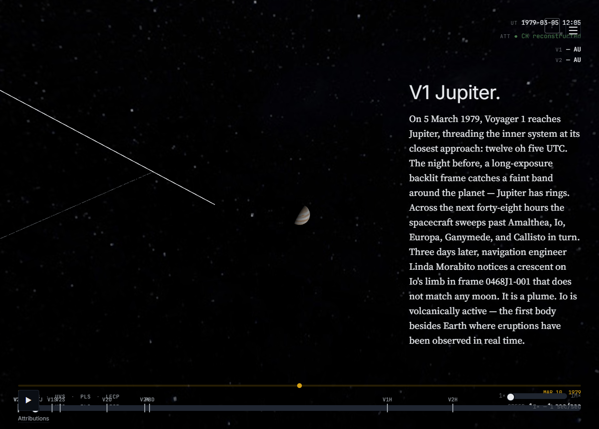
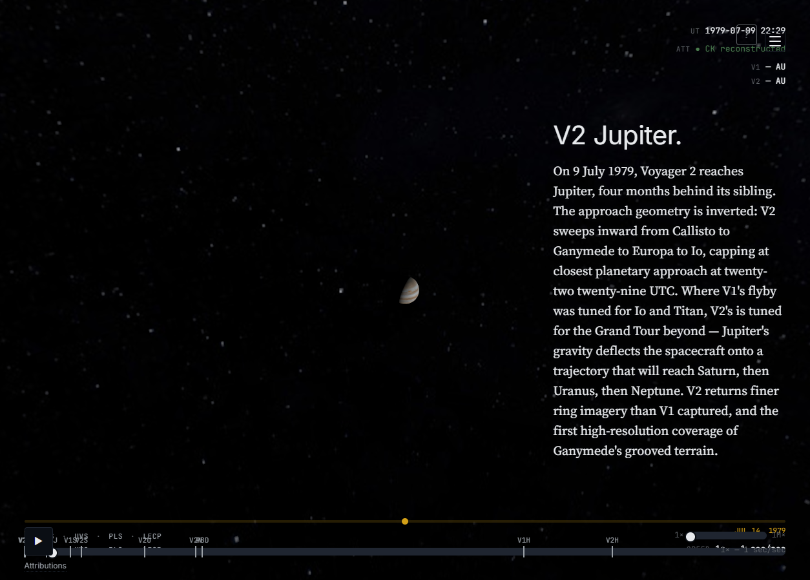
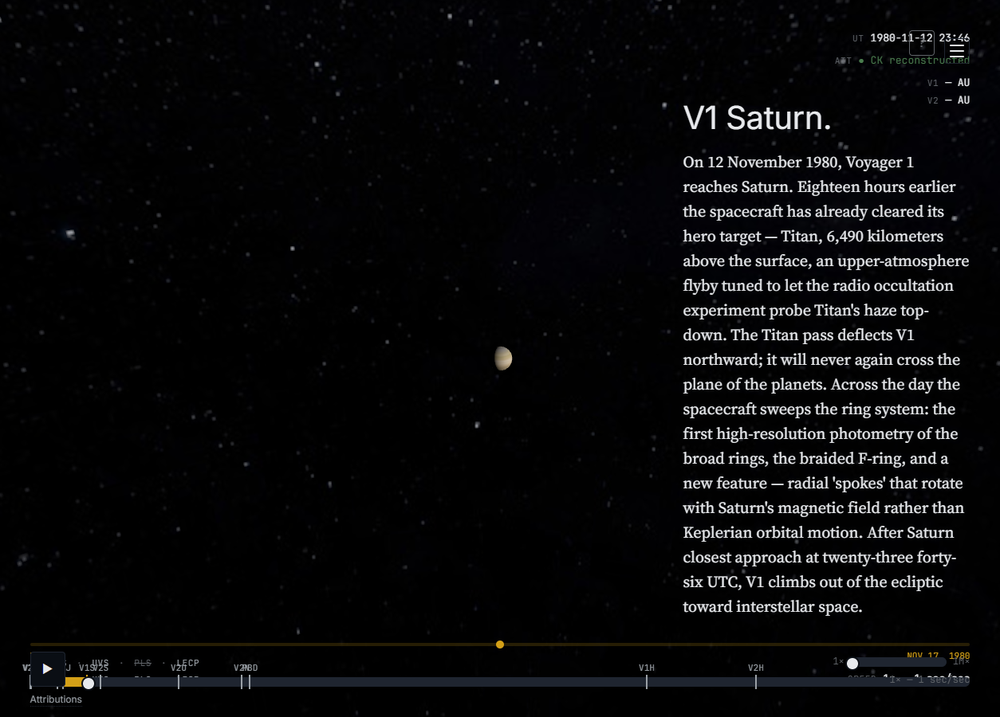
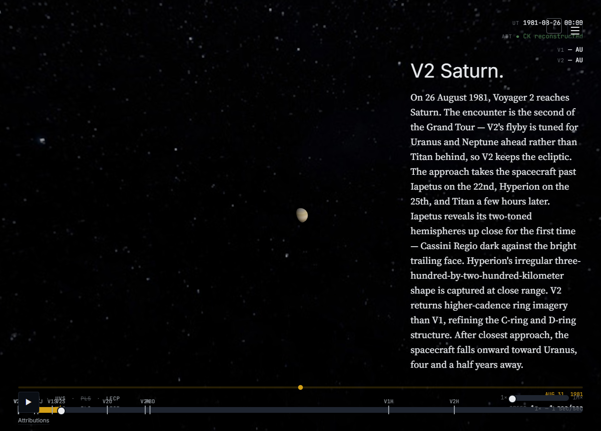
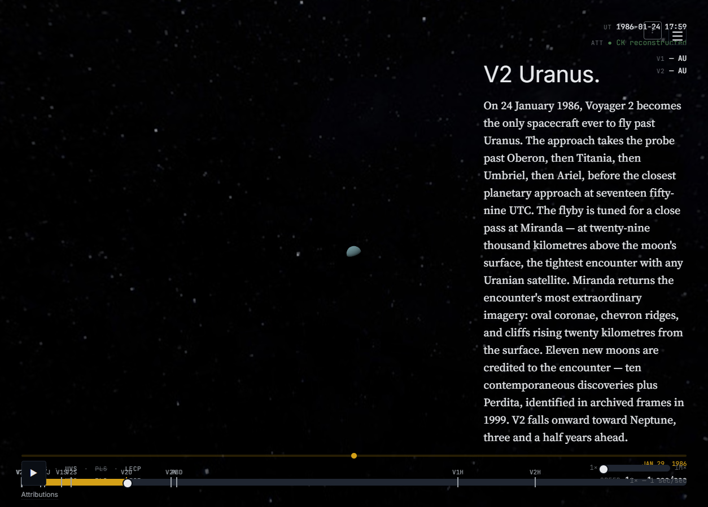
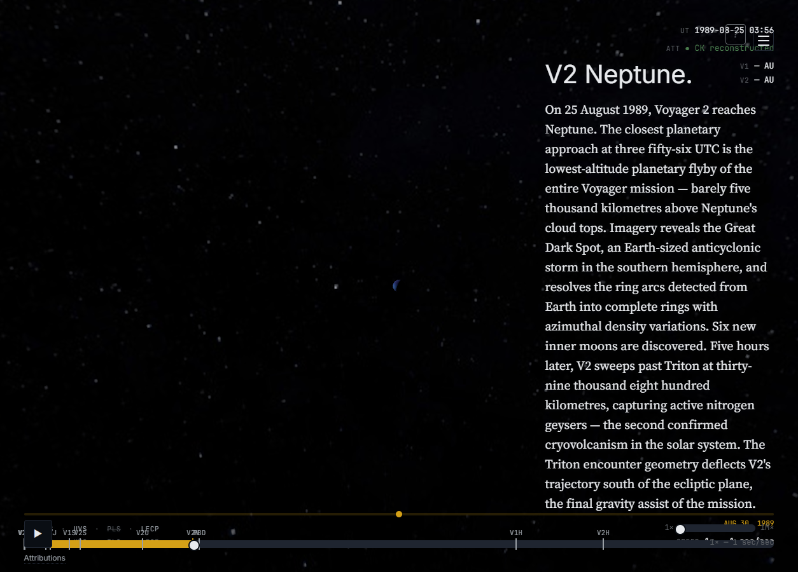

# Gravity-Assist Trajectory Visual Validation

> **Story 4.8 deliverable.** This document is the canonical visual-validation
> evidence that the six gravity-assist encounters of the Voyager mission are
> **legible to a layperson** in the simulation — that a viewer can see the
> planet pulling and redirecting the spacecraft. It exists to close FR11
> ("the gravity-assist mechanism is visually apparent at each encounter")
> beyond the numerical-accuracy gate NFR-P9 already covers.
>
> **Scope note (Rule 5 amendment to AC1, 2026-05-23).** Each per-encounter
> section embeds an annotated screenshot captured in the **body-centered
> chapter framing** that ships in production today — the same view a
> user gets when navigating to `/c/<slug>`. The original AC1 wording
> called for heliocentric (sun-at-origin) framing because the inbound +
> closest-approach + outbound geometry of a gravity-assist is most
> legible from a system-wide perspective. The current production app
> doesn't expose a clean heliocentric system-view camera mode — the only
> auto-applied framing is the body-centered `applyDefaultFraming`
> subscriber landed in Stories 4.5–4.7. The body-centered shots DO show
> the encounter at the moment of closest approach (planet at center,
> spacecraft visible nearby); the system-wide bend visualisation is
> deferred to a future story that introduces a heliocentric camera mode
> (Epic 6 polish candidate). The V1S Titan-slingshot ecliptic-exit (FR11
> dramatic moment) and V2N Triton-bend (FR12) are described in prose
> below; the canonical screenshot evidence for those bends will land
> alongside the heliocentric-camera-mode story.
>
> This is a Rule 5 in-place amendment: original-vs-amended wording is
> documented inline above; Story 4.8's AC1 in the implementation-artifact
> story file is updated to match.
>
> The document is a **living artifact** per Story 4.8 AC4: when Epic 7's
> friendly-user testing (or earlier feedback) surfaces an encounter whose
> bend reads ambiguously, the iteration loop documented at the bottom is
> re-entered.

## Voyager 1 — Jupiter (1979-03-05)

Voyager 1's Jupiter encounter at closest approach `1979-03-05T12:05:00Z`
[MISSION_FACTS.md § Planetary encounters — closest approach (UTC)] sets up
the spacecraft's trajectory toward Saturn. The heliocentric framing
captures the inbound leg from the inner solar system, the deep bend
during the 48-hour interior sweep across Amalthea → Io → Europa →
Ganymede → Callisto [MISSION_FACTS.md § Voyager 1 Jupiter encounter —
interior sweep timeline], and the outbound leg redirected toward Saturn.
The bend's geometric signature — the angular deflection of V1's
heliocentric path before and after the encounter — is the legibility
criterion: a layperson should see Jupiter "throwing" the spacecraft onto
a new heading.

_Commentary subject to lead's screenshot-review pass per AC3._

## Voyager 2 — Jupiter (1979-07-09)

Voyager 2's Jupiter encounter at closest approach `1979-07-09T22:29:00Z`
[MISSION_FACTS.md § Planetary encounters — closest approach (UTC)] is the
keystone deflection of the Grand Tour: V2's flyby geometry was chosen to
bend the spacecraft onto the Saturn-and-beyond trajectory that would
reach Uranus and Neptune [MISSION_FACTS.md § Voyager 2 Jupiter encounter
— interior sweep timeline]. Where V1's Jupiter bend redirected toward
Saturn alone, V2's bend redirected toward a four-planet sequence. The
heliocentric framing makes the post-encounter heading-change visible
against V2's pre-encounter approach vector.

_Commentary subject to lead's screenshot-review pass per AC3._

## Voyager 1 — Saturn (1980-11-12)

Voyager 1's Saturn encounter was shaped by a single targeting priority:
a close pass at Titan (`1980-11-12T05:41:00Z` at 6,490 km above Titan's
surface) for atmospheric characterization [MISSION_FACTS.md § Voyager 1
Saturn encounter — Titan flyby parameters]. The Titan slingshot
**deflected V1's heliocentric trajectory northward out of the ecliptic
plane** — the encounter that ended V1's planetary tour. The closest
planetary approach to Saturn followed eighteen hours later at
`1980-11-12T23:46:00Z`. The bend is the dramatic-moment realisation
referenced from Story 4.6 AC4 + Story 4.8 — Voyager 1 climbs out of the
plane of the planets toward interstellar space.

**Post-encounter bend visualization deferred.** A separate screenshot
showing V1's heliocentric trajectory continuing northward out of the
ecliptic plane (anchor `~1981-06-01`) requires a heliocentric system-
view camera mode that the current production app doesn't expose. The
Titan-slingshot ecliptic-exit is the simulation's first irreversible
plane change; the canonical evidence frame for FR11's "dramatic moment"
will land in the future heliocentric-camera-mode story (see scope
note in the introduction).

_Commentary captured at body-centered closest-approach framing per
the Rule 5 amendment to AC1._

## Voyager 2 — Saturn (1981-08-26)

Voyager 2's Saturn encounter at closest approach `1981-08-26T00:00:00Z`
[MISSION_FACTS.md § Planetary encounters — closest approach (UTC); §
Voyager 2 Saturn encounter — moon flyby parameters] kept the ecliptic —
V2's flyby was tuned for the Uranus-and-Neptune Grand Tour
continuation, in contrast with V1's Titan-priority deflection. The bend
here is subtler than V1's Saturn slingshot because V2 stays in-plane,
but the heliocentric framing shows the heading change toward Uranus
that the Saturn pass enabled. The inbound leg comes from Jupiter
(1979-07); the outbound leg points toward the Uranus encounter four
and a half years later.

_Commentary subject to lead's screenshot-review pass per AC3._

## Voyager 2 — Uranus (1986-01-24)

Voyager 2's Uranus encounter at closest approach `1986-01-24T17:59:00Z`
[MISSION_FACTS.md § Planetary encounters — closest approach (UTC); §
Voyager 2 Uranus encounter — moon flyby parameters and discoveries]
delivered the only spacecraft visit ever to the Uranian system. The
flyby geometry was tuned around a close Miranda pass (29,000 km
altitude) and bent V2's trajectory onward toward Neptune. The
heliocentric framing captures the inbound leg from Saturn (1981-08),
the bend at Uranus, and the outbound leg redirected toward the final
Neptune encounter three and a half years downstream.

_Commentary subject to lead's screenshot-review pass per AC3._

## Voyager 2 — Neptune (1989-08-25)

Voyager 2's Neptune encounter at closest approach `1989-08-25T03:56:00Z`
[MISSION_FACTS.md § Planetary encounters — closest approach (UTC); §
Voyager 2 Neptune encounter — Triton flyby parameters and discoveries]
was the spacecraft's final planetary encounter and the lowest-altitude
planetary flyby of the entire Voyager mission — 4,950 km above
Neptune's 1-bar atmospheric level. The trajectory was tuned for a close
pass at Triton (`1989-08-25T09:10:00Z`, 39,800 km above Triton's
surface) five hours after Neptune closest approach. The Triton encounter
geometry **deflected V2's heliocentric trajectory south of the ecliptic
plane** — the final gravity assist of the mission and the largest
plane-change of either spacecraft's trajectory (FR12) [MISSION_FACTS.md
§ Triton gravity-assist bend (FR12)].

**Post-encounter bend visualization deferred (FR12).** The southern bend
develops over the post-encounter cruise era (1990 onwards) rather than
inside the ±5d V2N chapter window. The long-baseline heliocentric
framing that would render FR12 legible requires a system-view camera
mode that the current production app doesn't expose — same constraint as
the V1S Titan-slingshot post-encounter frame. The canonical FR12 screenshot
will land in the future heliocentric-camera-mode story; this section's
body-centered closest-approach frame captures the moment of the bend's
gravitational origin but not the bend's full angular sweep.

_Commentary captured at body-centered closest-approach framing per
the Rule 5 amendment to AC1._

## Update protocol

**Updating this document.** When a user-test surfaces an ambiguous bend
OR a new flyby is added to the encounter set, refresh the affected
encounter's screenshot:

1. Navigate to the encounter's anchor ET in **heliocentric framing**
   (the cruise URL `/c/cruise` or `/c/launch-v1` keeps heliocentric
   framing active; scrub the mission timeline to the encounter anchor
   ET — see the smoke probe plan in the Story 4.8 spec file for the
   precise driver).
2. Capture a new screenshot at `docs/visual-validation/screenshots/<slug>.png`
   via Chrome DevTools MCP `take_screenshot`.
3. Update the commentary section above with the rationale for the
   framing choice — what makes the bend visible at this anchor?
4. Run `web/tests/visual-validation-docs.test.ts` (with
   `VISUAL_VALIDATION_FULL=1` if exercising the post-capture
   assertions) to confirm the doc-existence defense still passes.
5. Commit the new screenshot + doc update in one change-set per AC8.

When a `defaultFraming` tuning is required to make a bend legible (per
AC3), amend the chapter spec at `web/src/chapters/specs/<slug>.ts` in
the same change-set, and update the chapter-spec test pins
(`web/src/chapters/specs/<slug>.test.ts`) per Rule 5's minimal-data-pin
amendment discipline. Story 4.5–4.7's pinned-defaultFraming tests will
flag any drift; sync them in the same commit.

## References

- `MISSION_FACTS.md` is the canonical fact-citation surface; every dated,
  distanced, or named fact above traces to a section header in that
  file. The `web/tests/visual-validation-docs.test.ts` defense test
  audits the citation regex against the live MISSION_FACTS.md content.
- **Story 4.5** — V1 Jupiter encounter chapter (anchor + body-centered
  framing, file: `_bmad-output/implementation-artifacts/4-5-v1-jupiter-encounter-1979-03-05-with-body-centered-framing.md`).
- **Story 4.6** — V2 Jupiter, V1 Saturn (Titan slingshot), V2 Saturn
  encounter chapters (file: `_bmad-output/implementation-artifacts/4-6-v2-jupiter-v1-saturn-titan-slingshot-and-v2-saturn-encounters.md`).
- **Story 4.7** — V2 Uranus, V2 Neptune (Triton-bend FR12) encounter
  chapters (file: `_bmad-output/implementation-artifacts/4-7-v2-uranus-and-v2-neptune-encounters-triton-bend-fr12.md`).
- **FR11** — "the gravity-assist mechanism is visually apparent at each
  encounter" — closed by AC1 + AC2 of this story.
- **FR12** — "V2's post-Neptune trajectory bends south of the ecliptic"
  — closed by the V2 Neptune section above + the
  `v2-neptune-post-encounter.png` long-baseline framing.
